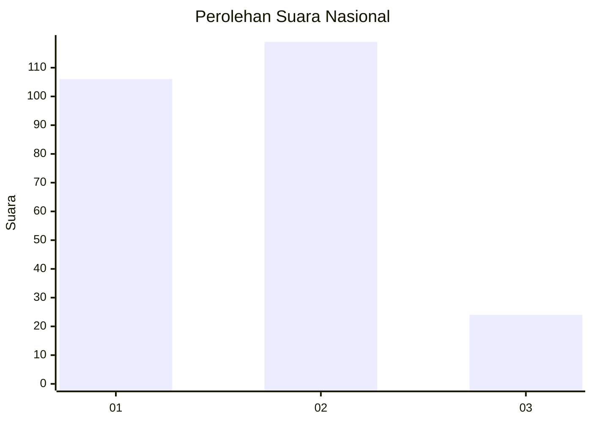
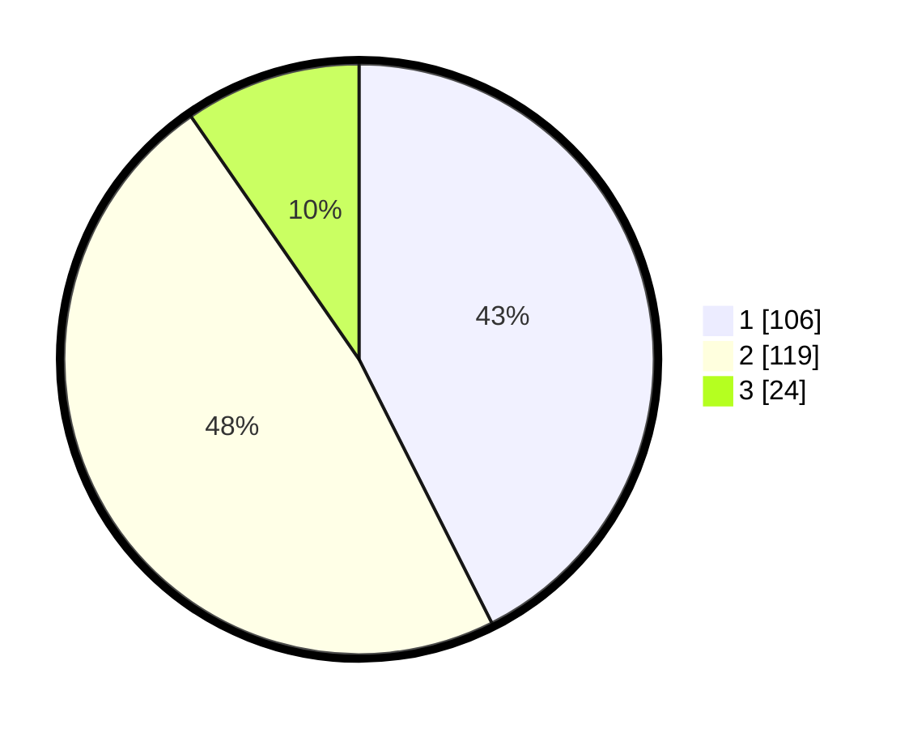

# Hasil

## Grafik

## Tabel

| No. | Nama Paslon    | Suara | Suara (raw) | Persentase |
|:--- |:-------------- | -----:| -----------:| ----------:|
| 1   | ANIES MUHAIMIN | 106   | [106][p-1]  | 42,57      |
| 2   | PRABOWO GIBRAN | 119   | [119][p-2]  | 47,79      |
| 3   | GANJAR MAHFUD  | 24    | [24][p-3]   | 9,64       |

[p-1]: https://github.com/gigit-pemilu/pemilu-2024/blob/main/pilpres/hitung-suara/sub/99-luar-negeri/sub/64-kuwait-city-kuwait/sub/01-kuwait-city-kuwait/sub/0001-kuwait-city-kuwait/sub/004-tps/sub/paslon-1.txt
[p-2]: https://github.com/gigit-pemilu/pemilu-2024/blob/main/pilpres/hitung-suara/sub/99-luar-negeri/sub/64-kuwait-city-kuwait/sub/01-kuwait-city-kuwait/sub/0001-kuwait-city-kuwait/sub/004-tps/sub/paslon-2.txt
[p-3]: https://github.com/gigit-pemilu/pemilu-2024/blob/main/pilpres/hitung-suara/sub/99-luar-negeri/sub/64-kuwait-city-kuwait/sub/01-kuwait-city-kuwait/sub/0001-kuwait-city-kuwait/sub/004-tps/sub/paslon-3.txt

## Foto C Plano

https://sirekap-obj-formc.kpu.go.id/f197/pemilu/ppwp/99/64/01/00/01/9964010001004-20240214-201918--2941ddd1-95e0-455e-9869-96e4d67484b4.jpg

https://sirekap-obj-formc.kpu.go.id/f197/pemilu/ppwp/99/64/01/00/01/9964010001004-20240214-201929--1f0cbd40-04c6-42ac-a860-4bd4fc049470.jpg

https://sirekap-obj-formc.kpu.go.id/f197/pemilu/ppwp/99/64/01/00/01/9964010001004-20240214-201946--4f89dbf9-e888-498c-923c-99201b81b0dd.jpg

## Metadata

| Key        | Value               |
| ---------- | ------------------- |
| Time Stamp | 2024-02-15 18:30:25 |

## DATA PEMILIH TETAP

Jumlah pemilih dalam DPT: **442**.
 * L: **153**.
 * P: **289**.

## DATA PENGGUNA HAK PILIH

Jumlah pengguna hak pilih dalam DPT: **165**.
 * L: **78**.
 * P: **87**.

Jumlah pengguna hak pilih dalam DPTb: **21**.
 * L: **9**.
 * P: **12**.

Jumlah pengguna hak pilih dalam DPK: **68**.
 * L: **22**.
 * P: **46**.

Jumlah pengguna hak pilih: **254**.
 * L: **109**.
 * P: **145**.

## JUMLAH SUARA SAH DAN TIDAK SAH

JUMLAH SELURUH SUARA SAH: **249**.

JUMLAH SUARA TIDAK SAH: **5**.

JUMLAH SELURUH SUARA SAH DAN SUARA TIDAK SAH: **254**.

