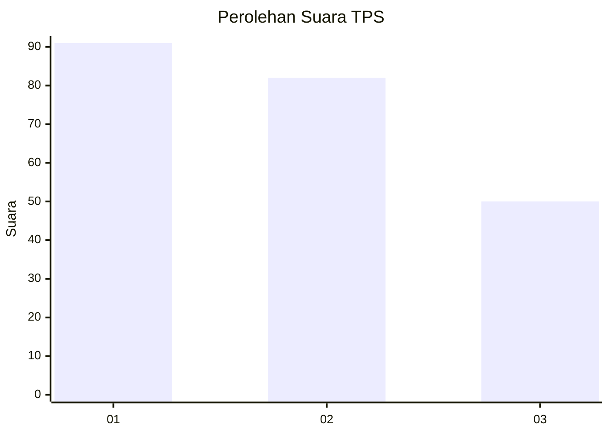
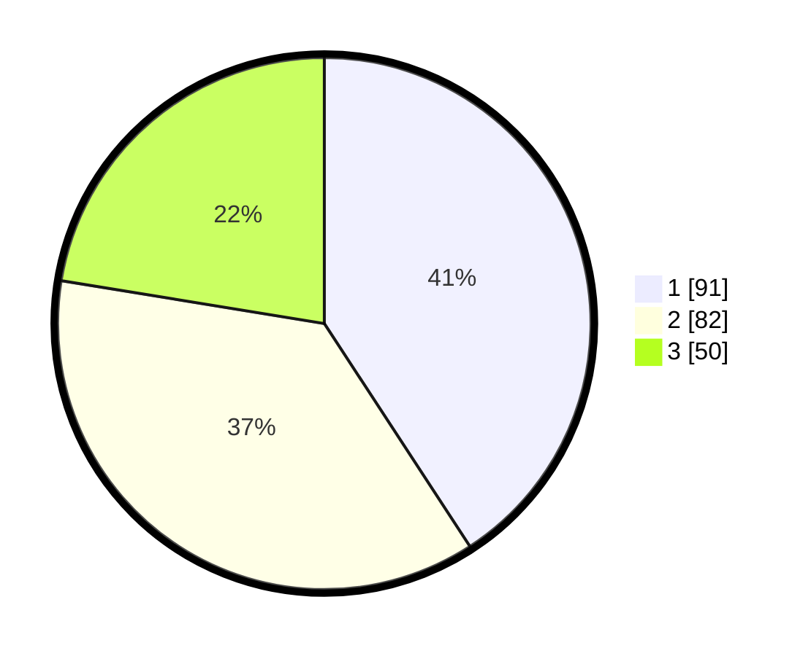

# Hasil

## Grafik

## Tabel

| No. | Nama Paslon    | Suara | Suara (raw) | Persentase |
|:--- |:-------------- | -----:| -----------:| ----------:|
| 1   | ANIES MUHAIMIN | 91    | [91][p-1]   | 40,81      |
| 2   | PRABOWO GIBRAN | 82    | [82][p-2]   | 36,77      |
| 3   | GANJAR MAHFUD  | 50    | [50][p-3]   | 22,42      |

[p-1]: https://github.com/gigit-pemilu/pemilu-2024-99-luar-negeri/blob/main/pilpres/hitung-suara/sub/99-luar-negeri/sub/64-kuwait-city-kuwait/sub/01-kuwait-city-kuwait/sub/0001-kuwait-city-kuwait/sub/005-tps/sub/paslon-1.txt
[p-2]: https://github.com/gigit-pemilu/pemilu-2024-99-luar-negeri/blob/main/pilpres/hitung-suara/sub/99-luar-negeri/sub/64-kuwait-city-kuwait/sub/01-kuwait-city-kuwait/sub/0001-kuwait-city-kuwait/sub/005-tps/sub/paslon-2.txt
[p-3]: https://github.com/gigit-pemilu/pemilu-2024-99-luar-negeri/blob/main/pilpres/hitung-suara/sub/99-luar-negeri/sub/64-kuwait-city-kuwait/sub/01-kuwait-city-kuwait/sub/0001-kuwait-city-kuwait/sub/005-tps/sub/paslon-3.txt

## Foto C Plano

https://sirekap-obj-formc.kpu.go.id/1d1a/pemilu/ppwp/99/64/01/00/01/9964010001005-20240214-231455--ab5e3b18-84b2-4560-b6ee-8773cb14e707.jpg

https://sirekap-obj-formc.kpu.go.id/1d1a/pemilu/ppwp/99/64/01/00/01/9964010001005-20240215-203458--844a807d-3442-4081-b392-1d05592cd3d2.jpg

https://sirekap-obj-formc.kpu.go.id/1d1a/pemilu/ppwp/99/64/01/00/01/9964010001005-20240214-210941--38807b7a-b351-49ce-9ab6-dd8a9d68055f.jpg

## Metadata

| Key        | Value               |
| ---------- | ------------------- |
| Time Stamp | 2024-02-15 23:29:50 |

## DATA PEMILIH TETAP

Jumlah pemilih dalam DPT: **441**.
 * L: **165**.
 * P: **276**.

## DATA PENGGUNA HAK PILIH

Jumlah pengguna hak pilih dalam DPT: **172**.
 * L: **75**.
 * P: **97**.

Jumlah pengguna hak pilih dalam DPTb: **23**.
 * L: **12**.
 * P: **11**.

Jumlah pengguna hak pilih dalam DPK: **33**.
 * L: **1**.
 * P: **32**.

Jumlah pengguna hak pilih: **228**.
 * L: **88**.
 * P: **140**.

## JUMLAH SUARA SAH DAN TIDAK SAH

JUMLAH SELURUH SUARA SAH: **223**.

JUMLAH SUARA TIDAK SAH: **5**.

JUMLAH SELURUH SUARA SAH DAN SUARA TIDAK SAH: **228**.

