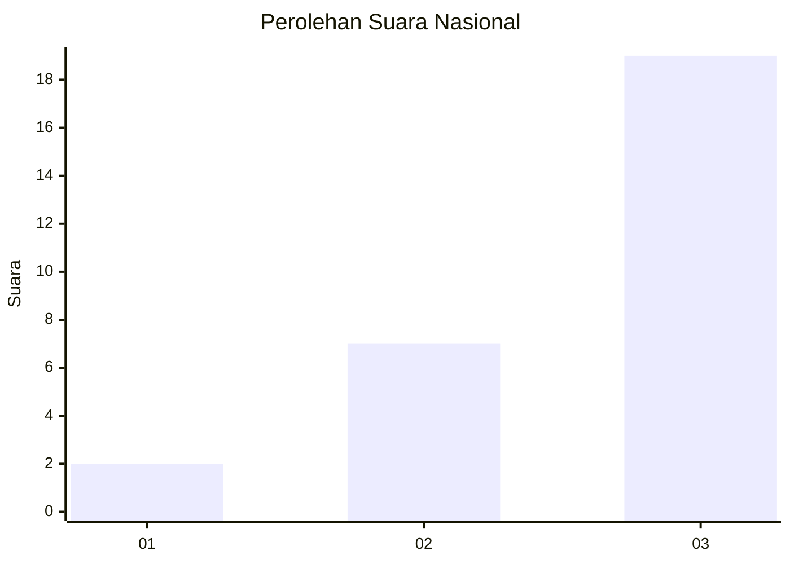
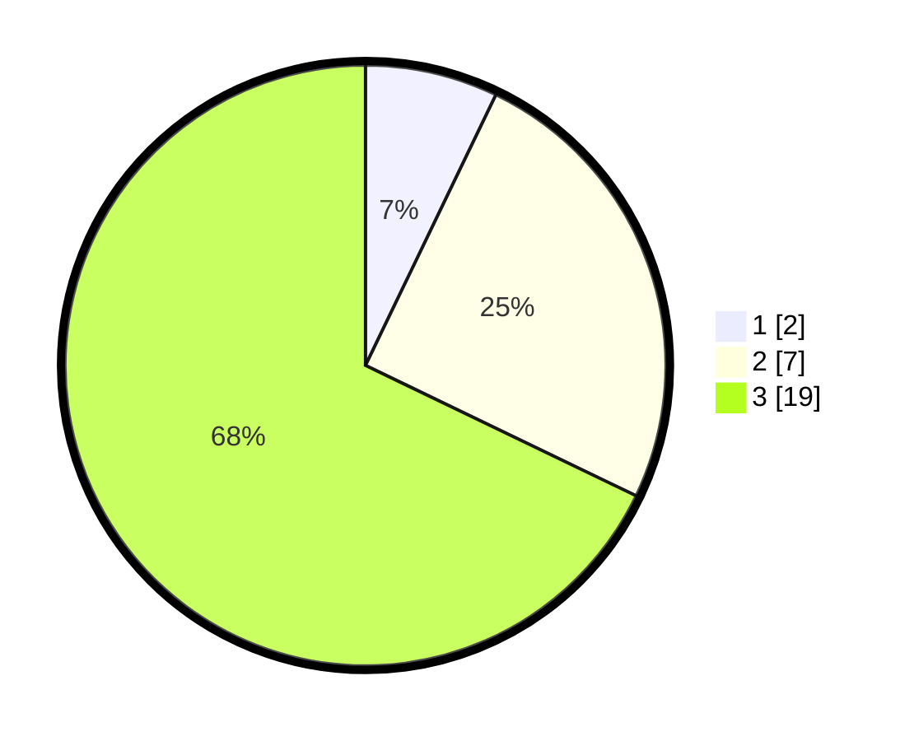

# Hasil

## Grafik

## Tabel

| No. | Nama Paslon    | Suara | Suara (raw) | Persentase |
|:--- |:-------------- | -----:| -----------:| ----------:|
| 1   | ANIES MUHAIMIN | 2     | [2][p-1]    | 7,14       |
| 2   | PRABOWO GIBRAN | 7     | [7][p-2]    | 25,00      |
| 3   | GANJAR MAHFUD  | 19    | [19][p-3]   | 67,86      |

[p-1]: https://github.com/gigit-pemilu/pemilu-2024/blob/main/pilpres/hitung-suara/sub/99-luar-negeri/sub/65-lima-peru/sub/01-lima-peru/sub/0001-lima-peru/sub/001-pos-001/sub/paslon-1.txt
[p-2]: https://github.com/gigit-pemilu/pemilu-2024/blob/main/pilpres/hitung-suara/sub/99-luar-negeri/sub/65-lima-peru/sub/01-lima-peru/sub/0001-lima-peru/sub/001-pos-001/sub/paslon-2.txt
[p-3]: https://github.com/gigit-pemilu/pemilu-2024/blob/main/pilpres/hitung-suara/sub/99-luar-negeri/sub/65-lima-peru/sub/01-lima-peru/sub/0001-lima-peru/sub/001-pos-001/sub/paslon-3.txt

## Foto C Plano

https://sirekap-obj-formc.kpu.go.id/3106/pemilu/ppwp/99/65/01/00/01/9965010001001-20240216-221949--3c5d0d0d-1b85-4660-aa8c-3b02ce06693c.jpg

https://sirekap-obj-formc.kpu.go.id/3106/pemilu/ppwp/99/65/01/00/01/9965010001001-20240216-035346--77116e43-e1b5-431d-a13a-1bca4a0d7e8b.jpg

https://sirekap-obj-formc.kpu.go.id/3106/pemilu/ppwp/99/65/01/00/01/9965010001001-20240216-035421--bb5bb853-7abd-40e3-b8af-d38d98d1ec24.jpg

## Metadata

| Key        | Value               |
| ---------- | ------------------- |
| Time Stamp | 2024-02-16 22:30:00 |

## DATA PEMILIH TETAP

Jumlah pemilih dalam DPT: **30**.
 * L: **17**.
 * P: **13**.

## DATA PENGGUNA HAK PILIH

Jumlah pengguna hak pilih dalam DPT: **30**.
 * L: **17**.
 * P: **13**.

Jumlah pengguna hak pilih dalam DPTb: **0**.
 * L: **0**.
 * P: **0**.

Jumlah pengguna hak pilih dalam DPK: **0**.
 * L: **0**.
 * P: **0**.

Jumlah pengguna hak pilih: **30**.
 * L: **17**.
 * P: **13**.

## JUMLAH SUARA SAH DAN TIDAK SAH

JUMLAH SELURUH SUARA SAH: **28**.

JUMLAH SUARA TIDAK SAH: **0**.

JUMLAH SELURUH SUARA SAH DAN SUARA TIDAK SAH: **28**.

