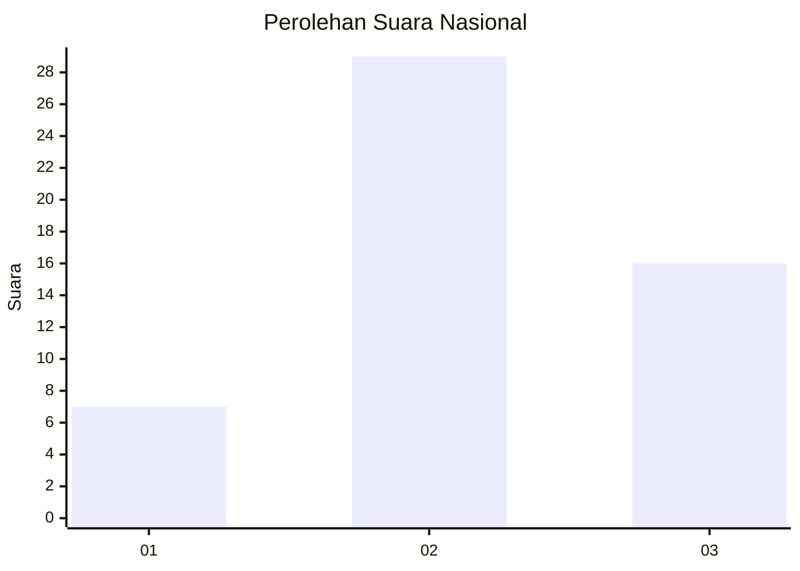
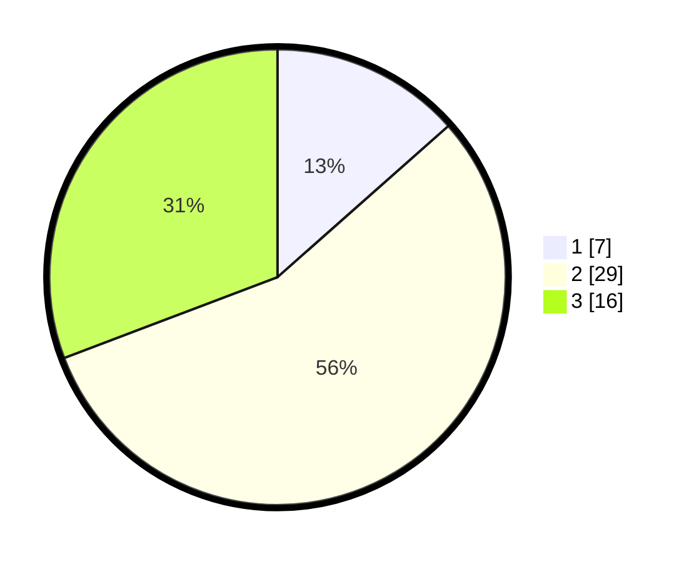

# Hasil

## Grafik

## Tabel

| No. | Nama Paslon    | Suara | Suara (raw) | Persentase |
|:--- |:-------------- | -----:| -----------:| ----------:|
| 1   | ANIES MUHAIMIN | 7     | [7][p-1]    | 13,46      |
| 2   | PRABOWO GIBRAN | 29    | [29][p-2]   | 55,77      |
| 3   | GANJAR MAHFUD  | 16    | [16][p-3]   | 30,77      |

[p-1]: https://github.com/gigit-pemilu/pemilu-2024/blob/main/pilpres/hitung-suara/sub/99-luar-negeri/sub/65-lima-peru/sub/01-lima-peru/sub/0001-lima-peru/sub/002-tps-001/sub/paslon-1.txt
[p-2]: https://github.com/gigit-pemilu/pemilu-2024/blob/main/pilpres/hitung-suara/sub/99-luar-negeri/sub/65-lima-peru/sub/01-lima-peru/sub/0001-lima-peru/sub/002-tps-001/sub/paslon-2.txt
[p-3]: https://github.com/gigit-pemilu/pemilu-2024/blob/main/pilpres/hitung-suara/sub/99-luar-negeri/sub/65-lima-peru/sub/01-lima-peru/sub/0001-lima-peru/sub/002-tps-001/sub/paslon-3.txt

## Foto C Plano

https://sirekap-obj-formc.kpu.go.id/a45e/pemilu/ppwp/99/65/01/00/01/9965010001002-20240215-031155--7dd1401e-1f1f-40cc-9815-f2c973601e76.jpg

https://sirekap-obj-formc.kpu.go.id/a45e/pemilu/ppwp/99/65/01/00/01/9965010001002-20240215-031240--718e996c-410b-41eb-8ff1-77b5453e1eec.jpg

https://sirekap-obj-formc.kpu.go.id/a45e/pemilu/ppwp/99/65/01/00/01/9965010001002-20240215-031322--3c0c2f0a-f24f-4d40-8df3-13f6b2e854b1.jpg

## Metadata

| Key        | Value               |
| ---------- | ------------------- |
| Time Stamp | 2024-02-15 19:30:26 |

## DATA PEMILIH TETAP

Jumlah pemilih dalam DPT: **57**.
 * L: **28**.
 * P: **29**.

## DATA PENGGUNA HAK PILIH

Jumlah pengguna hak pilih dalam DPT: **48**.
 * L: **22**.
 * P: **26**.

Jumlah pengguna hak pilih dalam DPTb: **1**.
 * L: **0**.
 * P: **1**.

Jumlah pengguna hak pilih dalam DPK: **5**.
 * L: **3**.
 * P: **2**.

Jumlah pengguna hak pilih: **54**.
 * L: **25**.
 * P: **29**.

## JUMLAH SUARA SAH DAN TIDAK SAH

JUMLAH SELURUH SUARA SAH: **52**.

JUMLAH SUARA TIDAK SAH: **2**.

JUMLAH SELURUH SUARA SAH DAN SUARA TIDAK SAH: **54**.

