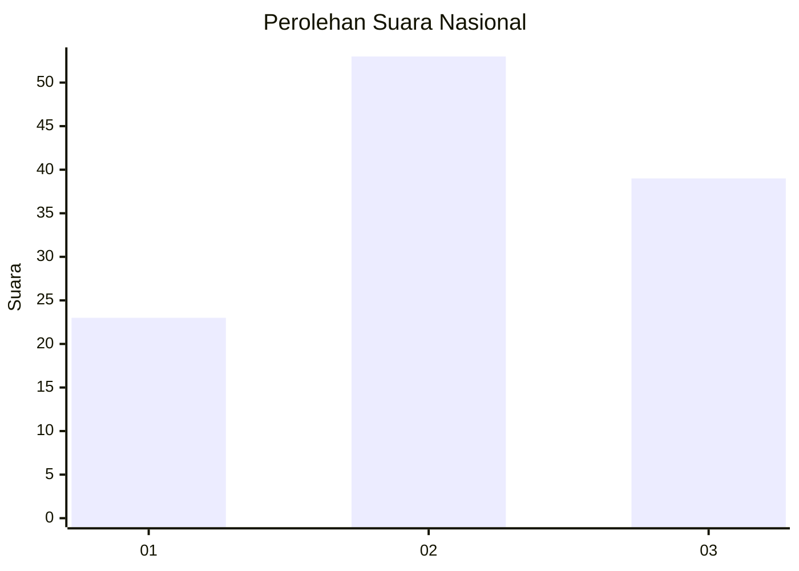
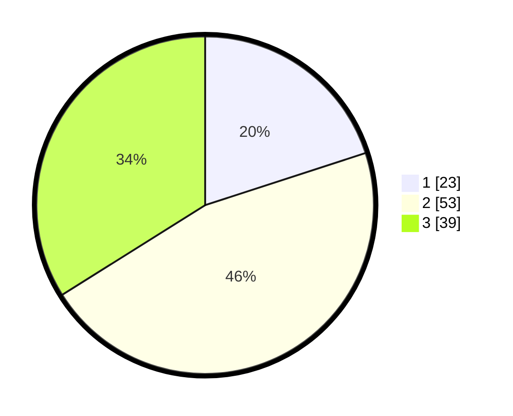

# Hasil

## Grafik

## Tabel

| No. | Nama Paslon    | Suara | Suara (raw) | Persentase |
|:--- |:-------------- | -----:| -----------:| ----------:|
| 1   | ANIES MUHAIMIN | 23    | [23][p-1]   | 20,00      |
| 2   | PRABOWO GIBRAN | 53    | [53][p-2]   | 46,09      |
| 3   | GANJAR MAHFUD  | 39    | [39][p-3]   | 33,91      |

[p-1]: https://github.com/gigit-pemilu/pemilu-2024/blob/main/pilpres/hitung-suara/sub/99-luar-negeri/sub/66-lisabon-portugal/sub/01-lisabon-portugal/sub/0001-lisabon-portugal/sub/002-tps-001/sub/paslon-1.txt
[p-2]: https://github.com/gigit-pemilu/pemilu-2024/blob/main/pilpres/hitung-suara/sub/99-luar-negeri/sub/66-lisabon-portugal/sub/01-lisabon-portugal/sub/0001-lisabon-portugal/sub/002-tps-001/sub/paslon-2.txt
[p-3]: https://github.com/gigit-pemilu/pemilu-2024/blob/main/pilpres/hitung-suara/sub/99-luar-negeri/sub/66-lisabon-portugal/sub/01-lisabon-portugal/sub/0001-lisabon-portugal/sub/002-tps-001/sub/paslon-3.txt

## Foto C Plano

https://sirekap-obj-formc.kpu.go.id/9076/pemilu/ppwp/99/66/01/00/01/9966010001002-20240214-211310--9a2e46dd-dca3-46a6-9b0b-ef505bbfb14f.jpg

https://sirekap-obj-formc.kpu.go.id/9076/pemilu/ppwp/99/66/01/00/01/9966010001002-20240214-211427--757f0a5a-0018-460b-9bbf-9bc4548c87b0.jpg

https://sirekap-obj-formc.kpu.go.id/9076/pemilu/ppwp/99/66/01/00/01/9966010001002-20240214-211516--49590f5c-70bc-486b-a12d-885589c34e2d.jpg

## Metadata

| Key        | Value               |
| ---------- | ------------------- |
| Time Stamp | 2024-02-15 00:41:44 |

## DATA PEMILIH TETAP

Jumlah pemilih dalam DPT: **134**.
 * L: **39**.
 * P: **95**.

## DATA PENGGUNA HAK PILIH

Jumlah pengguna hak pilih dalam DPT: **97**.
 * L: **28**.
 * P: **69**.

Jumlah pengguna hak pilih dalam DPTb: **16**.
 * L: **4**.
 * P: **12**.

Jumlah pengguna hak pilih dalam DPK: **3**.
 * L: **2**.
 * P: **1**.

Jumlah pengguna hak pilih: **116**.
 * L: **34**.
 * P: **82**.

## JUMLAH SUARA SAH DAN TIDAK SAH

JUMLAH SELURUH SUARA SAH: **115**.

JUMLAH SUARA TIDAK SAH: **1**.

JUMLAH SELURUH SUARA SAH DAN SUARA TIDAK SAH: **116**.

