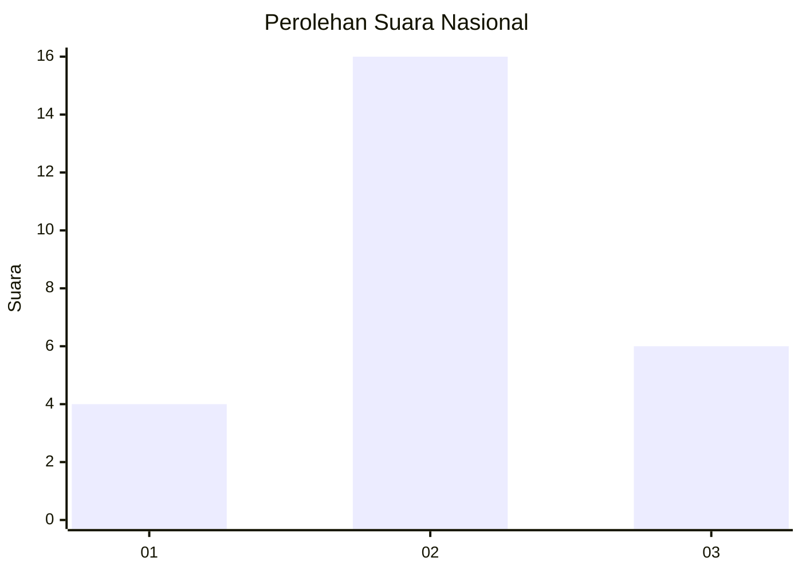
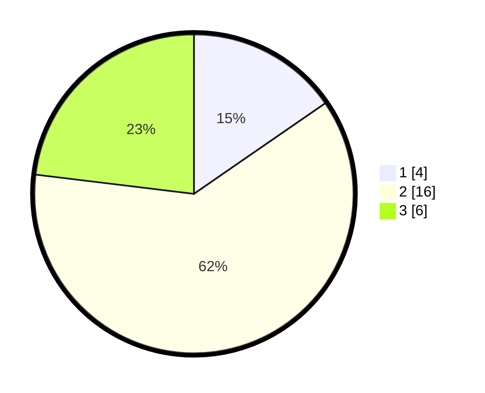

# Hasil

## Grafik

## Tabel

| No. | Nama Paslon    | Suara | Suara (raw) | Persentase |
|:--- |:-------------- | -----:| -----------:| ----------:|
| 1   | ANIES MUHAIMIN | 4     | [4][p-1]    | 15,38      |
| 2   | PRABOWO GIBRAN | 16    | [16][p-2]   | 61,54      |
| 3   | GANJAR MAHFUD  | 6     | [6][p-3]    | 23,08      |

[p-1]: https://github.com/gigit-pemilu/pemilu-2024/blob/main/pilpres/hitung-suara/sub/99-luar-negeri/sub/66-lisabon-portugal/sub/01-lisabon-portugal/sub/0001-lisabon-portugal/sub/003-ksk-001/sub/paslon-1.txt
[p-2]: https://github.com/gigit-pemilu/pemilu-2024/blob/main/pilpres/hitung-suara/sub/99-luar-negeri/sub/66-lisabon-portugal/sub/01-lisabon-portugal/sub/0001-lisabon-portugal/sub/003-ksk-001/sub/paslon-2.txt
[p-3]: https://github.com/gigit-pemilu/pemilu-2024/blob/main/pilpres/hitung-suara/sub/99-luar-negeri/sub/66-lisabon-portugal/sub/01-lisabon-portugal/sub/0001-lisabon-portugal/sub/003-ksk-001/sub/paslon-3.txt

## Foto C Plano

https://sirekap-obj-formc.kpu.go.id/bbdc/pemilu/ppwp/99/66/01/00/01/9966010001003-20240215-151733--2076b865-a37e-4da2-8a76-ff3e4ce5182b.jpg

https://sirekap-obj-formc.kpu.go.id/bbdc/pemilu/ppwp/99/66/01/00/01/9966010001003-20240215-000554--47c9bd87-208e-4e22-8091-c92da23fab3b.jpg

https://sirekap-obj-formc.kpu.go.id/bbdc/pemilu/ppwp/99/66/01/00/01/9966010001003-20240214-223411--7d2e3cdc-d5ba-43fc-aaeb-b8b520751eef.jpg

## Metadata

| Key        | Value               |
| ---------- | ------------------- |
| Time Stamp | 2024-02-15 17:00:25 |

## DATA PEMILIH TETAP

Jumlah pemilih dalam DPT: **38**.
 * L: **29**.
 * P: **9**.

## DATA PENGGUNA HAK PILIH

Jumlah pengguna hak pilih dalam DPT: **13**.
 * L: **8**.
 * P: **5**.

Jumlah pengguna hak pilih dalam DPTb: **8**.
 * L: **3**.
 * P: **5**.

Jumlah pengguna hak pilih dalam DPK: **5**.
 * L: **4**.
 * P: **1**.

Jumlah pengguna hak pilih: **26**.
 * L: **15**.
 * P: **11**.

## JUMLAH SUARA SAH DAN TIDAK SAH

JUMLAH SELURUH SUARA SAH: **26**.

JUMLAH SUARA TIDAK SAH: **0**.

JUMLAH SELURUH SUARA SAH DAN SUARA TIDAK SAH: **26**.

