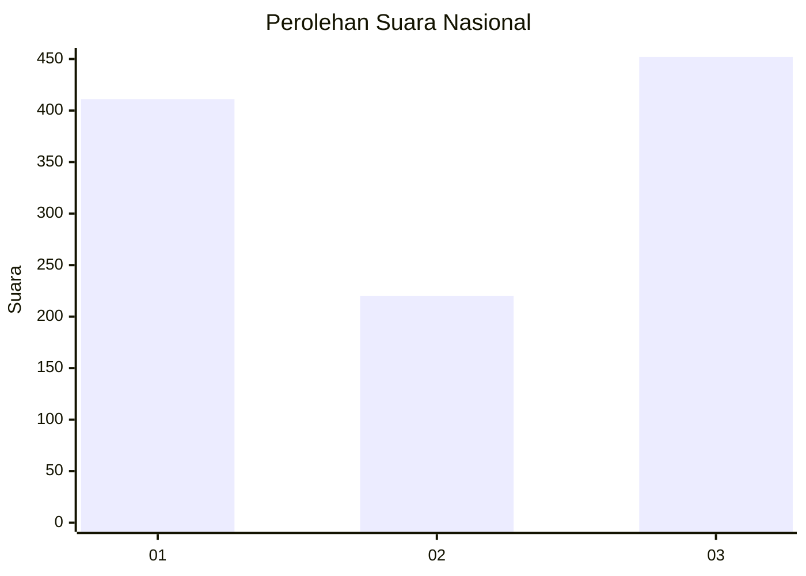
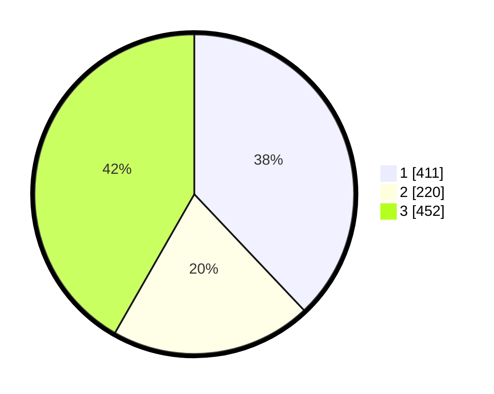

# Hasil

## Grafik

## Tabel

| No. | Nama Paslon    | Suara | Suara (raw) | Persentase |
|:--- |:-------------- | -----:| -----------:| ----------:|
| 1   | ANIES MUHAIMIN | 411   | [411][p-1]  | 37,95      |
| 2   | PRABOWO GIBRAN | 220   | [220][p-2]  | 20,31      |
| 3   | GANJAR MAHFUD  | 452   | [452][p-3]  | 41,74      |

[p-1]: https://github.com/gigit-pemilu/pemilu-2024/blob/main/pilpres/hitung-suara/sub/99-luar-negeri/sub/67-london-inggris/sub/01-london-inggris/sub/0001-london-inggris/sub/001-pos-001/sub/paslon-1.txt
[p-2]: https://github.com/gigit-pemilu/pemilu-2024/blob/main/pilpres/hitung-suara/sub/99-luar-negeri/sub/67-london-inggris/sub/01-london-inggris/sub/0001-london-inggris/sub/001-pos-001/sub/paslon-2.txt
[p-3]: https://github.com/gigit-pemilu/pemilu-2024/blob/main/pilpres/hitung-suara/sub/99-luar-negeri/sub/67-london-inggris/sub/01-london-inggris/sub/0001-london-inggris/sub/001-pos-001/sub/paslon-3.txt

## Foto C Plano

https://sirekap-obj-formc.kpu.go.id/bebd/pemilu/ppwp/99/67/01/00/01/9967010001001-20240216-044836--7a4a0381-73d4-4f6b-bb5d-10ec3a72a22e.jpg

https://sirekap-obj-formc.kpu.go.id/bebd/pemilu/ppwp/99/67/01/00/01/9967010001001-20240216-044909--603a468b-fffd-4fb8-b4bb-8fde435855b7.jpg

https://sirekap-obj-formc.kpu.go.id/bebd/pemilu/ppwp/99/67/01/00/01/9967010001001-20240216-044930--f60ee403-62a4-4d99-9dbe-450cb039083c.jpg

## Metadata

| Key        | Value               |
| ---------- | ------------------- |
| Time Stamp | 2024-02-16 05:30:26 |

## DATA PEMILIH TETAP

Jumlah pemilih dalam DPT: **1319**.
 * L: **418**.
 * P: **901**.

## DATA PENGGUNA HAK PILIH

Jumlah pengguna hak pilih dalam DPT: **1095**.
 * L: **347**.
 * P: **748**.

Jumlah pengguna hak pilih dalam DPTb: **5**.
 * L: **3**.
 * P: **2**.

Jumlah pengguna hak pilih dalam DPK: **0**.
 * L: **0**.
 * P: **0**.

Jumlah pengguna hak pilih: **1100**.
 * L: **350**.
 * P: **750**.

## JUMLAH SUARA SAH DAN TIDAK SAH

JUMLAH SELURUH SUARA SAH: **1083**.

JUMLAH SUARA TIDAK SAH: **17**.

JUMLAH SELURUH SUARA SAH DAN SUARA TIDAK SAH: **1100**.

