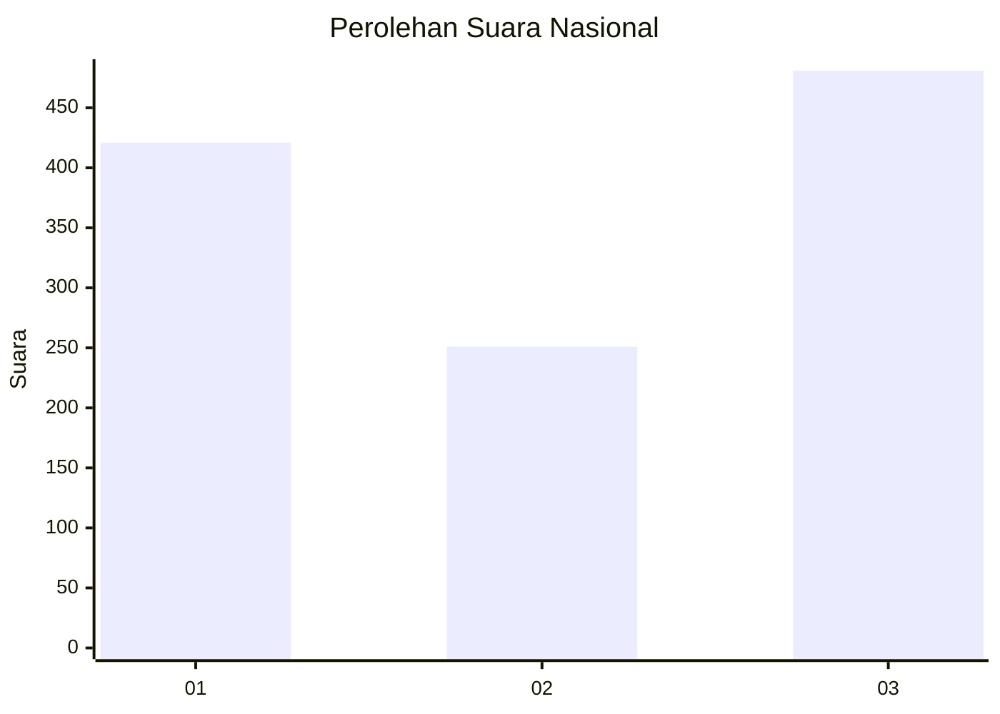
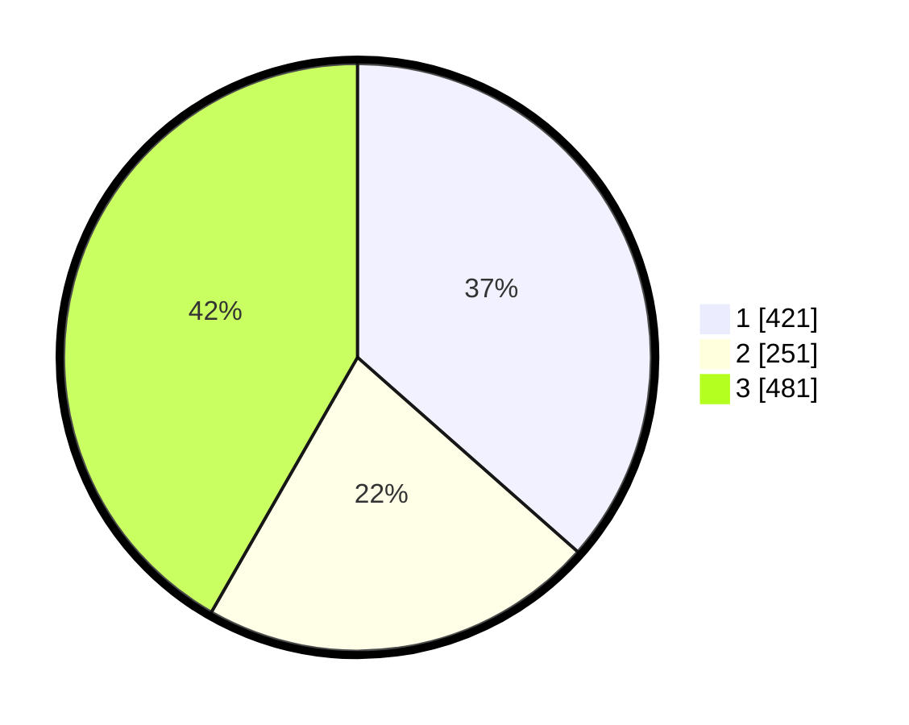

# Hasil

## Grafik

## Tabel

| No. | Nama Paslon    | Suara | Suara (raw) | Persentase |
|:--- |:-------------- | -----:| -----------:| ----------:|
| 1   | ANIES MUHAIMIN | 421   | [421][p-1]  | 36,51      |
| 2   | PRABOWO GIBRAN | 251   | [251][p-2]  | 21,77      |
| 3   | GANJAR MAHFUD  | 481   | [481][p-3]  | 41,72      |

[p-1]: https://github.com/gigit-pemilu/pemilu-2024/blob/main/pilpres/hitung-suara/sub/99-luar-negeri/sub/67-london-inggris/sub/01-london-inggris/sub/0001-london-inggris/sub/002-tps-001/sub/paslon-1.txt
[p-2]: https://github.com/gigit-pemilu/pemilu-2024/blob/main/pilpres/hitung-suara/sub/99-luar-negeri/sub/67-london-inggris/sub/01-london-inggris/sub/0001-london-inggris/sub/002-tps-001/sub/paslon-2.txt
[p-3]: https://github.com/gigit-pemilu/pemilu-2024/blob/main/pilpres/hitung-suara/sub/99-luar-negeri/sub/67-london-inggris/sub/01-london-inggris/sub/0001-london-inggris/sub/002-tps-001/sub/paslon-3.txt

## Foto C Plano

https://sirekap-obj-formc.kpu.go.id/015d/pemilu/ppwp/99/67/01/00/01/9967010001002-20240215-065735--3f9f6cef-f316-4f6c-8dbf-e66161a42713.jpg

https://sirekap-obj-formc.kpu.go.id/015d/pemilu/ppwp/99/67/01/00/01/9967010001002-20240215-065859--d395cd99-4f1f-4a0c-825e-8fdba4064e71.jpg

https://sirekap-obj-formc.kpu.go.id/015d/pemilu/ppwp/99/67/01/00/01/9967010001002-20240215-065954--78d93a27-a942-42df-887b-bf1bbc0a354a.jpg

## Metadata

| Key        | Value               |
| ---------- | ------------------- |
| Time Stamp | 2024-02-15 18:30:25 |

## DATA PEMILIH TETAP

Jumlah pemilih dalam DPT: **1310**.
 * L: **525**.
 * P: **785**.

## DATA PENGGUNA HAK PILIH

Jumlah pengguna hak pilih dalam DPT: **613**.
 * L: **241**.
 * P: **372**.

Jumlah pengguna hak pilih dalam DPTb: **380**.
 * L: **162**.
 * P: **218**.

Jumlah pengguna hak pilih dalam DPK: **170**.
 * L: **56**.
 * P: **114**.

Jumlah pengguna hak pilih: **1163**.
 * L: **459**.
 * P: **704**.

## JUMLAH SUARA SAH DAN TIDAK SAH

JUMLAH SELURUH SUARA SAH: **1153**.

JUMLAH SUARA TIDAK SAH: **10**.

JUMLAH SELURUH SUARA SAH DAN SUARA TIDAK SAH: **1163**.

