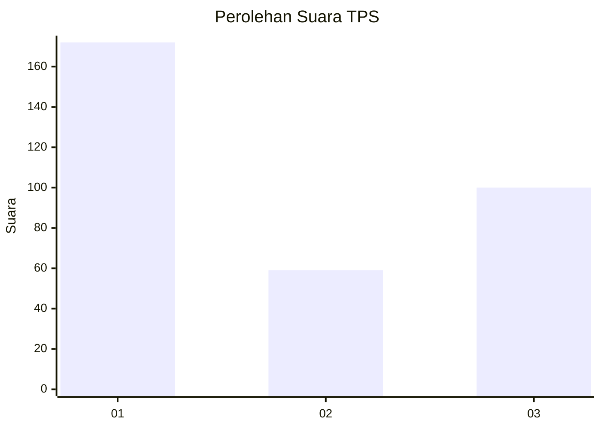
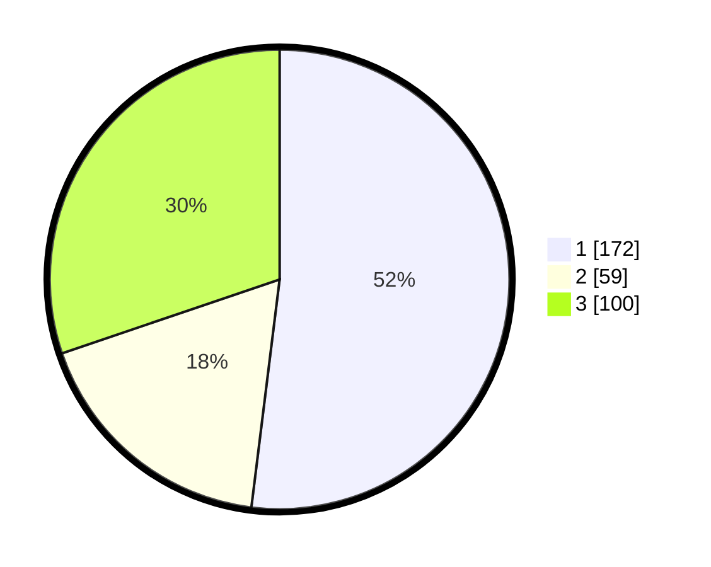

# Hasil

## Grafik

## Tabel

| No. | Nama Paslon    | Suara | Suara (raw) | Persentase |
|:--- |:-------------- | -----:| -----------:| ----------:|
| 1   | ANIES MUHAIMIN | 172   | [172][p-1]  | 51,96      |
| 2   | PRABOWO GIBRAN | 59    | [59][p-2]   | 17,82      |
| 3   | GANJAR MAHFUD  | 100   | [100][p-3]  | 30,21      |

[p-1]: https://github.com/gigit-pemilu/pemilu-2024-99-luar-negeri/blob/main/pilpres/hitung-suara/sub/99-luar-negeri/sub/67-london-inggris/sub/01-london-inggris/sub/0001-london-inggris/sub/003-tps-002/sub/paslon-1.txt
[p-2]: https://github.com/gigit-pemilu/pemilu-2024-99-luar-negeri/blob/main/pilpres/hitung-suara/sub/99-luar-negeri/sub/67-london-inggris/sub/01-london-inggris/sub/0001-london-inggris/sub/003-tps-002/sub/paslon-2.txt
[p-3]: https://github.com/gigit-pemilu/pemilu-2024-99-luar-negeri/blob/main/pilpres/hitung-suara/sub/99-luar-negeri/sub/67-london-inggris/sub/01-london-inggris/sub/0001-london-inggris/sub/003-tps-002/sub/paslon-3.txt

## Foto C Plano

https://sirekap-obj-formc.kpu.go.id/7a8e/pemilu/ppwp/99/67/01/00/01/9967010001003-20240215-014623--b1cae266-46a8-435f-af36-ce7a80fa7ec5.jpg

https://sirekap-obj-formc.kpu.go.id/7a8e/pemilu/ppwp/99/67/01/00/01/9967010001003-20240215-014726--7aa91446-3b84-40a8-a150-92f33f71995d.jpg

https://sirekap-obj-formc.kpu.go.id/7a8e/pemilu/ppwp/99/67/01/00/01/9967010001003-20240215-014756--0d890a25-f838-4585-96f1-4ae92981fe59.jpg

## Metadata

| Key        | Value               |
| ---------- | ------------------- |
| Time Stamp | 2024-02-16 21:01:00 |

## DATA PEMILIH TETAP

Jumlah pemilih dalam DPT: **302**.
 * L: **122**.
 * P: **180**.

## DATA PENGGUNA HAK PILIH

Jumlah pengguna hak pilih dalam DPT: **227**.
 * L: **94**.
 * P: **133**.

Jumlah pengguna hak pilih dalam DPTb: **105**.
 * L: **39**.
 * P: **66**.

Jumlah pengguna hak pilih dalam DPK: **0**.
 * L: **0**.
 * P: **0**.

Jumlah pengguna hak pilih: **332**.
 * L: **133**.
 * P: **199**.

## JUMLAH SUARA SAH DAN TIDAK SAH

JUMLAH SELURUH SUARA SAH: **331**.

JUMLAH SUARA TIDAK SAH: **1**.

JUMLAH SELURUH SUARA SAH DAN SUARA TIDAK SAH: **332**.

