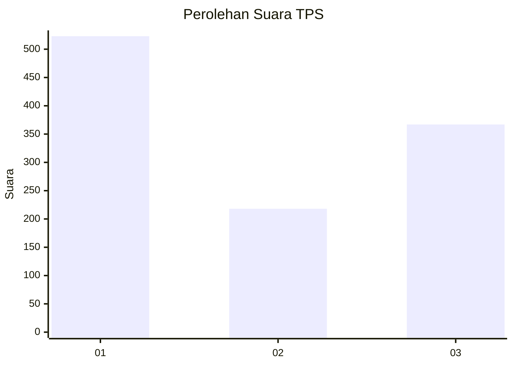
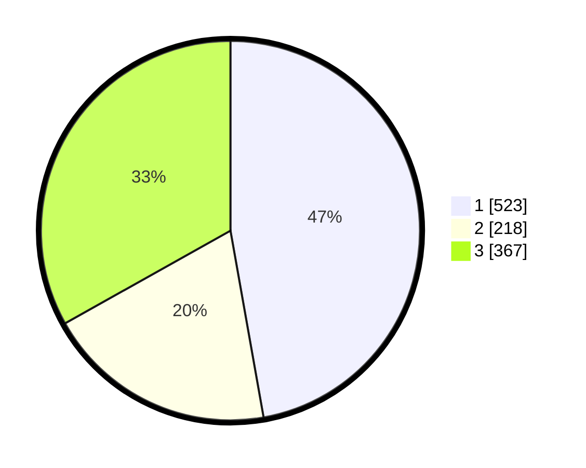

# Hasil

## Grafik

## Tabel

| No. | Nama Paslon    | Suara | Suara (raw) | Persentase |
|:--- |:-------------- | -----:| -----------:| ----------:|
| 1   | ANIES MUHAIMIN | 523   | [523][p-1]  | 47,20      |
| 2   | PRABOWO GIBRAN | 218   | [218][p-2]  | 19,68      |
| 3   | GANJAR MAHFUD  | 367   | [367][p-3]  | 33,12      |

[p-1]: https://github.com/gigit-pemilu/pemilu-2024-99-luar-negeri/blob/main/pilpres/hitung-suara/sub/99-luar-negeri/sub/67-london-inggris/sub/01-london-inggris/sub/0001-london-inggris/sub/004-tps-003/sub/paslon-1.txt
[p-2]: https://github.com/gigit-pemilu/pemilu-2024-99-luar-negeri/blob/main/pilpres/hitung-suara/sub/99-luar-negeri/sub/67-london-inggris/sub/01-london-inggris/sub/0001-london-inggris/sub/004-tps-003/sub/paslon-2.txt
[p-3]: https://github.com/gigit-pemilu/pemilu-2024-99-luar-negeri/blob/main/pilpres/hitung-suara/sub/99-luar-negeri/sub/67-london-inggris/sub/01-london-inggris/sub/0001-london-inggris/sub/004-tps-003/sub/paslon-3.txt

## Foto C Plano

https://sirekap-obj-formc.kpu.go.id/753f/pemilu/ppwp/99/67/01/00/01/9967010001004-20240216-035203--df7d04cd-65ae-4f62-b4a2-4fd94ea4fc38.jpg

https://sirekap-obj-formc.kpu.go.id/753f/pemilu/ppwp/99/67/01/00/01/9967010001004-20240216-031423--88e39d6d-b16a-4a85-ba2b-5ba915ca55ab.jpg

https://sirekap-obj-formc.kpu.go.id/753f/pemilu/ppwp/99/67/01/00/01/9967010001004-20240216-031439--48f9a3de-4395-4e88-aca6-952e2c357978.jpg

## Metadata

| Key        | Value               |
| ---------- | ------------------- |
| Time Stamp | 2024-02-16 22:01:00 |

## DATA PEMILIH TETAP

Jumlah pemilih dalam DPT: **1850**.
 * L: **603**.
 * P: **1247**.

## DATA PENGGUNA HAK PILIH

Jumlah pengguna hak pilih dalam DPT: **411**.
 * L: **131**.
 * P: **280**.

Jumlah pengguna hak pilih dalam DPTb: **656**.
 * L: **247**.
 * P: **409**.

Jumlah pengguna hak pilih dalam DPK: **46**.
 * L: **12**.
 * P: **34**.

Jumlah pengguna hak pilih: **1113**.
 * L: **390**.
 * P: **723**.

## JUMLAH SUARA SAH DAN TIDAK SAH

JUMLAH SELURUH SUARA SAH: **1108**.

JUMLAH SUARA TIDAK SAH: **5**.

JUMLAH SELURUH SUARA SAH DAN SUARA TIDAK SAH: **1113**.

