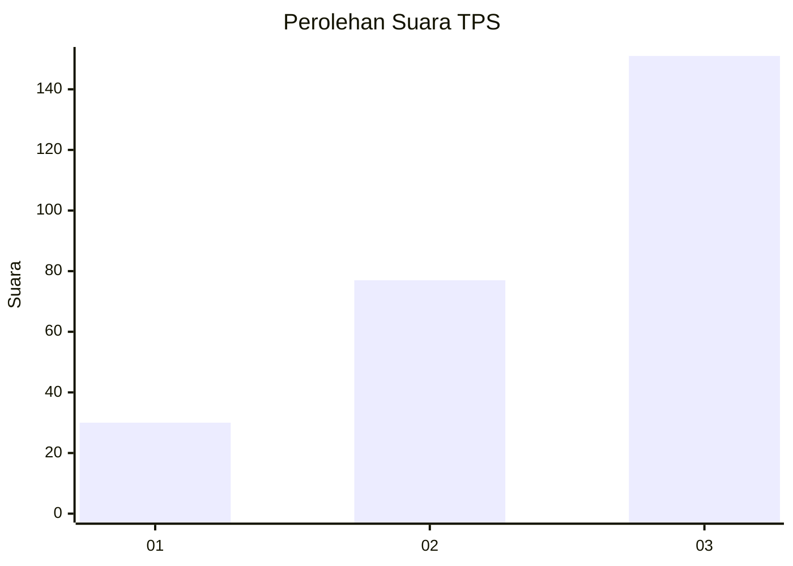
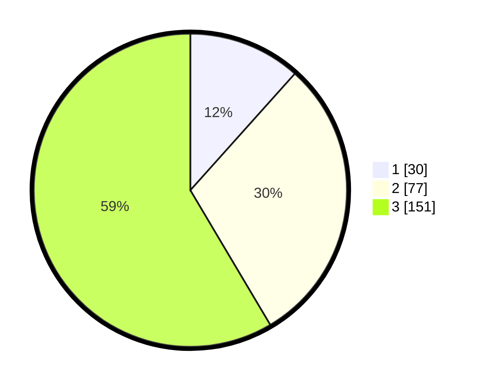

# Hasil

## Grafik

## Tabel

| No. | Nama Paslon    | Suara | Suara (raw) | Persentase |
|:--- |:-------------- | -----:| -----------:| ----------:|
| 1   | ANIES MUHAIMIN | 30    | [30][p-1]   | 11,63      |
| 2   | PRABOWO GIBRAN | 77    | [77][p-2]   | 29,84      |
| 3   | GANJAR MAHFUD  | 151   | [151][p-3]  | 58,53      |

[p-1]: https://github.com/gigit-pemilu/pemilu-2024-99-luar-negeri/blob/main/pilpres/hitung-suara/sub/99-luar-negeri/sub/68-los-angeles-amerika-serikat/sub/01-los-angeles-amerika-serikat/sub/0001-los-angeles-amerika-serikat/sub/001-pos-001/sub/paslon-1.txt
[p-2]: https://github.com/gigit-pemilu/pemilu-2024-99-luar-negeri/blob/main/pilpres/hitung-suara/sub/99-luar-negeri/sub/68-los-angeles-amerika-serikat/sub/01-los-angeles-amerika-serikat/sub/0001-los-angeles-amerika-serikat/sub/001-pos-001/sub/paslon-2.txt
[p-3]: https://github.com/gigit-pemilu/pemilu-2024-99-luar-negeri/blob/main/pilpres/hitung-suara/sub/99-luar-negeri/sub/68-los-angeles-amerika-serikat/sub/01-los-angeles-amerika-serikat/sub/0001-los-angeles-amerika-serikat/sub/001-pos-001/sub/paslon-3.txt

## Foto C Plano

https://sirekap-obj-formc.kpu.go.id/dcc5/pemilu/ppwp/99/68/01/00/01/9968010001001-20240216-132420--ada8aeb2-e2fc-4790-b47a-c10724f6dea4.jpg

https://sirekap-obj-formc.kpu.go.id/dcc5/pemilu/ppwp/99/68/01/00/01/9968010001001-20240216-124850--461d2a19-82e5-4a88-b3fe-c488b8753bf7.jpg

https://sirekap-obj-formc.kpu.go.id/dcc5/pemilu/ppwp/99/68/01/00/01/9968010001001-20240216-124942--f273e05c-a8fa-4752-9a21-e553ac788f3b.jpg

## Metadata

| Key        | Value               |
| ---------- | ------------------- |
| Time Stamp | 2024-02-16 13:30:32 |

## DATA PEMILIH TETAP

Jumlah pemilih dalam DPT: **1647**.
 * L: **374**.
 * P: **1273**.

## DATA PENGGUNA HAK PILIH

Jumlah pengguna hak pilih dalam DPT: **264**.
 * L: **68**.
 * P: **196**.

Jumlah pengguna hak pilih dalam DPTb: **0**.
 * L: **0**.
 * P: **0**.

Jumlah pengguna hak pilih dalam DPK: **0**.
 * L: **0**.
 * P: **0**.

Jumlah pengguna hak pilih: **264**.
 * L: **68**.
 * P: **196**.

## JUMLAH SUARA SAH DAN TIDAK SAH

JUMLAH SELURUH SUARA SAH: **258**.

JUMLAH SUARA TIDAK SAH: **6**.

JUMLAH SELURUH SUARA SAH DAN SUARA TIDAK SAH: **264**.

