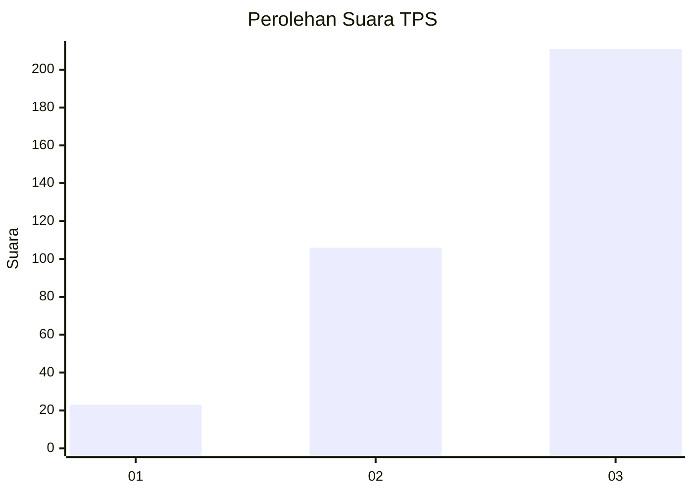
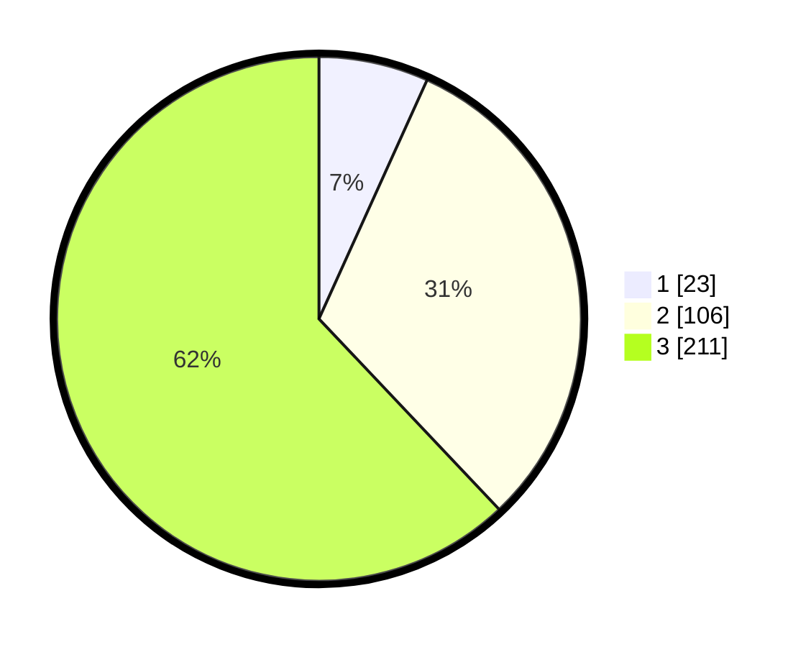

# Hasil

## Grafik

## Tabel

| No. | Nama Paslon    | Suara | Suara (raw) | Persentase |
|:--- |:-------------- | -----:| -----------:| ----------:|
| 1   | ANIES MUHAIMIN | 23    | [23][p-1]   | 6,76       |
| 2   | PRABOWO GIBRAN | 106   | [106][p-2]  | 31,18      |
| 3   | GANJAR MAHFUD  | 211   | [211][p-3]  | 62,06      |

[p-1]: https://github.com/gigit-pemilu/pemilu-2024-99-luar-negeri/blob/main/pilpres/hitung-suara/sub/99-luar-negeri/sub/68-los-angeles-amerika-serikat/sub/01-los-angeles-amerika-serikat/sub/0001-los-angeles-amerika-serikat/sub/002-pos-002/sub/paslon-1.txt
[p-2]: https://github.com/gigit-pemilu/pemilu-2024-99-luar-negeri/blob/main/pilpres/hitung-suara/sub/99-luar-negeri/sub/68-los-angeles-amerika-serikat/sub/01-los-angeles-amerika-serikat/sub/0001-los-angeles-amerika-serikat/sub/002-pos-002/sub/paslon-2.txt
[p-3]: https://github.com/gigit-pemilu/pemilu-2024-99-luar-negeri/blob/main/pilpres/hitung-suara/sub/99-luar-negeri/sub/68-los-angeles-amerika-serikat/sub/01-los-angeles-amerika-serikat/sub/0001-los-angeles-amerika-serikat/sub/002-pos-002/sub/paslon-3.txt

## Foto C Plano

https://sirekap-obj-formc.kpu.go.id/f985/pemilu/ppwp/99/68/01/00/01/9968010001002-20240217-053627--9c5f2ec6-8232-4f02-b66c-970301eb63bb.jpg

https://sirekap-obj-formc.kpu.go.id/f985/pemilu/ppwp/99/68/01/00/01/9968010001002-20240216-115118--518d21dd-494c-43b7-a0b0-724cb1e827ed.jpg

https://sirekap-obj-formc.kpu.go.id/f985/pemilu/ppwp/99/68/01/00/01/9968010001002-20240216-115306--4fe9098d-c2b9-4e6d-abe8-8c17159823b9.jpg

## Metadata

| Key        | Value               |
| ---------- | ------------------- |
| Time Stamp | 2024-02-17 06:00:03 |

## DATA PEMILIH TETAP

Jumlah pemilih dalam DPT: **1685**.
 * L: **772**.
 * P: **913**.

## DATA PENGGUNA HAK PILIH

Jumlah pengguna hak pilih dalam DPT: **335**.
 * L: **156**.
 * P: **179**.

Jumlah pengguna hak pilih dalam DPTb: **27**.
 * L: **11**.
 * P: **16**.

Jumlah pengguna hak pilih dalam DPK: **0**.
 * L: **0**.
 * P: **0**.

Jumlah pengguna hak pilih: **362**.
 * L: **167**.
 * P: **195**.

## JUMLAH SUARA SAH DAN TIDAK SAH

JUMLAH SELURUH SUARA SAH: **340**.

JUMLAH SUARA TIDAK SAH: **22**.

JUMLAH SELURUH SUARA SAH DAN SUARA TIDAK SAH: **362**.

