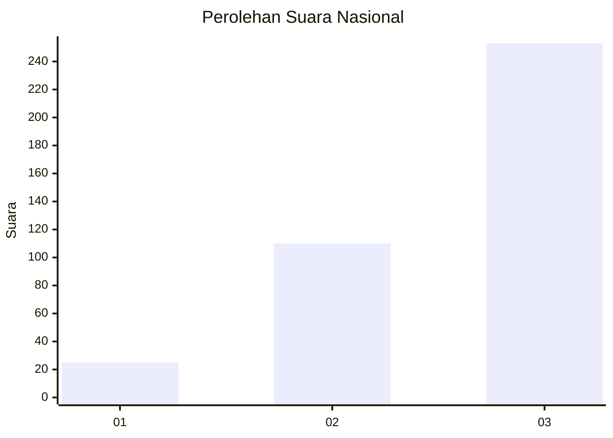
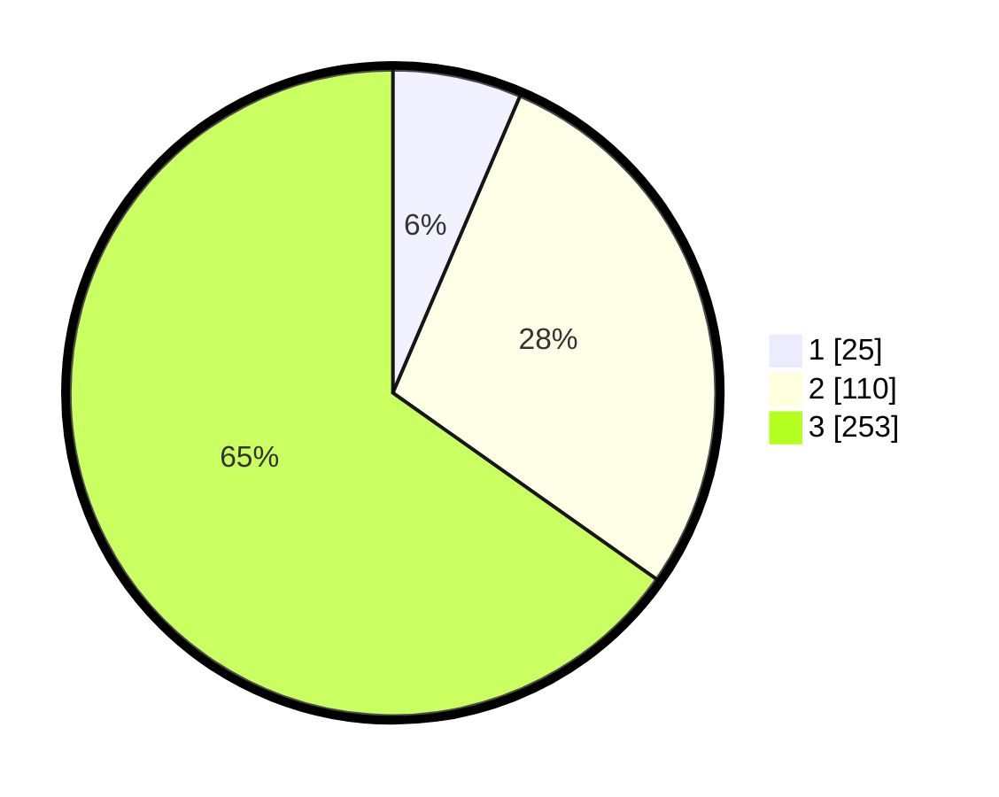

# Hasil

## Grafik

## Tabel

| No. | Nama Paslon    | Suara | Suara (raw) | Persentase |
|:--- |:-------------- | -----:| -----------:| ----------:|
| 1   | ANIES MUHAIMIN | 25    | [25][p-1]   | 6,44       |
| 2   | PRABOWO GIBRAN | 110   | [110][p-2]  | 28,35      |
| 3   | GANJAR MAHFUD  | 253   | [253][p-3]  | 65,21      |

[p-1]: https://github.com/gigit-pemilu/pemilu-2024/blob/main/pilpres/hitung-suara/sub/99-luar-negeri/sub/68-los-angeles-amerika-serikat/sub/01-los-angeles-amerika-serikat/sub/0001-los-angeles-amerika-serikat/sub/003-pos-003/sub/paslon-1.txt
[p-2]: https://github.com/gigit-pemilu/pemilu-2024/blob/main/pilpres/hitung-suara/sub/99-luar-negeri/sub/68-los-angeles-amerika-serikat/sub/01-los-angeles-amerika-serikat/sub/0001-los-angeles-amerika-serikat/sub/003-pos-003/sub/paslon-2.txt
[p-3]: https://github.com/gigit-pemilu/pemilu-2024/blob/main/pilpres/hitung-suara/sub/99-luar-negeri/sub/68-los-angeles-amerika-serikat/sub/01-los-angeles-amerika-serikat/sub/0001-los-angeles-amerika-serikat/sub/003-pos-003/sub/paslon-3.txt

## Foto C Plano

https://sirekap-obj-formc.kpu.go.id/edef/pemilu/ppwp/99/68/01/00/01/9968010001003-20240217-050735--755f9070-60f3-4f75-8a47-60fa03f8932c.jpg

https://sirekap-obj-formc.kpu.go.id/edef/pemilu/ppwp/99/68/01/00/01/9968010001003-20240217-050437--9ed469a4-649a-43ee-981c-09f75db54ea0.jpg

https://sirekap-obj-formc.kpu.go.id/edef/pemilu/ppwp/99/68/01/00/01/9968010001003-20240217-050547--020febd8-cf89-4602-9f01-a744e8c02152.jpg

## Metadata

| Key        | Value               |
| ---------- | ------------------- |
| Time Stamp | 2024-02-17 05:30:02 |

## DATA PEMILIH TETAP

Jumlah pemilih dalam DPT: **1746**.
 * L: **712**.
 * P: **1034**.

## DATA PENGGUNA HAK PILIH

Jumlah pengguna hak pilih dalam DPT: **399**.
 * L: **168**.
 * P: **231**.

Jumlah pengguna hak pilih dalam DPTb: **29**.
 * L: **11**.
 * P: **18**.

Jumlah pengguna hak pilih dalam DPK: **0**.
 * L: **0**.
 * P: **0**.

Jumlah pengguna hak pilih: **428**.
 * L: **179**.
 * P: **249**.

## JUMLAH SUARA SAH DAN TIDAK SAH

JUMLAH SELURUH SUARA SAH: **388**.

JUMLAH SUARA TIDAK SAH: **40**.

JUMLAH SELURUH SUARA SAH DAN SUARA TIDAK SAH: **428**.

