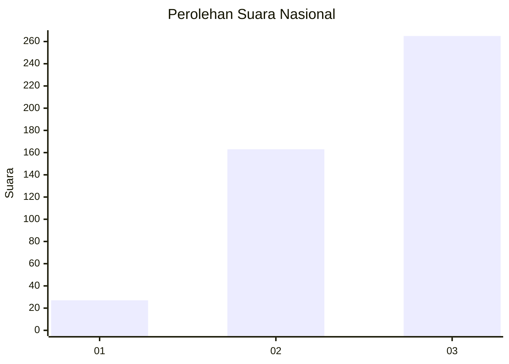
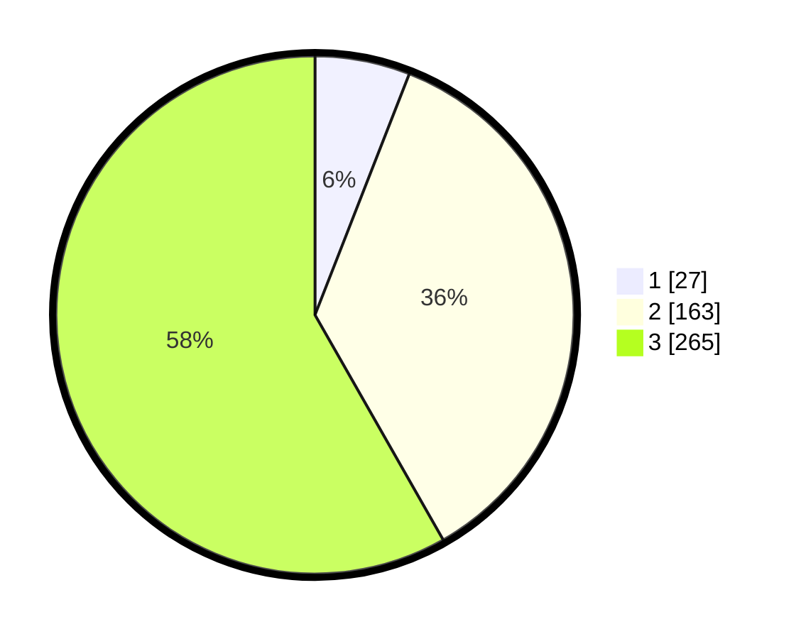

# Hasil

## Grafik

## Tabel

| No. | Nama Paslon    | Suara | Suara (raw) | Persentase |
|:--- |:-------------- | -----:| -----------:| ----------:|
| 1   | ANIES MUHAIMIN | 27    | [27][p-1]   | 5,93       |
| 2   | PRABOWO GIBRAN | 163   | [163][p-2]  | 35,82      |
| 3   | GANJAR MAHFUD  | 265   | [265][p-3]  | 58,24      |

[p-1]: https://github.com/gigit-pemilu/pemilu-2024/blob/main/pilpres/hitung-suara/sub/99-luar-negeri/sub/68-los-angeles-amerika-serikat/sub/01-los-angeles-amerika-serikat/sub/0001-los-angeles-amerika-serikat/sub/004-pos-004/sub/paslon-1.txt
[p-2]: https://github.com/gigit-pemilu/pemilu-2024/blob/main/pilpres/hitung-suara/sub/99-luar-negeri/sub/68-los-angeles-amerika-serikat/sub/01-los-angeles-amerika-serikat/sub/0001-los-angeles-amerika-serikat/sub/004-pos-004/sub/paslon-2.txt
[p-3]: https://github.com/gigit-pemilu/pemilu-2024/blob/main/pilpres/hitung-suara/sub/99-luar-negeri/sub/68-los-angeles-amerika-serikat/sub/01-los-angeles-amerika-serikat/sub/0001-los-angeles-amerika-serikat/sub/004-pos-004/sub/paslon-3.txt

## Foto C Plano

https://sirekap-obj-formc.kpu.go.id/657f/pemilu/ppwp/99/68/01/00/01/9968010001004-20240216-132907--41fa2bf6-3988-4295-aaa1-67d79db92b49.jpg

https://sirekap-obj-formc.kpu.go.id/657f/pemilu/ppwp/99/68/01/00/01/9968010001004-20240216-133727--5e1d1d0b-7785-4b9a-ad13-3681f535237a.jpg

https://sirekap-obj-formc.kpu.go.id/657f/pemilu/ppwp/99/68/01/00/01/9968010001004-20240216-133150--aa1e1150-8c1d-45d7-8bc3-c262ac29d1a9.jpg

## Metadata

| Key        | Value               |
| ---------- | ------------------- |
| Time Stamp | 2024-02-16 14:00:34 |

## DATA PEMILIH TETAP

Jumlah pemilih dalam DPT: **1597**.
 * L: **91**.
 * P: **1506**.

## DATA PENGGUNA HAK PILIH

Jumlah pengguna hak pilih dalam DPT: **446**.
 * L: **30**.
 * P: **416**.

Jumlah pengguna hak pilih dalam DPTb: **19**.
 * L: **10**.
 * P: **9**.

Jumlah pengguna hak pilih dalam DPK: **0**.
 * L: **0**.
 * P: **0**.

Jumlah pengguna hak pilih: **465**.
 * L: **40**.
 * P: **425**.

## JUMLAH SUARA SAH DAN TIDAK SAH

JUMLAH SELURUH SUARA SAH: **455**.

JUMLAH SUARA TIDAK SAH: **39**.

JUMLAH SELURUH SUARA SAH DAN SUARA TIDAK SAH: **494**.

