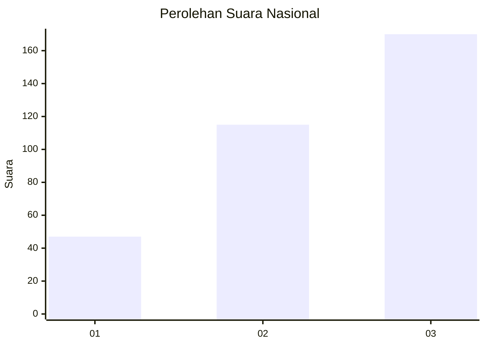
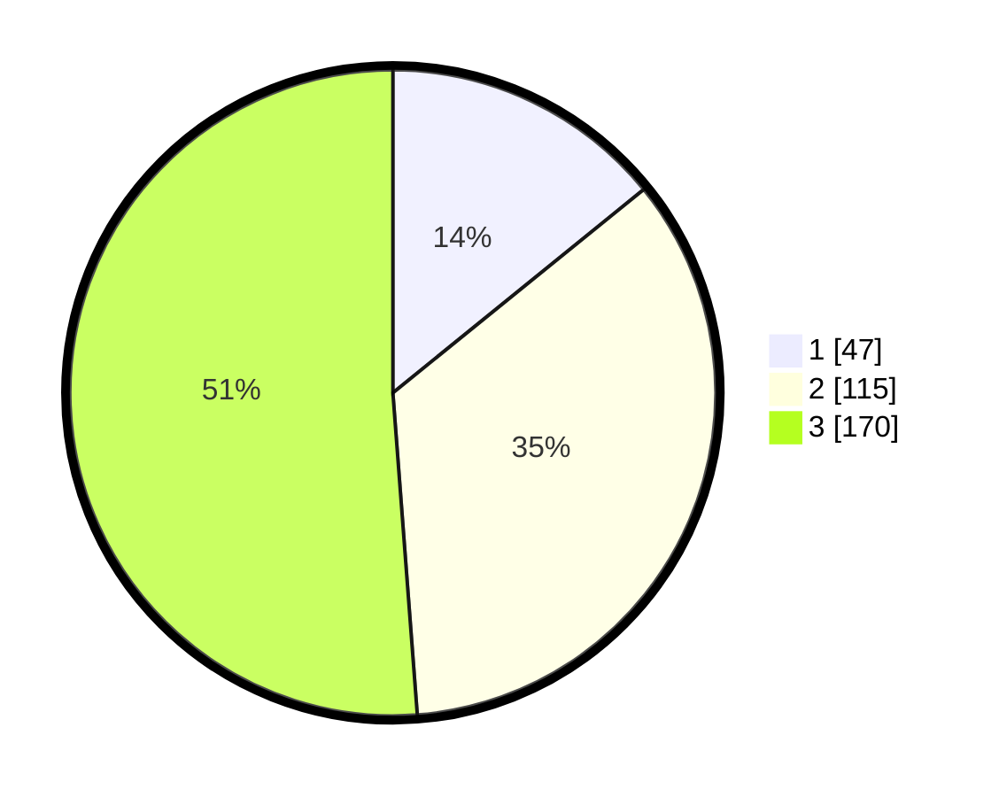

# Hasil

## Grafik

## Tabel

| No. | Nama Paslon    | Suara | Suara (raw) | Persentase |
|:--- |:-------------- | -----:| -----------:| ----------:|
| 1   | ANIES MUHAIMIN | 47    | [47][p-1]   | 14,16      |
| 2   | PRABOWO GIBRAN | 115   | [115][p-2]  | 34,64      |
| 3   | GANJAR MAHFUD  | 170   | [170][p-3]  | 51,20      |

[p-1]: https://github.com/gigit-pemilu/pemilu-2024/blob/main/pilpres/hitung-suara/sub/99-luar-negeri/sub/68-los-angeles-amerika-serikat/sub/01-los-angeles-amerika-serikat/sub/0001-los-angeles-amerika-serikat/sub/005-pos-005/sub/paslon-1.txt
[p-2]: https://github.com/gigit-pemilu/pemilu-2024/blob/main/pilpres/hitung-suara/sub/99-luar-negeri/sub/68-los-angeles-amerika-serikat/sub/01-los-angeles-amerika-serikat/sub/0001-los-angeles-amerika-serikat/sub/005-pos-005/sub/paslon-2.txt
[p-3]: https://github.com/gigit-pemilu/pemilu-2024/blob/main/pilpres/hitung-suara/sub/99-luar-negeri/sub/68-los-angeles-amerika-serikat/sub/01-los-angeles-amerika-serikat/sub/0001-los-angeles-amerika-serikat/sub/005-pos-005/sub/paslon-3.txt

## Foto C Plano

https://sirekap-obj-formc.kpu.go.id/0b96/pemilu/ppwp/99/68/01/00/01/9968010001005-20240216-144031--dadf8754-452e-4ca6-a44f-c3dd8c7d7e79.jpg

https://sirekap-obj-formc.kpu.go.id/0b96/pemilu/ppwp/99/68/01/00/01/9968010001005-20240216-142854--3b988c97-8d59-49e4-b4d9-8cd72645d946.jpg

https://sirekap-obj-formc.kpu.go.id/0b96/pemilu/ppwp/99/68/01/00/01/9968010001005-20240216-143115--137f5c68-7909-44b7-a10e-f34b968fa26a.jpg

## Metadata

| Key        | Value               |
| ---------- | ------------------- |
| Time Stamp | 2024-02-17 05:30:02 |

## DATA PEMILIH TETAP

Jumlah pemilih dalam DPT: **1538**.
 * L: **602**.
 * P: **936**.

## DATA PENGGUNA HAK PILIH

Jumlah pengguna hak pilih dalam DPT: **350**.
 * L: **148**.
 * P: **202**.

Jumlah pengguna hak pilih dalam DPTb: **0**.
 * L: **0**.
 * P: **0**.

Jumlah pengguna hak pilih dalam DPK: **0**.
 * L: **0**.
 * P: **0**.

Jumlah pengguna hak pilih: **350**.
 * L: **148**.
 * P: **202**.

## JUMLAH SUARA SAH DAN TIDAK SAH

JUMLAH SELURUH SUARA SAH: **332**.

JUMLAH SUARA TIDAK SAH: **18**.

JUMLAH SELURUH SUARA SAH DAN SUARA TIDAK SAH: **350**.

