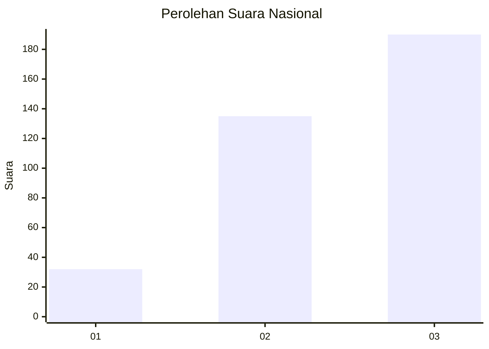
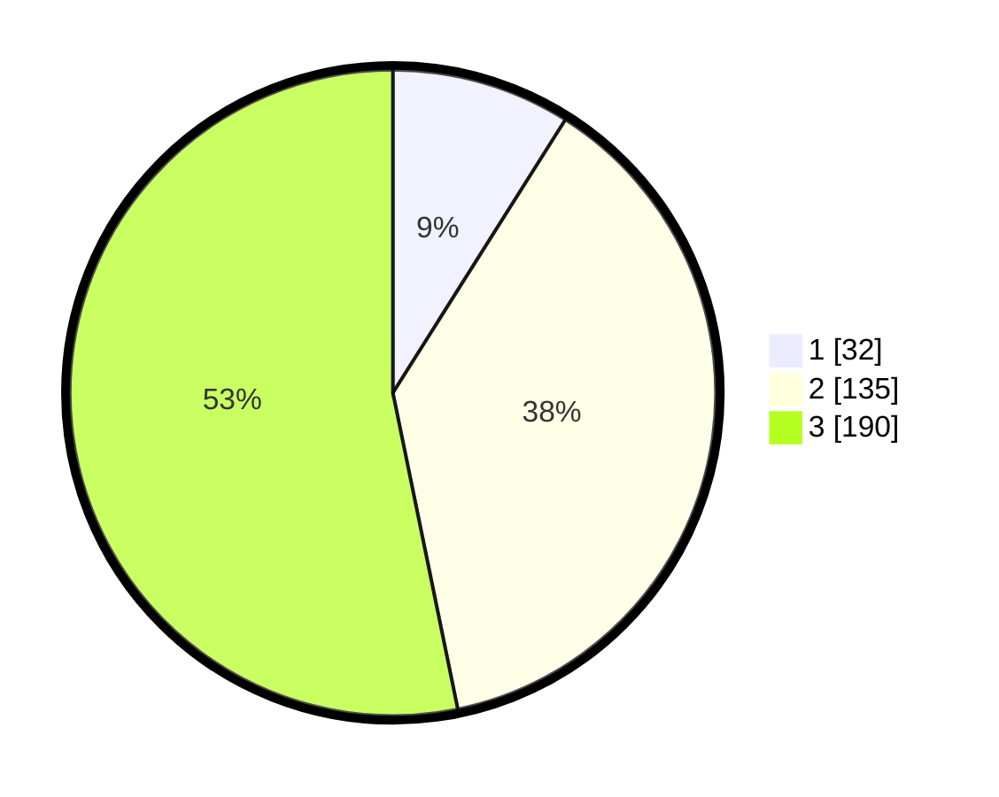

# Hasil

## Grafik

## Tabel

| No. | Nama Paslon    | Suara | Suara (raw) | Persentase |
|:--- |:-------------- | -----:| -----------:| ----------:|
| 1   | ANIES MUHAIMIN | 32    | [32][p-1]   | 8,96       |
| 2   | PRABOWO GIBRAN | 135   | [135][p-2]  | 37,82      |
| 3   | GANJAR MAHFUD  | 190   | [190][p-3]  | 53,22      |

[p-1]: https://github.com/gigit-pemilu/pemilu-2024/blob/main/pilpres/hitung-suara/sub/99-luar-negeri/sub/68-los-angeles-amerika-serikat/sub/01-los-angeles-amerika-serikat/sub/0001-los-angeles-amerika-serikat/sub/007-pos-007/sub/paslon-1.txt
[p-2]: https://github.com/gigit-pemilu/pemilu-2024/blob/main/pilpres/hitung-suara/sub/99-luar-negeri/sub/68-los-angeles-amerika-serikat/sub/01-los-angeles-amerika-serikat/sub/0001-los-angeles-amerika-serikat/sub/007-pos-007/sub/paslon-2.txt
[p-3]: https://github.com/gigit-pemilu/pemilu-2024/blob/main/pilpres/hitung-suara/sub/99-luar-negeri/sub/68-los-angeles-amerika-serikat/sub/01-los-angeles-amerika-serikat/sub/0001-los-angeles-amerika-serikat/sub/007-pos-007/sub/paslon-3.txt

## Foto C Plano

https://sirekap-obj-formc.kpu.go.id/71df/pemilu/ppwp/99/68/01/00/01/9968010001007-20240217-113841--3bc48dd4-a70d-45b5-9ef1-d3c4035a3dfd.jpg

https://sirekap-obj-formc.kpu.go.id/71df/pemilu/ppwp/99/68/01/00/01/9968010001007-20240217-114414--e80a9e57-1685-44e0-80b9-caf07da7e2bd.jpg

https://sirekap-obj-formc.kpu.go.id/71df/pemilu/ppwp/99/68/01/00/01/9968010001007-20240217-114608--e3a60da2-1168-403f-8c94-8af132c69980.jpg

## Metadata

| Key        | Value               |
| ---------- | ------------------- |
| Time Stamp | 2024-02-17 12:00:00 |

## DATA PEMILIH TETAP

Jumlah pemilih dalam DPT: **1568**.
 * L: **708**.
 * P: **860**.

## DATA PENGGUNA HAK PILIH

Jumlah pengguna hak pilih dalam DPT: **412**.
 * L: **163**.
 * P: **249**.

Jumlah pengguna hak pilih dalam DPTb: **0**.
 * L: **0**.
 * P: **0**.

Jumlah pengguna hak pilih dalam DPK: **0**.
 * L: **0**.
 * P: **0**.

Jumlah pengguna hak pilih: **412**.
 * L: **163**.
 * P: **249**.

## JUMLAH SUARA SAH DAN TIDAK SAH

JUMLAH SELURUH SUARA SAH: **357**.

JUMLAH SUARA TIDAK SAH: **55**.

JUMLAH SELURUH SUARA SAH DAN SUARA TIDAK SAH: **412**.

