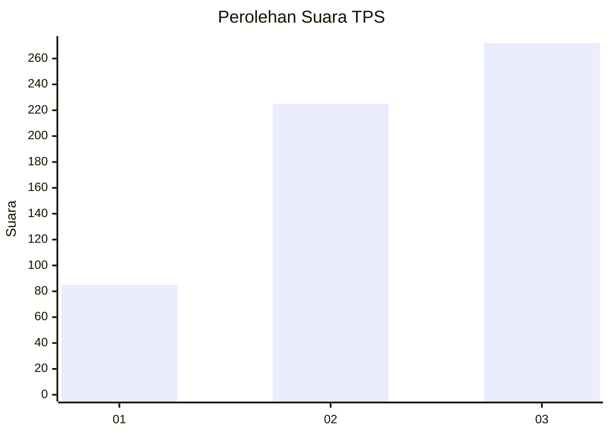
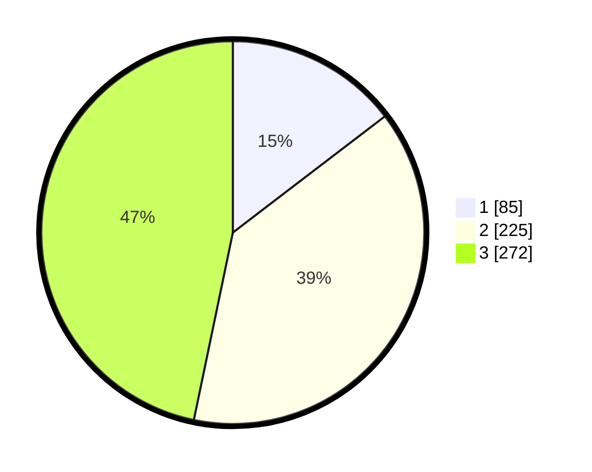

# Hasil

## Grafik

## Tabel

| No. | Nama Paslon    | Suara | Suara (raw) | Persentase |
|:--- |:-------------- | -----:| -----------:| ----------:|
| 1   | ANIES MUHAIMIN | 85    | [85][p-1]   | 14,60      |
| 2   | PRABOWO GIBRAN | 225   | [225][p-2]  | 38,66      |
| 3   | GANJAR MAHFUD  | 272   | [272][p-3]  | 46,74      |

[p-1]: https://github.com/gigit-pemilu/pemilu-2024-99-luar-negeri/blob/main/pilpres/hitung-suara/sub/99-luar-negeri/sub/69-madrid-spanyol/sub/01-madrid-spanyol/sub/0001-madrid-spanyol/sub/001-pos-001/sub/paslon-1.txt
[p-2]: https://github.com/gigit-pemilu/pemilu-2024-99-luar-negeri/blob/main/pilpres/hitung-suara/sub/99-luar-negeri/sub/69-madrid-spanyol/sub/01-madrid-spanyol/sub/0001-madrid-spanyol/sub/001-pos-001/sub/paslon-2.txt
[p-3]: https://github.com/gigit-pemilu/pemilu-2024-99-luar-negeri/blob/main/pilpres/hitung-suara/sub/99-luar-negeri/sub/69-madrid-spanyol/sub/01-madrid-spanyol/sub/0001-madrid-spanyol/sub/001-pos-001/sub/paslon-3.txt

## Foto C Plano

https://sirekap-obj-formc.kpu.go.id/d726/pemilu/ppwp/99/69/01/00/01/9969010001001-20240216-221949--87e4669f-445b-4896-906d-1e6589dc064b.jpg

https://sirekap-obj-formc.kpu.go.id/d726/pemilu/ppwp/99/69/01/00/01/9969010001001-20240216-221950--92dc2075-08cf-44c5-8655-f5fa200b3414.jpg

https://sirekap-obj-formc.kpu.go.id/d726/pemilu/ppwp/99/69/01/00/01/9969010001001-20240216-221950--d59caf88-df0d-466d-9d60-d34c11f2c079.jpg

## Metadata

| Key        | Value               |
| ---------- | ------------------- |
| Time Stamp | 2024-02-17 19:00:04 |

## DATA PEMILIH TETAP

Jumlah pemilih dalam DPT: **1217**.
 * L: **702**.
 * P: **515**.

## DATA PENGGUNA HAK PILIH

Jumlah pengguna hak pilih dalam DPT: **580**.
 * L: **292**.
 * P: **288**.

Jumlah pengguna hak pilih dalam DPTb: **27**.
 * L: **13**.
 * P: **14**.

Jumlah pengguna hak pilih dalam DPK: **0**.
 * L: **0**.
 * P: **0**.

Jumlah pengguna hak pilih: **607**.
 * L: **305**.
 * P: **302**.

## JUMLAH SUARA SAH DAN TIDAK SAH

JUMLAH SELURUH SUARA SAH: **582**.

JUMLAH SUARA TIDAK SAH: **25**.

JUMLAH SELURUH SUARA SAH DAN SUARA TIDAK SAH: **607**.

