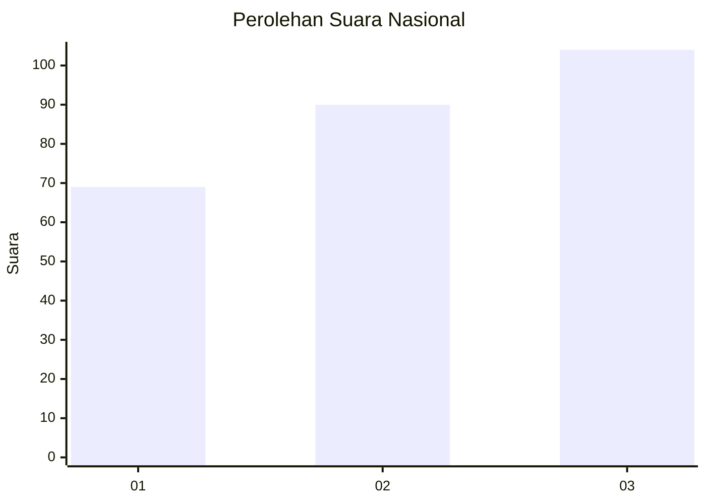
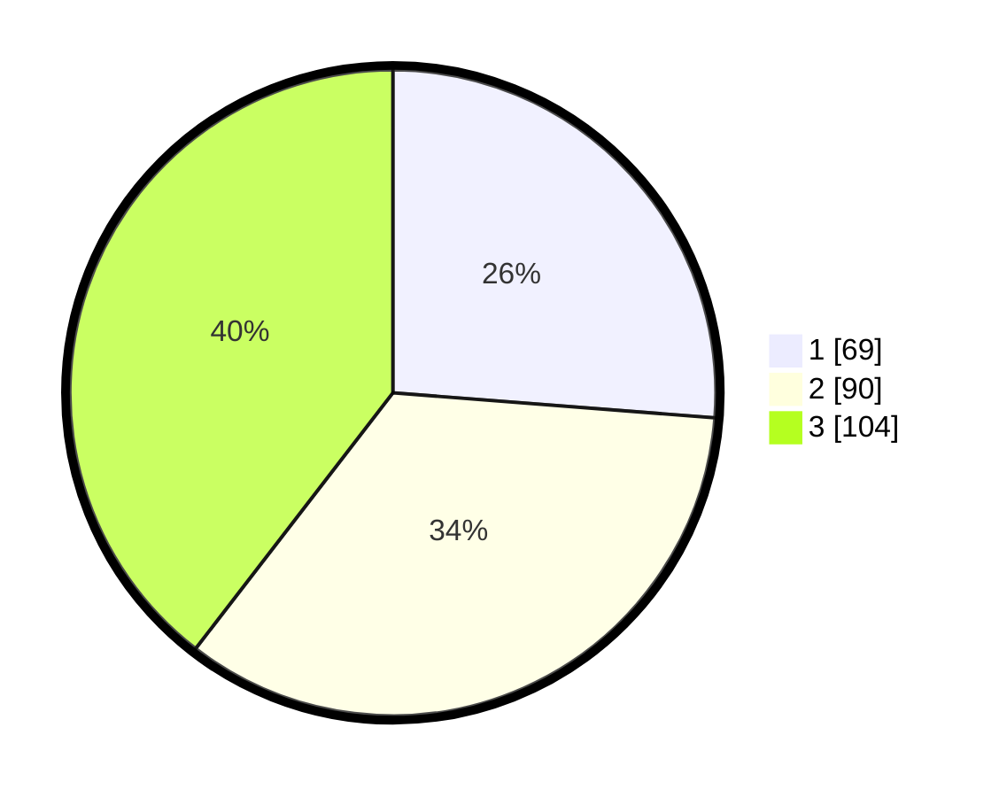

# Hasil

## Grafik

## Tabel

| No. | Nama Paslon    | Suara | Suara (raw) | Persentase |
|:--- |:-------------- | -----:| -----------:| ----------:|
| 1   | ANIES MUHAIMIN | 69    | [69][p-1]   | 26,24      |
| 2   | PRABOWO GIBRAN | 90    | [90][p-2]   | 34,22      |
| 3   | GANJAR MAHFUD  | 104   | [104][p-3]  | 39,54      |

[p-1]: https://github.com/gigit-pemilu/pemilu-2024/blob/main/pilpres/hitung-suara/sub/99-luar-negeri/sub/69-madrid-spanyol/sub/01-madrid-spanyol/sub/0001-madrid-spanyol/sub/002-tps-001/sub/paslon-1.txt
[p-2]: https://github.com/gigit-pemilu/pemilu-2024/blob/main/pilpres/hitung-suara/sub/99-luar-negeri/sub/69-madrid-spanyol/sub/01-madrid-spanyol/sub/0001-madrid-spanyol/sub/002-tps-001/sub/paslon-2.txt
[p-3]: https://github.com/gigit-pemilu/pemilu-2024/blob/main/pilpres/hitung-suara/sub/99-luar-negeri/sub/69-madrid-spanyol/sub/01-madrid-spanyol/sub/0001-madrid-spanyol/sub/002-tps-001/sub/paslon-3.txt

## Foto C Plano

https://sirekap-obj-formc.kpu.go.id/21dd/pemilu/ppwp/99/69/01/00/01/9969010001002-20240216-074659--a6a9d5d2-c33e-4bd9-8061-61a6a5118b40.jpg

https://sirekap-obj-formc.kpu.go.id/21dd/pemilu/ppwp/99/69/01/00/01/9969010001002-20240216-074701--6c998b30-b310-439f-94aa-8331c1fe78bc.jpg

https://sirekap-obj-formc.kpu.go.id/21dd/pemilu/ppwp/99/69/01/00/01/9969010001002-20240216-074700--1767ac44-22f5-41fa-958a-8cafe1b614ba.jpg

## Metadata

| Key        | Value               |
| ---------- | ------------------- |
| Time Stamp | 2024-02-17 19:00:04 |

## DATA PEMILIH TETAP

Jumlah pemilih dalam DPT: **350**.
 * L: **125**.
 * P: **225**.

## DATA PENGGUNA HAK PILIH

Jumlah pengguna hak pilih dalam DPT: **199**.
 * L: **75**.
 * P: **124**.

Jumlah pengguna hak pilih dalam DPTb: **54**.
 * L: **21**.
 * P: **33**.

Jumlah pengguna hak pilih dalam DPK: **14**.
 * L: **4**.
 * P: **10**.

Jumlah pengguna hak pilih: **267**.
 * L: **100**.
 * P: **167**.

## JUMLAH SUARA SAH DAN TIDAK SAH

JUMLAH SELURUH SUARA SAH: **263**.

JUMLAH SUARA TIDAK SAH: **4**.

JUMLAH SELURUH SUARA SAH DAN SUARA TIDAK SAH: **267**.

