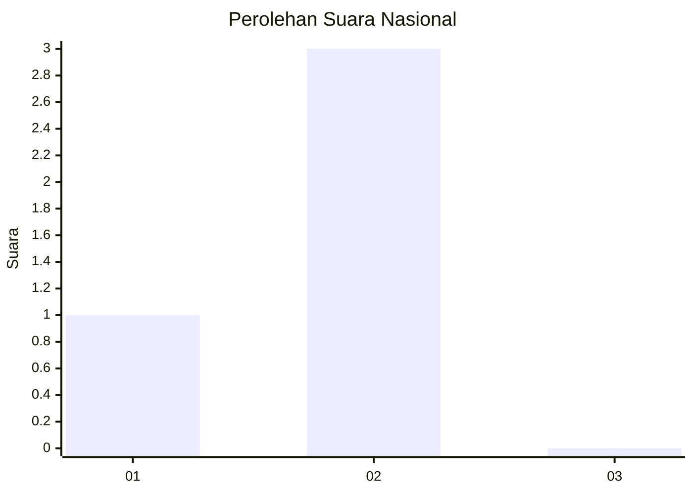
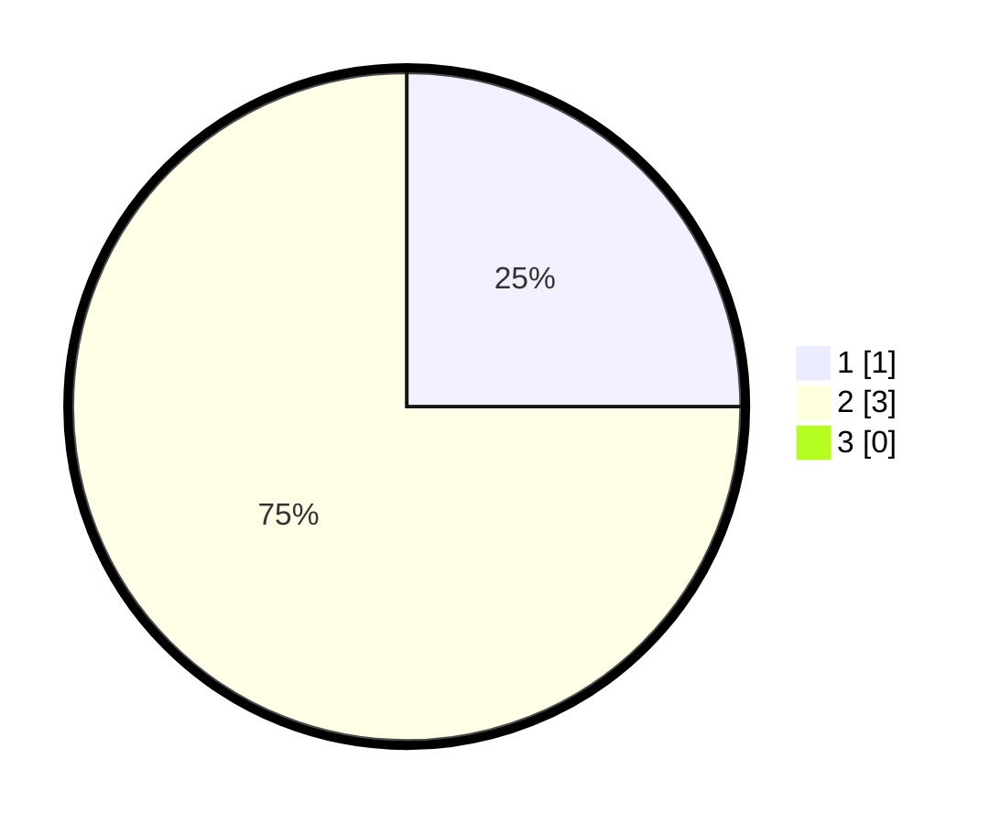

# Hasil

## Grafik

## Tabel

| No. | Nama Paslon    | Suara | Suara (raw) | Persentase |
|:--- |:-------------- | -----:| -----------:| ----------:|
| 1   | ANIES MUHAIMIN | 1     | [1][p-1]    | 25,00      |
| 2   | PRABOWO GIBRAN | 3     | [3][p-2]    | 75,00      |
| 3   | GANJAR MAHFUD  | 0     | [0][p-3]    | 0,00       |

[p-1]: https://github.com/gigit-pemilu/pemilu-2024/blob/main/pilpres/hitung-suara/sub/99-luar-negeri/sub/70-manama-bahrain/sub/01-manama-bahrain/sub/0001-manama-bahrain/sub/001-pos-001/sub/paslon-1.txt
[p-2]: https://github.com/gigit-pemilu/pemilu-2024/blob/main/pilpres/hitung-suara/sub/99-luar-negeri/sub/70-manama-bahrain/sub/01-manama-bahrain/sub/0001-manama-bahrain/sub/001-pos-001/sub/paslon-2.txt
[p-3]: https://github.com/gigit-pemilu/pemilu-2024/blob/main/pilpres/hitung-suara/sub/99-luar-negeri/sub/70-manama-bahrain/sub/01-manama-bahrain/sub/0001-manama-bahrain/sub/001-pos-001/sub/paslon-3.txt

## Foto C Plano

https://sirekap-obj-formc.kpu.go.id/6fa7/pemilu/ppwp/99/70/01/00/01/9970010001001-20240215-201026--6d111376-6120-4f6e-ba97-e15f4f7620d1.jpg

https://sirekap-obj-formc.kpu.go.id/6fa7/pemilu/ppwp/99/70/01/00/01/9970010001001-20240215-174021--09227c79-88f9-48bc-99a2-b61088d666f6.jpg

https://sirekap-obj-formc.kpu.go.id/6fa7/pemilu/ppwp/99/70/01/00/01/9970010001001-20240215-174158--5c09e7e5-1f7c-4667-9cbc-e97685ba286e.jpg

## Metadata

| Key        | Value               |
| ---------- | ------------------- |
| Time Stamp | 2024-02-16 16:25:10 |

## DATA PEMILIH TETAP

Jumlah pemilih dalam DPT: **6**.
 * L: **1**.
 * P: **5**.

## DATA PENGGUNA HAK PILIH

Jumlah pengguna hak pilih dalam DPT: **4**.
 * L: **1**.
 * P: **3**.

Jumlah pengguna hak pilih dalam DPTb: **0**.
 * L: **0**.
 * P: **0**.

Jumlah pengguna hak pilih dalam DPK: **0**.
 * L: **0**.
 * P: **0**.

Jumlah pengguna hak pilih: **4**.
 * L: **1**.
 * P: **3**.

## JUMLAH SUARA SAH DAN TIDAK SAH

JUMLAH SELURUH SUARA SAH: **4**.

JUMLAH SUARA TIDAK SAH: **0**.

JUMLAH SELURUH SUARA SAH DAN SUARA TIDAK SAH: **4**.

