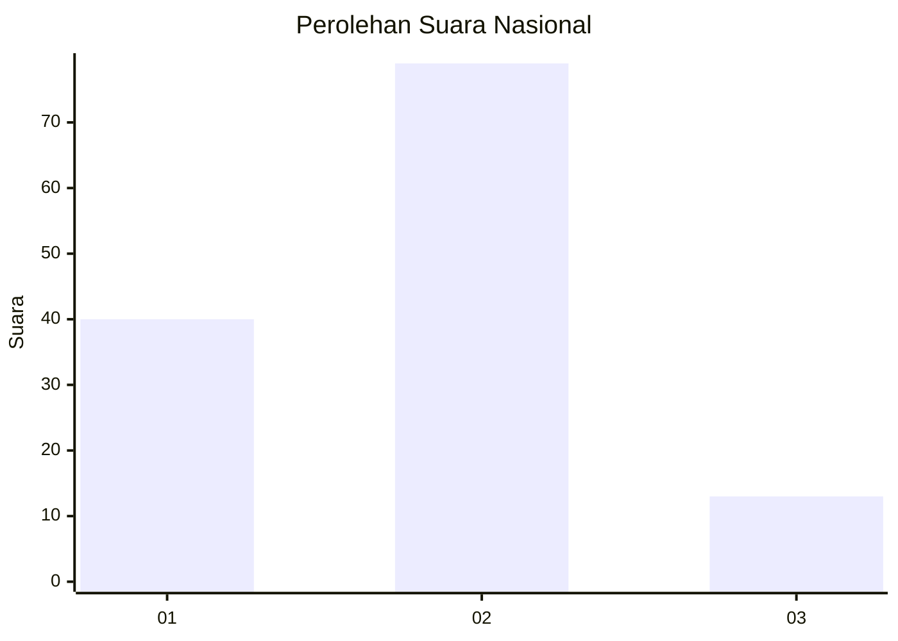
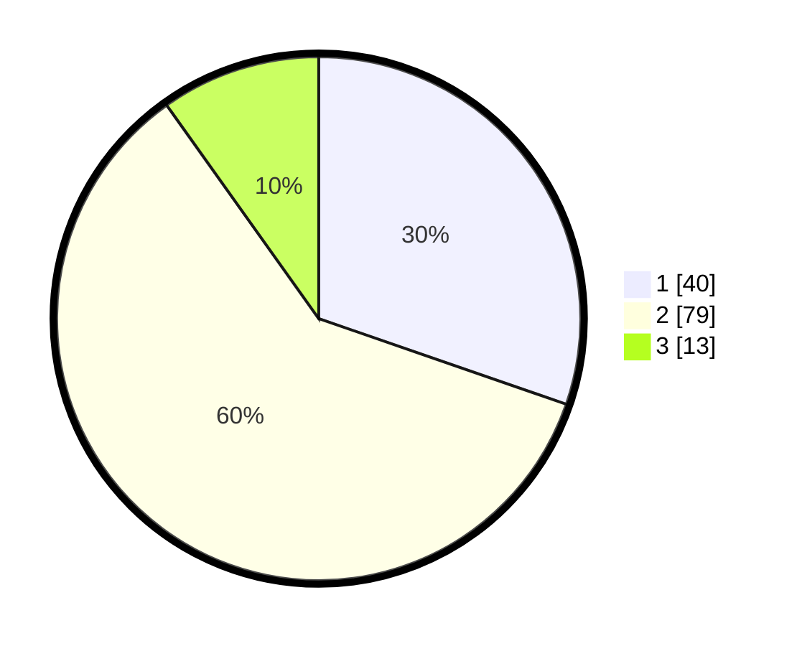

# Hasil

## Grafik

## Tabel

| No. | Nama Paslon    | Suara | Suara (raw) | Persentase |
|:--- |:-------------- | -----:| -----------:| ----------:|
| 1   | ANIES MUHAIMIN | 40    | [40][p-1]   | 30,30      |
| 2   | PRABOWO GIBRAN | 79    | [79][p-2]   | 59,85      |
| 3   | GANJAR MAHFUD  | 13    | [13][p-3]   | 9,85       |

[p-1]: https://github.com/gigit-pemilu/pemilu-2024/blob/main/pilpres/hitung-suara/sub/99-luar-negeri/sub/70-manama-bahrain/sub/01-manama-bahrain/sub/0001-manama-bahrain/sub/002-tps-001/sub/paslon-1.txt
[p-2]: https://github.com/gigit-pemilu/pemilu-2024/blob/main/pilpres/hitung-suara/sub/99-luar-negeri/sub/70-manama-bahrain/sub/01-manama-bahrain/sub/0001-manama-bahrain/sub/002-tps-001/sub/paslon-2.txt
[p-3]: https://github.com/gigit-pemilu/pemilu-2024/blob/main/pilpres/hitung-suara/sub/99-luar-negeri/sub/70-manama-bahrain/sub/01-manama-bahrain/sub/0001-manama-bahrain/sub/002-tps-001/sub/paslon-3.txt

## Foto C Plano

https://sirekap-obj-formc.kpu.go.id/c7dc/pemilu/ppwp/99/70/01/00/01/9970010001002-20240215-164002--b1adc87c-0797-4cde-9334-9e07dc5f2a31.jpg

https://sirekap-obj-formc.kpu.go.id/c7dc/pemilu/ppwp/99/70/01/00/01/9970010001002-20240215-164514--2033fd0d-1fc2-4f92-92ee-0198dce01e92.jpg

https://sirekap-obj-formc.kpu.go.id/c7dc/pemilu/ppwp/99/70/01/00/01/9970010001002-20240215-164655--79f3f918-b684-4ab5-89e2-bfb2163fd22d.jpg

## Metadata

| Key        | Value               |
| ---------- | ------------------- |
| Time Stamp | 2024-02-15 20:00:44 |

## DATA PEMILIH TETAP

Jumlah pemilih dalam DPT: **446**.
 * L: **121**.
 * P: **325**.

## DATA PENGGUNA HAK PILIH

Jumlah pengguna hak pilih dalam DPT: **77**.
 * L: **29**.
 * P: **48**.

Jumlah pengguna hak pilih dalam DPTb: **11**.
 * L: **3**.
 * P: **8**.

Jumlah pengguna hak pilih dalam DPK: **45**.
 * L: **5**.
 * P: **40**.

Jumlah pengguna hak pilih: **133**.
 * L: **37**.
 * P: **96**.

## JUMLAH SUARA SAH DAN TIDAK SAH

JUMLAH SELURUH SUARA SAH: **132**.

JUMLAH SUARA TIDAK SAH: **1**.

JUMLAH SELURUH SUARA SAH DAN SUARA TIDAK SAH: **133**.

