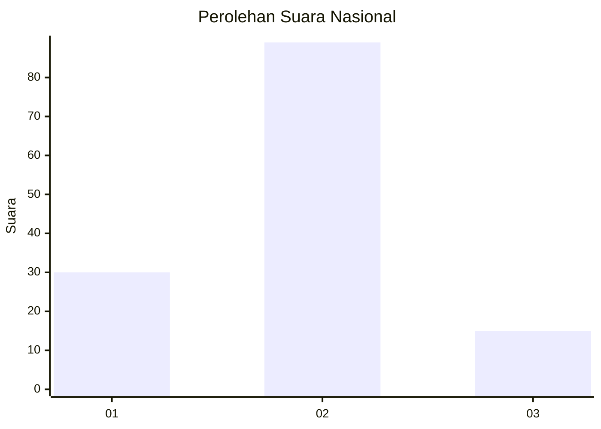
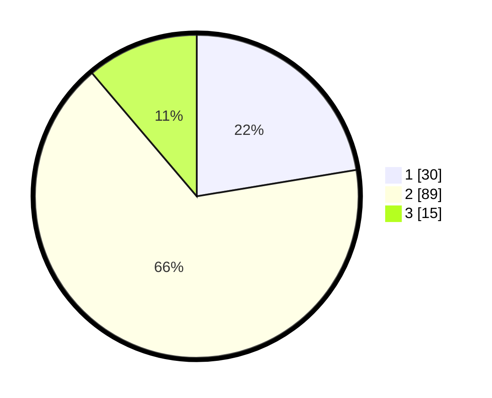

# Hasil

## Grafik

## Tabel

| No. | Nama Paslon    | Suara | Suara (raw) | Persentase |
|:--- |:-------------- | -----:| -----------:| ----------:|
| 1   | ANIES MUHAIMIN | 30    | [30][p-1]   | 22,39      |
| 2   | PRABOWO GIBRAN | 89    | [89][p-2]   | 66,42      |
| 3   | GANJAR MAHFUD  | 15    | [15][p-3]   | 11,19      |

[p-1]: https://github.com/gigit-pemilu/pemilu-2024/blob/main/pilpres/hitung-suara/sub/99-luar-negeri/sub/70-manama-bahrain/sub/01-manama-bahrain/sub/0001-manama-bahrain/sub/003-tps-002/sub/paslon-1.txt
[p-2]: https://github.com/gigit-pemilu/pemilu-2024/blob/main/pilpres/hitung-suara/sub/99-luar-negeri/sub/70-manama-bahrain/sub/01-manama-bahrain/sub/0001-manama-bahrain/sub/003-tps-002/sub/paslon-2.txt
[p-3]: https://github.com/gigit-pemilu/pemilu-2024/blob/main/pilpres/hitung-suara/sub/99-luar-negeri/sub/70-manama-bahrain/sub/01-manama-bahrain/sub/0001-manama-bahrain/sub/003-tps-002/sub/paslon-3.txt

## Foto C Plano

https://sirekap-obj-formc.kpu.go.id/ad82/pemilu/ppwp/99/70/01/00/01/9970010001003-20240215-025221--33c58329-1f61-48b7-a1a5-0bbd08f63322.jpg

https://sirekap-obj-formc.kpu.go.id/ad82/pemilu/ppwp/99/70/01/00/01/9970010001003-20240215-025309--827f935a-8af4-48bb-8ff3-830ec08ae9f1.jpg

https://sirekap-obj-formc.kpu.go.id/ad82/pemilu/ppwp/99/70/01/00/01/9970010001003-20240215-025539--7bada90b-a183-4abe-bd1e-4d9923066f26.jpg

## Metadata

| Key        | Value               |
| ---------- | ------------------- |
| Time Stamp | 2024-02-16 21:01:00 |

## DATA PEMILIH TETAP

Jumlah pemilih dalam DPT: **447**.
 * L: **65**.
 * P: **382**.

## DATA PENGGUNA HAK PILIH

Jumlah pengguna hak pilih dalam DPT: **79**.
 * L: **19**.
 * P: **60**.

Jumlah pengguna hak pilih dalam DPTb: **20**.
 * L: **7**.
 * P: **13**.

Jumlah pengguna hak pilih dalam DPK: **41**.
 * L: **2**.
 * P: **39**.

Jumlah pengguna hak pilih: **140**.
 * L: **28**.
 * P: **112**.

## JUMLAH SUARA SAH DAN TIDAK SAH

JUMLAH SELURUH SUARA SAH: **134**.

JUMLAH SUARA TIDAK SAH: **6**.

JUMLAH SELURUH SUARA SAH DAN SUARA TIDAK SAH: **140**.

