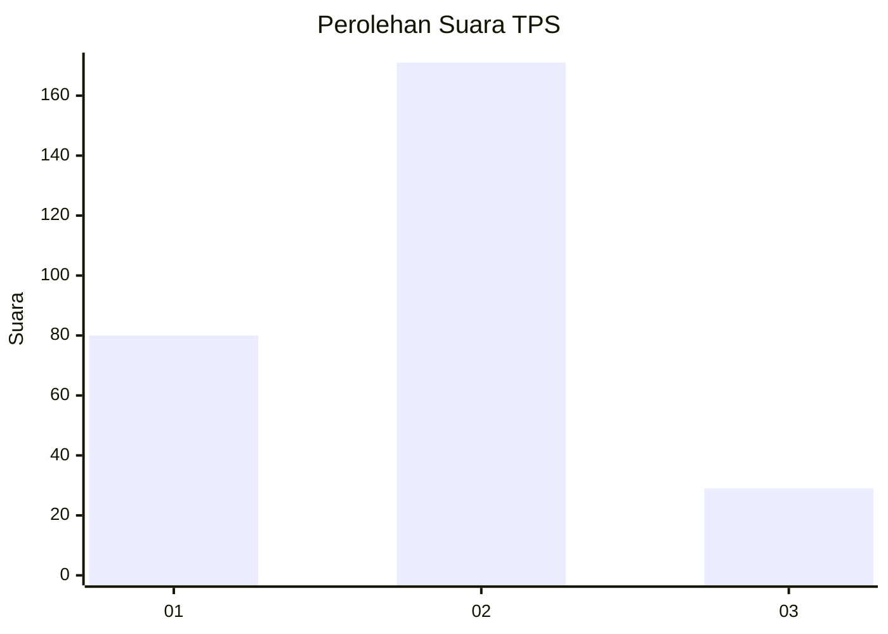
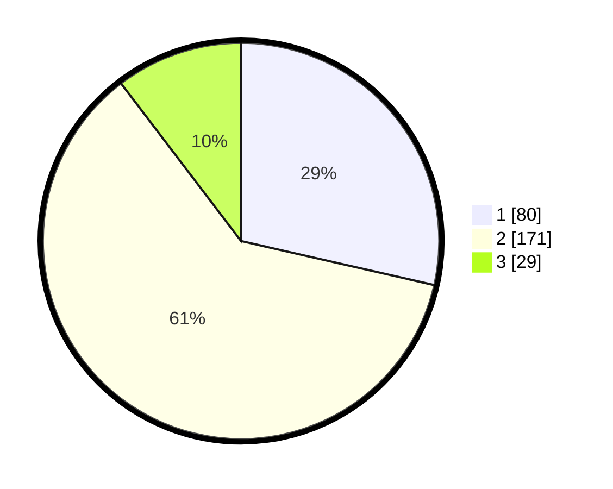

# Hasil

## Grafik

## Tabel

| No. | Nama Paslon    | Suara | Suara (raw) | Persentase |
|:--- |:-------------- | -----:| -----------:| ----------:|
| 1   | ANIES MUHAIMIN | 80    | [80][p-1]   | 28,57      |
| 2   | PRABOWO GIBRAN | 171   | [171][p-2]  | 61,07      |
| 3   | GANJAR MAHFUD  | 29    | [29][p-3]   | 10,36      |

[p-1]: https://github.com/gigit-pemilu/pemilu-2024-99-luar-negeri/blob/main/pilpres/hitung-suara/sub/99-luar-negeri/sub/70-manama-bahrain/sub/01-manama-bahrain/sub/0001-manama-bahrain/sub/004-tps-003/sub/paslon-1.txt
[p-2]: https://github.com/gigit-pemilu/pemilu-2024-99-luar-negeri/blob/main/pilpres/hitung-suara/sub/99-luar-negeri/sub/70-manama-bahrain/sub/01-manama-bahrain/sub/0001-manama-bahrain/sub/004-tps-003/sub/paslon-2.txt
[p-3]: https://github.com/gigit-pemilu/pemilu-2024-99-luar-negeri/blob/main/pilpres/hitung-suara/sub/99-luar-negeri/sub/70-manama-bahrain/sub/01-manama-bahrain/sub/0001-manama-bahrain/sub/004-tps-003/sub/paslon-3.txt

## Foto C Plano

https://sirekap-obj-formc.kpu.go.id/9cb6/pemilu/ppwp/99/70/01/00/01/9970010001004-20240215-015323--48b2f611-4887-4b7d-a52b-4c8f5b9f9c86.jpg

https://sirekap-obj-formc.kpu.go.id/9cb6/pemilu/ppwp/99/70/01/00/01/9970010001004-20240215-015419--44775d72-3d9f-40a3-87bb-2b88b2503975.jpg

https://sirekap-obj-formc.kpu.go.id/9cb6/pemilu/ppwp/99/70/01/00/01/9970010001004-20240215-032418--193ab674-e2d1-483c-9746-c7fb8248e1b0.jpg

## Metadata

| Key        | Value               |
| ---------- | ------------------- |
| Time Stamp | 2024-02-15 18:30:25 |

## DATA PEMILIH TETAP

Jumlah pemilih dalam DPT: **644**.
 * L: **99**.
 * P: **545**.

## DATA PENGGUNA HAK PILIH

Jumlah pengguna hak pilih dalam DPT: **217**.
 * L: **49**.
 * P: **168**.

Jumlah pengguna hak pilih dalam DPTb: **35**.
 * L: **6**.
 * P: **29**.

Jumlah pengguna hak pilih dalam DPK: **35**.
 * L: **2**.
 * P: **33**.

Jumlah pengguna hak pilih: **287**.
 * L: **57**.
 * P: **230**.

## JUMLAH SUARA SAH DAN TIDAK SAH

JUMLAH SELURUH SUARA SAH: **280**.

JUMLAH SUARA TIDAK SAH: **7**.

JUMLAH SELURUH SUARA SAH DAN SUARA TIDAK SAH: **287**.

