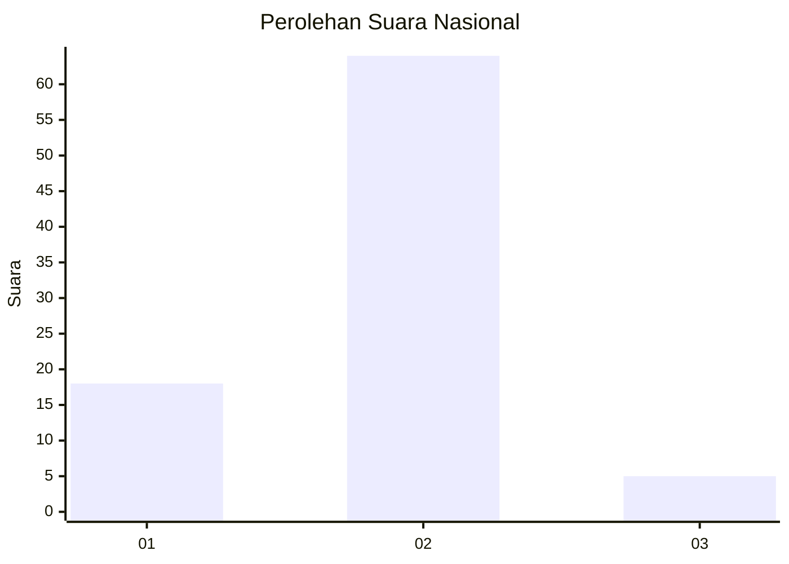
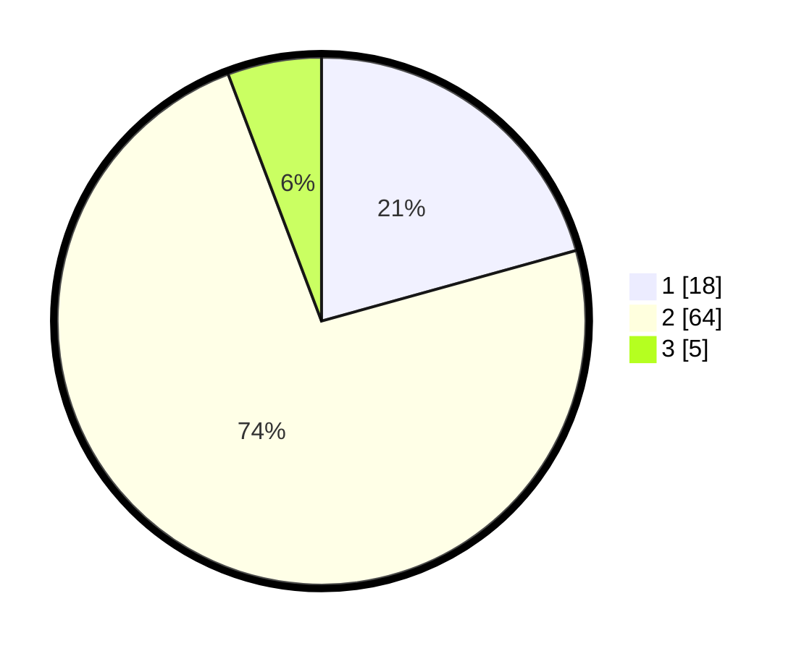

# Hasil

## Grafik

## Tabel

| No. | Nama Paslon    | Suara | Suara (raw) | Persentase |
|:--- |:-------------- | -----:| -----------:| ----------:|
| 1   | ANIES MUHAIMIN | 18    | [18][p-1]   | 20,69      |
| 2   | PRABOWO GIBRAN | 64    | [64][p-2]   | 73,56      |
| 3   | GANJAR MAHFUD  | 5     | [5][p-3]    | 5,75       |

[p-1]: https://github.com/gigit-pemilu/pemilu-2024/blob/main/pilpres/hitung-suara/sub/99-luar-negeri/sub/70-manama-bahrain/sub/01-manama-bahrain/sub/0001-manama-bahrain/sub/005-ksk-001/sub/paslon-1.txt
[p-2]: https://github.com/gigit-pemilu/pemilu-2024/blob/main/pilpres/hitung-suara/sub/99-luar-negeri/sub/70-manama-bahrain/sub/01-manama-bahrain/sub/0001-manama-bahrain/sub/005-ksk-001/sub/paslon-2.txt
[p-3]: https://github.com/gigit-pemilu/pemilu-2024/blob/main/pilpres/hitung-suara/sub/99-luar-negeri/sub/70-manama-bahrain/sub/01-manama-bahrain/sub/0001-manama-bahrain/sub/005-ksk-001/sub/paslon-3.txt

## Foto C Plano

https://sirekap-obj-formc.kpu.go.id/27df/pemilu/ppwp/99/70/01/00/01/9970010001005-20240214-233425--3e480209-0317-41d5-a6d1-61c4a9203ed0.jpg

https://sirekap-obj-formc.kpu.go.id/27df/pemilu/ppwp/99/70/01/00/01/9970010001005-20240214-233624--ae358ac3-e003-4b7c-88d3-4869bffdc911.jpg

https://sirekap-obj-formc.kpu.go.id/27df/pemilu/ppwp/99/70/01/00/01/9970010001005-20240214-233728--d859f5f4-37cc-49f3-ac00-df2214caf540.jpg

## Metadata

| Key        | Value               |
| ---------- | ------------------- |
| Time Stamp | 2024-02-15 15:00:29 |

## DATA PEMILIH TETAP

Jumlah pemilih dalam DPT: **287**.
 * L: **52**.
 * P: **235**.

## DATA PENGGUNA HAK PILIH

Jumlah pengguna hak pilih dalam DPT: **70**.
 * L: **24**.
 * P: **46**.

Jumlah pengguna hak pilih dalam DPTb: **3**.
 * L: **2**.
 * P: **1**.

Jumlah pengguna hak pilih dalam DPK: **18**.
 * L: **3**.
 * P: **15**.

Jumlah pengguna hak pilih: **91**.
 * L: **29**.
 * P: **62**.

## JUMLAH SUARA SAH DAN TIDAK SAH

JUMLAH SELURUH SUARA SAH: **87**.

JUMLAH SUARA TIDAK SAH: **4**.

JUMLAH SELURUH SUARA SAH DAN SUARA TIDAK SAH: **91**.

