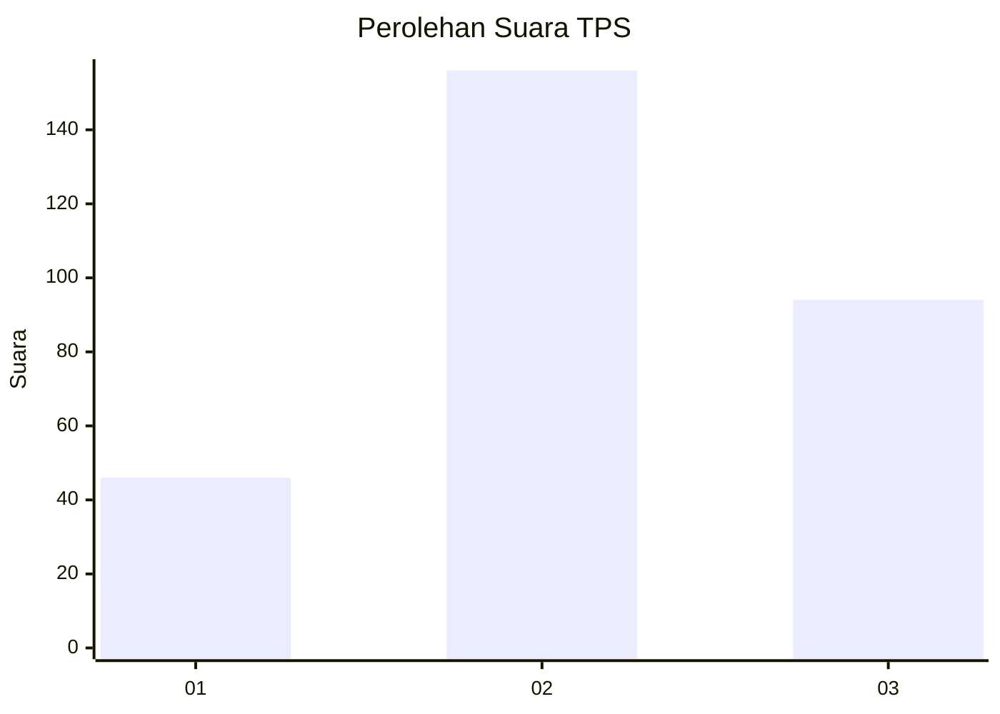
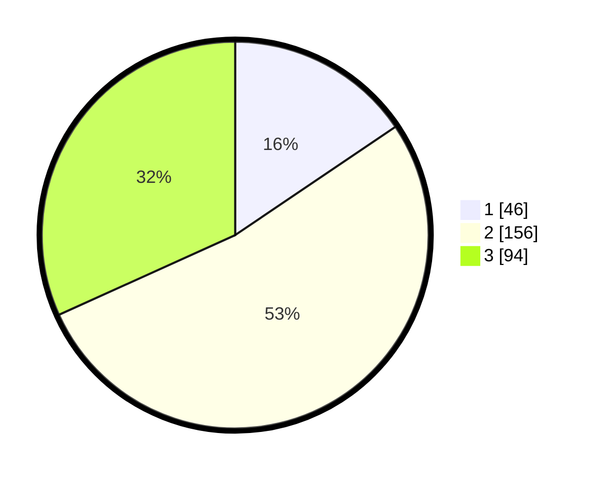

# Hasil

## Grafik

## Tabel

| No. | Nama Paslon    | Suara | Suara (raw) | Persentase |
|:--- |:-------------- | -----:| -----------:| ----------:|
| 1   | ANIES MUHAIMIN | 46    | [46][p-1]   | 15,54      |
| 2   | PRABOWO GIBRAN | 156   | [156][p-2]  | 52,70      |
| 3   | GANJAR MAHFUD  | 94    | [94][p-3]   | 31,76      |

[p-1]: https://github.com/gigit-pemilu/pemilu-2024-99-luar-negeri/blob/main/pilpres/hitung-suara/sub/99-luar-negeri/sub/71-manila-filipina/sub/01-manila-filipina/sub/0001-manila-filipina/sub/002-tps-001/sub/paslon-1.txt
[p-2]: https://github.com/gigit-pemilu/pemilu-2024-99-luar-negeri/blob/main/pilpres/hitung-suara/sub/99-luar-negeri/sub/71-manila-filipina/sub/01-manila-filipina/sub/0001-manila-filipina/sub/002-tps-001/sub/paslon-2.txt
[p-3]: https://github.com/gigit-pemilu/pemilu-2024-99-luar-negeri/blob/main/pilpres/hitung-suara/sub/99-luar-negeri/sub/71-manila-filipina/sub/01-manila-filipina/sub/0001-manila-filipina/sub/002-tps-001/sub/paslon-3.txt

## Foto C Plano

https://sirekap-obj-formc.kpu.go.id/f1b9/pemilu/ppwp/99/71/01/00/01/9971010001002-20240214-185345--b823d460-a0b9-4c65-82ca-fc9fb51fb1e3.jpg

https://sirekap-obj-formc.kpu.go.id/f1b9/pemilu/ppwp/99/71/01/00/01/9971010001002-20240214-184920--31d358b7-49f4-47da-a941-7b29a19689e0.jpg

https://sirekap-obj-formc.kpu.go.id/f1b9/pemilu/ppwp/99/71/01/00/01/9971010001002-20240214-184823--241188a8-b93e-42bc-8c2d-569058134dc2.jpg

## Metadata

| Key        | Value               |
| ---------- | ------------------- |
| Time Stamp | 2024-02-15 18:30:25 |

## DATA PEMILIH TETAP

Jumlah pemilih dalam DPT: **648**.
 * L: **360**.
 * P: **288**.

## DATA PENGGUNA HAK PILIH

Jumlah pengguna hak pilih dalam DPT: **212**.
 * L: **104**.
 * P: **108**.

Jumlah pengguna hak pilih dalam DPTb: **76**.
 * L: **35**.
 * P: **41**.

Jumlah pengguna hak pilih dalam DPK: **13**.
 * L: **7**.
 * P: **6**.

Jumlah pengguna hak pilih: **301**.
 * L: **146**.
 * P: **155**.

## JUMLAH SUARA SAH DAN TIDAK SAH

JUMLAH SELURUH SUARA SAH: **296**.

JUMLAH SUARA TIDAK SAH: **5**.

JUMLAH SELURUH SUARA SAH DAN SUARA TIDAK SAH: **301**.

