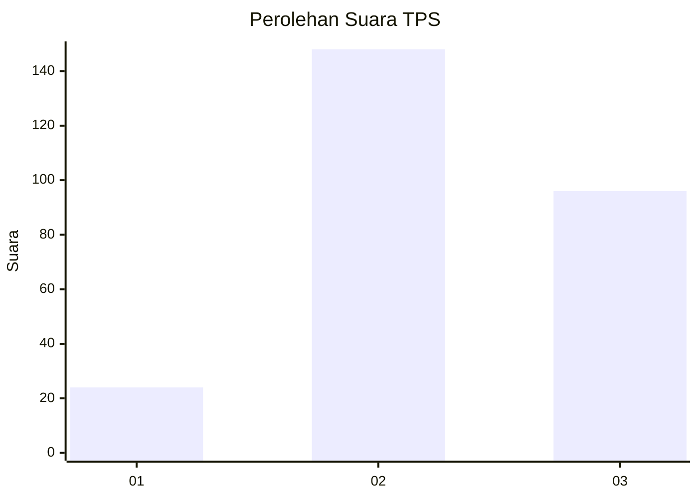
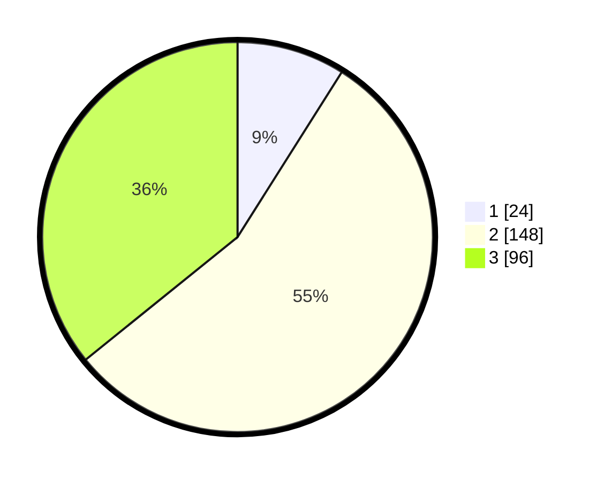

# Hasil

## Grafik

## Tabel

| No. | Nama Paslon    | Suara | Suara (raw) | Persentase |
|:--- |:-------------- | -----:| -----------:| ----------:|
| 1   | ANIES MUHAIMIN | 24    | [24][p-1]   | 8,96       |
| 2   | PRABOWO GIBRAN | 148   | [148][p-2]  | 55,22      |
| 3   | GANJAR MAHFUD  | 96    | [96][p-3]   | 35,82      |

[p-1]: https://github.com/gigit-pemilu/pemilu-2024-99-luar-negeri/blob/main/pilpres/hitung-suara/sub/99-luar-negeri/sub/71-manila-filipina/sub/01-manila-filipina/sub/0001-manila-filipina/sub/003-tps-002/sub/paslon-1.txt
[p-2]: https://github.com/gigit-pemilu/pemilu-2024-99-luar-negeri/blob/main/pilpres/hitung-suara/sub/99-luar-negeri/sub/71-manila-filipina/sub/01-manila-filipina/sub/0001-manila-filipina/sub/003-tps-002/sub/paslon-2.txt
[p-3]: https://github.com/gigit-pemilu/pemilu-2024-99-luar-negeri/blob/main/pilpres/hitung-suara/sub/99-luar-negeri/sub/71-manila-filipina/sub/01-manila-filipina/sub/0001-manila-filipina/sub/003-tps-002/sub/paslon-3.txt

## Foto C Plano

https://sirekap-obj-formc.kpu.go.id/e013/pemilu/ppwp/99/71/01/00/01/9971010001003-20240214-191514--d5b4b467-8b9a-4419-840a-434e132322dd.jpg

https://sirekap-obj-formc.kpu.go.id/e013/pemilu/ppwp/99/71/01/00/01/9971010001003-20240214-191651--32d2a435-760d-4f7f-a82f-1f52df437afe.jpg

https://sirekap-obj-formc.kpu.go.id/e013/pemilu/ppwp/99/71/01/00/01/9971010001003-20240214-200138--f64c6183-db70-42c2-bac3-c7b3a65d3d6d.jpg

## Metadata

| Key        | Value               |
| ---------- | ------------------- |
| Time Stamp | 2024-02-15 18:30:25 |

## DATA PEMILIH TETAP

Jumlah pemilih dalam DPT: **723**.
 * L: **379**.
 * P: **344**.

## DATA PENGGUNA HAK PILIH

Jumlah pengguna hak pilih dalam DPT: **180**.
 * L: **91**.
 * P: **89**.

Jumlah pengguna hak pilih dalam DPTb: **48**.
 * L: **13**.
 * P: **35**.

Jumlah pengguna hak pilih dalam DPK: **43**.
 * L: **19**.
 * P: **24**.

Jumlah pengguna hak pilih: **271**.
 * L: **123**.
 * P: **148**.

## JUMLAH SUARA SAH DAN TIDAK SAH

JUMLAH SELURUH SUARA SAH: **268**.

JUMLAH SUARA TIDAK SAH: **3**.

JUMLAH SELURUH SUARA SAH DAN SUARA TIDAK SAH: **271**.

