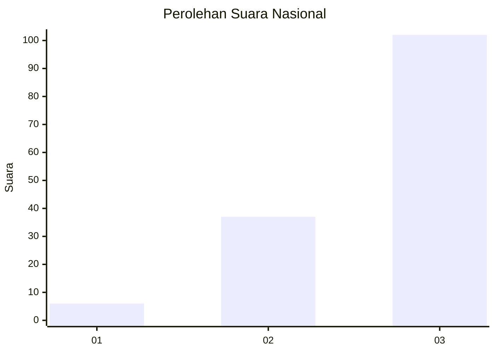
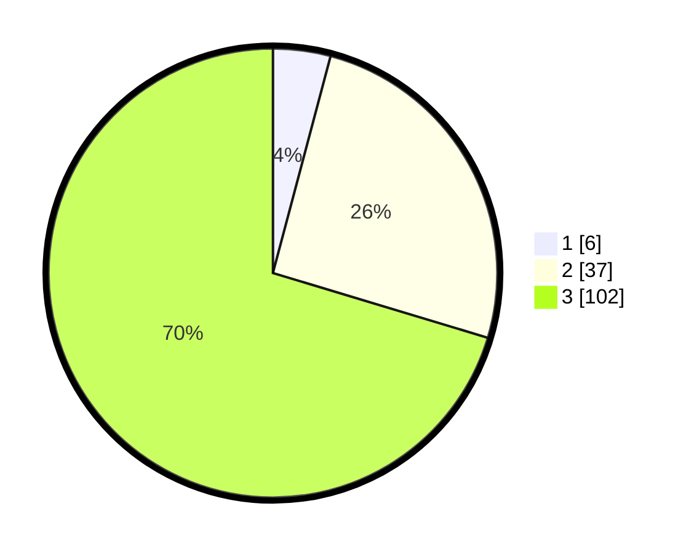

# Hasil

## Grafik

## Tabel

| No. | Nama Paslon    | Suara | Suara (raw) | Persentase |
|:--- |:-------------- | -----:| -----------:| ----------:|
| 1   | ANIES MUHAIMIN | 6     | [6][p-1]    | 4,14       |
| 2   | PRABOWO GIBRAN | 37    | [37][p-2]   | 25,52      |
| 3   | GANJAR MAHFUD  | 102   | [102][p-3]  | 70,34      |

[p-1]: https://github.com/gigit-pemilu/pemilu-2024/blob/main/pilpres/hitung-suara/sub/99-luar-negeri/sub/71-manila-filipina/sub/01-manila-filipina/sub/0001-manila-filipina/sub/004-ksk-001/sub/paslon-1.txt
[p-2]: https://github.com/gigit-pemilu/pemilu-2024/blob/main/pilpres/hitung-suara/sub/99-luar-negeri/sub/71-manila-filipina/sub/01-manila-filipina/sub/0001-manila-filipina/sub/004-ksk-001/sub/paslon-2.txt
[p-3]: https://github.com/gigit-pemilu/pemilu-2024/blob/main/pilpres/hitung-suara/sub/99-luar-negeri/sub/71-manila-filipina/sub/01-manila-filipina/sub/0001-manila-filipina/sub/004-ksk-001/sub/paslon-3.txt

## Foto C Plano

https://sirekap-obj-formc.kpu.go.id/39ac/pemilu/ppwp/99/71/01/00/01/9971010001004-20240214-190634--7a17fb2b-95c4-45f4-b79a-474f1510c9e4.jpg

https://sirekap-obj-formc.kpu.go.id/39ac/pemilu/ppwp/99/71/01/00/01/9971010001004-20240214-191138--7cfe875b-fc0f-49dc-a878-25a0c3579b0b.jpg

https://sirekap-obj-formc.kpu.go.id/39ac/pemilu/ppwp/99/71/01/00/01/9971010001004-20240214-190850--42be6d7d-b2c0-484f-a245-d2e58dfc89f2.jpg

## Metadata

| Key        | Value               |
| ---------- | ------------------- |
| Time Stamp | 2024-02-14 21:46:01 |

