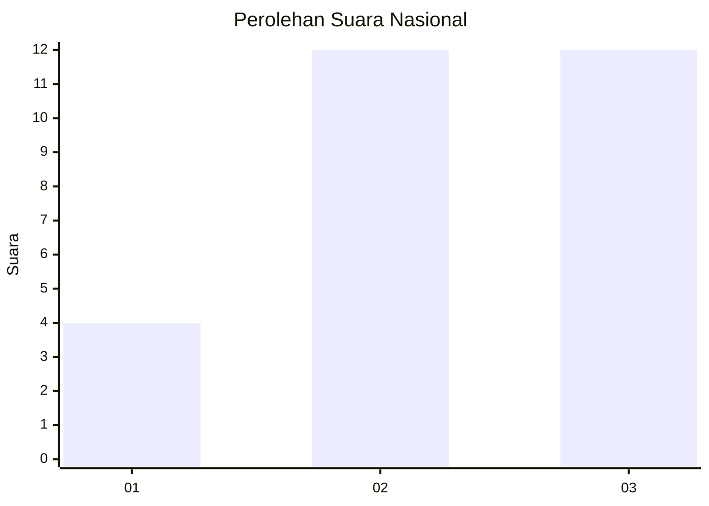
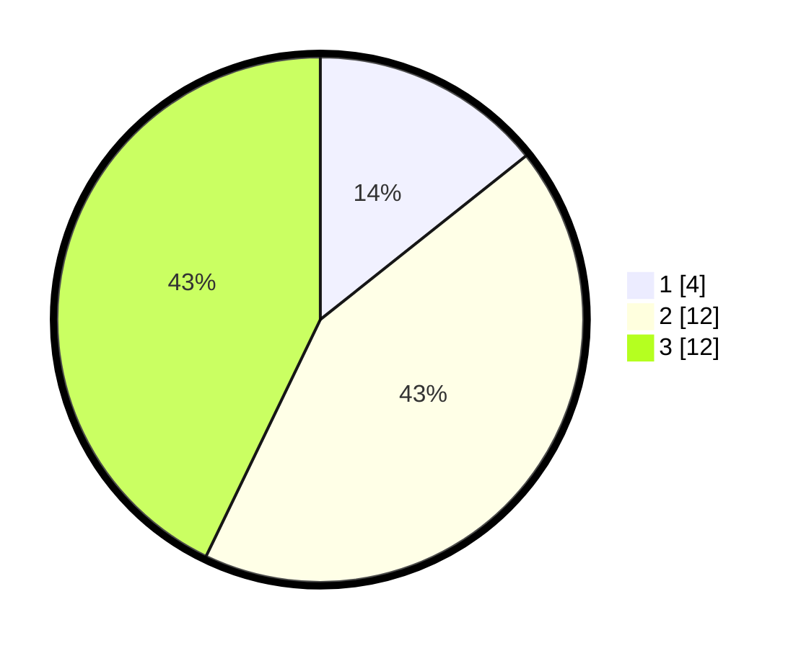

# Hasil

## Grafik

## Tabel

| No. | Nama Paslon    | Suara | Suara (raw) | Persentase |
|:--- |:-------------- | -----:| -----------:| ----------:|
| 1   | ANIES MUHAIMIN | 4     | [4][p-1]    | 14,29      |
| 2   | PRABOWO GIBRAN | 12    | [12][p-2]   | 42,86      |
| 3   | GANJAR MAHFUD  | 12    | [12][p-3]   | 42,86      |

[p-1]: https://github.com/gigit-pemilu/pemilu-2024/blob/main/pilpres/hitung-suara/sub/99-luar-negeri/sub/72-maputo-mozambik/sub/01-maputo-mozambik/sub/0001-maputo-mozambik/sub/001-pos-001/sub/paslon-1.txt
[p-2]: https://github.com/gigit-pemilu/pemilu-2024/blob/main/pilpres/hitung-suara/sub/99-luar-negeri/sub/72-maputo-mozambik/sub/01-maputo-mozambik/sub/0001-maputo-mozambik/sub/001-pos-001/sub/paslon-2.txt
[p-3]: https://github.com/gigit-pemilu/pemilu-2024/blob/main/pilpres/hitung-suara/sub/99-luar-negeri/sub/72-maputo-mozambik/sub/01-maputo-mozambik/sub/0001-maputo-mozambik/sub/001-pos-001/sub/paslon-3.txt

## Foto C Plano

https://sirekap-obj-formc.kpu.go.id/cb8c/pemilu/ppwp/99/72/01/00/01/9972010001001-20240216-163001--5cbae087-ead8-4a78-aa26-3b5f0e882457.jpg

https://sirekap-obj-formc.kpu.go.id/cb8c/pemilu/ppwp/99/72/01/00/01/9972010001001-20240216-170528--f7278116-4927-4600-9361-5a3848234ef2.jpg

https://sirekap-obj-formc.kpu.go.id/cb8c/pemilu/ppwp/99/72/01/00/01/9972010001001-20240216-163542--f2eed4fe-9fa2-46bc-b949-9087b8eab85a.jpg

## Metadata

| Key        | Value               |
| ---------- | ------------------- |
| Time Stamp | 2024-02-17 19:00:04 |

## DATA PEMILIH TETAP

Jumlah pemilih dalam DPT: **33**.
 * L: **25**.
 * P: **8**.

## DATA PENGGUNA HAK PILIH

Jumlah pengguna hak pilih dalam DPT: **25**.
 * L: **19**.
 * P: **6**.

Jumlah pengguna hak pilih dalam DPTb: **2**.
 * L: **2**.
 * P: **0**.

Jumlah pengguna hak pilih dalam DPK: **1**.
 * L: **0**.
 * P: **1**.

Jumlah pengguna hak pilih: **28**.
 * L: **21**.
 * P: **7**.

## JUMLAH SUARA SAH DAN TIDAK SAH

JUMLAH SELURUH SUARA SAH: **28**.

JUMLAH SUARA TIDAK SAH: **0**.

JUMLAH SELURUH SUARA SAH DAN SUARA TIDAK SAH: **28**.

