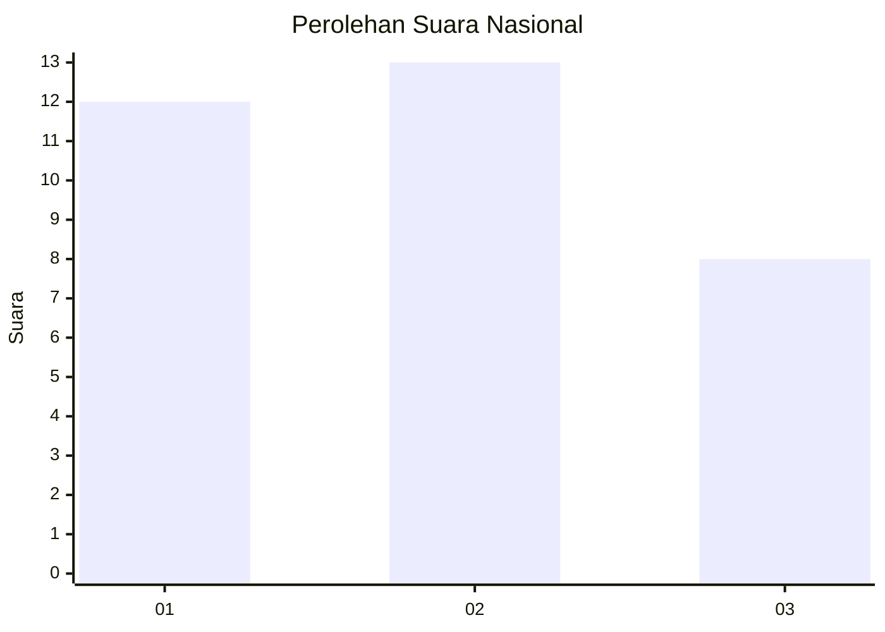
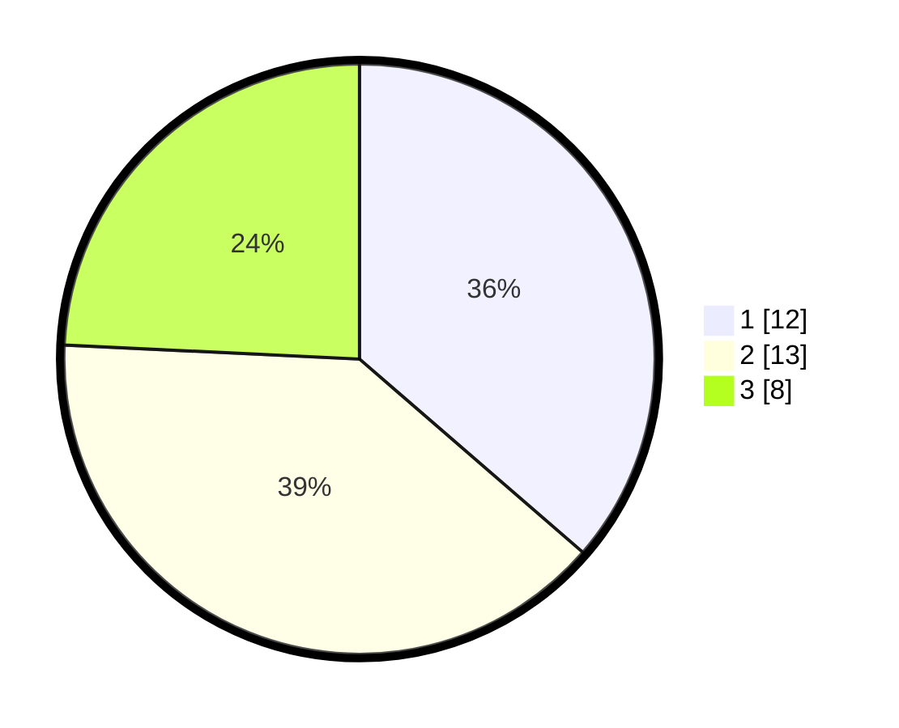

# Hasil

## Grafik

## Tabel

| No. | Nama Paslon    | Suara | Suara (raw) | Persentase |
|:--- |:-------------- | -----:| -----------:| ----------:|
| 1   | ANIES MUHAIMIN | 12    | [12][p-1]   | 36,36      |
| 2   | PRABOWO GIBRAN | 13    | [13][p-2]   | 39,39      |
| 3   | GANJAR MAHFUD  | 8     | [8][p-3]    | 24,24      |

[p-1]: https://github.com/gigit-pemilu/pemilu-2024/blob/main/pilpres/hitung-suara/sub/99-luar-negeri/sub/72-maputo-mozambik/sub/01-maputo-mozambik/sub/0001-maputo-mozambik/sub/002-tps-001/sub/paslon-1.txt
[p-2]: https://github.com/gigit-pemilu/pemilu-2024/blob/main/pilpres/hitung-suara/sub/99-luar-negeri/sub/72-maputo-mozambik/sub/01-maputo-mozambik/sub/0001-maputo-mozambik/sub/002-tps-001/sub/paslon-2.txt
[p-3]: https://github.com/gigit-pemilu/pemilu-2024/blob/main/pilpres/hitung-suara/sub/99-luar-negeri/sub/72-maputo-mozambik/sub/01-maputo-mozambik/sub/0001-maputo-mozambik/sub/002-tps-001/sub/paslon-3.txt

## Foto C Plano

https://sirekap-obj-formc.kpu.go.id/3d43/pemilu/ppwp/99/72/01/00/01/9972010001002-20240214-191524--bbc5ec6c-9642-4c1b-b8e3-b9b5cad21ae0.jpg

https://sirekap-obj-formc.kpu.go.id/3d43/pemilu/ppwp/99/72/01/00/01/9972010001002-20240214-193159--331442c1-0d25-4647-8b53-bf72a2035b8e.jpg

https://sirekap-obj-formc.kpu.go.id/3d43/pemilu/ppwp/99/72/01/00/01/9972010001002-20240214-191531--8c2dd890-115d-4482-95af-b5546e9d78cc.jpg

## Metadata

| Key        | Value               |
| ---------- | ------------------- |
| Time Stamp | 2024-02-14 21:46:01 |

## DATA PEMILIH TETAP

Jumlah pemilih dalam DPT: **35**.
 * L: **16**.
 * P: **19**.

## DATA PENGGUNA HAK PILIH

Jumlah pengguna hak pilih dalam DPT: **23**.
 * L: **11**.
 * P: **12**.

Jumlah pengguna hak pilih dalam DPTb: **8**.
 * L: **4**.
 * P: **4**.

Jumlah pengguna hak pilih dalam DPK: **2**.
 * L: **1**.
 * P: **1**.

Jumlah pengguna hak pilih: **33**.
 * L: **16**.
 * P: **17**.

## JUMLAH SUARA SAH DAN TIDAK SAH

JUMLAH SELURUH SUARA SAH: **33**.

JUMLAH SUARA TIDAK SAH: **0**.

JUMLAH SELURUH SUARA SAH DAN SUARA TIDAK SAH: **33**.

