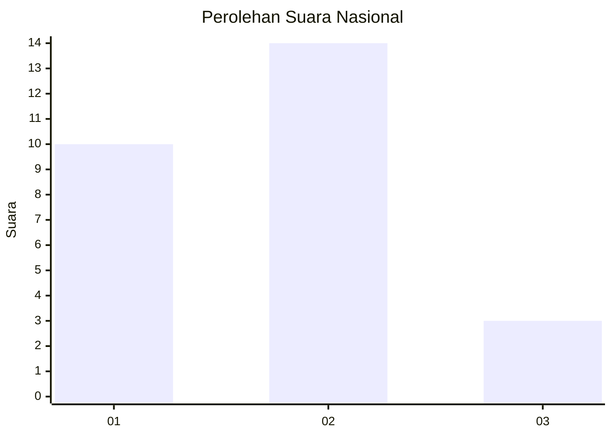
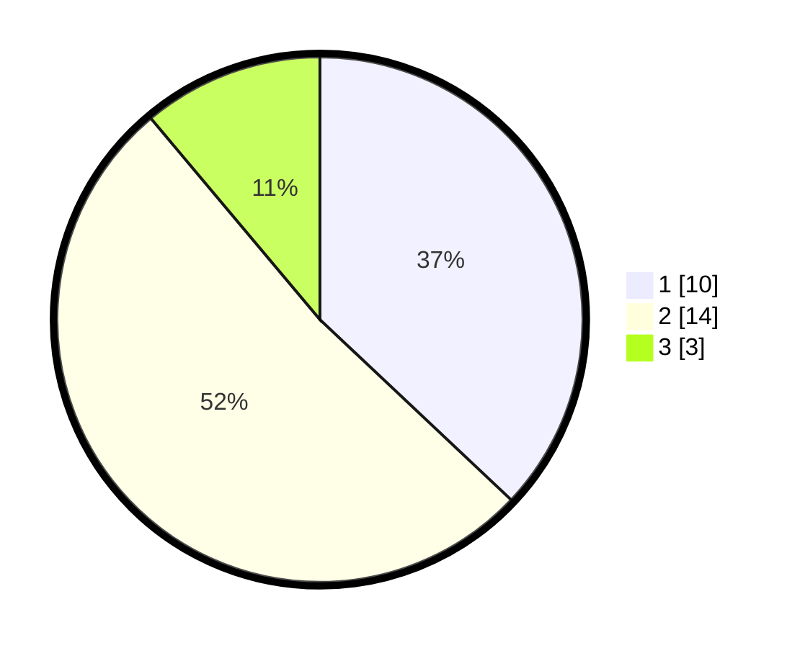

# Hasil

## Grafik

## Tabel

| No. | Nama Paslon    | Suara | Suara (raw) | Persentase |
|:--- |:-------------- | -----:| -----------:| ----------:|
| 1   | ANIES MUHAIMIN | 10    | [10][p-1]   | 37,04      |
| 2   | PRABOWO GIBRAN | 14    | [14][p-2]   | 51,85      |
| 3   | GANJAR MAHFUD  | 3     | [3][p-3]    | 11,11      |

[p-1]: https://github.com/gigit-pemilu/pemilu-2024/blob/main/pilpres/hitung-suara/sub/99-luar-negeri/sub/72-maputo-mozambik/sub/01-maputo-mozambik/sub/0001-maputo-mozambik/sub/003-ksk-001/sub/paslon-1.txt
[p-2]: https://github.com/gigit-pemilu/pemilu-2024/blob/main/pilpres/hitung-suara/sub/99-luar-negeri/sub/72-maputo-mozambik/sub/01-maputo-mozambik/sub/0001-maputo-mozambik/sub/003-ksk-001/sub/paslon-2.txt
[p-3]: https://github.com/gigit-pemilu/pemilu-2024/blob/main/pilpres/hitung-suara/sub/99-luar-negeri/sub/72-maputo-mozambik/sub/01-maputo-mozambik/sub/0001-maputo-mozambik/sub/003-ksk-001/sub/paslon-3.txt

## Foto C Plano

https://sirekap-obj-formc.kpu.go.id/7119/pemilu/ppwp/99/72/01/00/01/9972010001003-20240214-203429--9ce01d6a-52a6-45f1-bc82-1d4f74e1ea68.jpg

https://sirekap-obj-formc.kpu.go.id/7119/pemilu/ppwp/99/72/01/00/01/9972010001003-20240216-155139--d5627f6a-05ce-44ca-a50d-dd836b4bcdb6.jpg

https://sirekap-obj-formc.kpu.go.id/7119/pemilu/ppwp/99/72/01/00/01/9972010001003-20240214-203731--124bc230-fe35-46e5-87bb-06f65243c1aa.jpg

## Metadata

| Key        | Value               |
| ---------- | ------------------- |
| Time Stamp | 2024-02-17 19:00:04 |

## DATA PEMILIH TETAP

Jumlah pemilih dalam DPT: **49**.
 * L: **47**.
 * P: **2**.

## DATA PENGGUNA HAK PILIH

Jumlah pengguna hak pilih dalam DPT: **19**.
 * L: **18**.
 * P: **1**.

Jumlah pengguna hak pilih dalam DPTb: **8**.
 * L: **7**.
 * P: **1**.

Jumlah pengguna hak pilih dalam DPK: **1**.
 * L: **1**.
 * P: **0**.

Jumlah pengguna hak pilih: **28**.
 * L: **26**.
 * P: **2**.

## JUMLAH SUARA SAH DAN TIDAK SAH

JUMLAH SELURUH SUARA SAH: **27**.

JUMLAH SUARA TIDAK SAH: **1**.

JUMLAH SELURUH SUARA SAH DAN SUARA TIDAK SAH: **28**.

