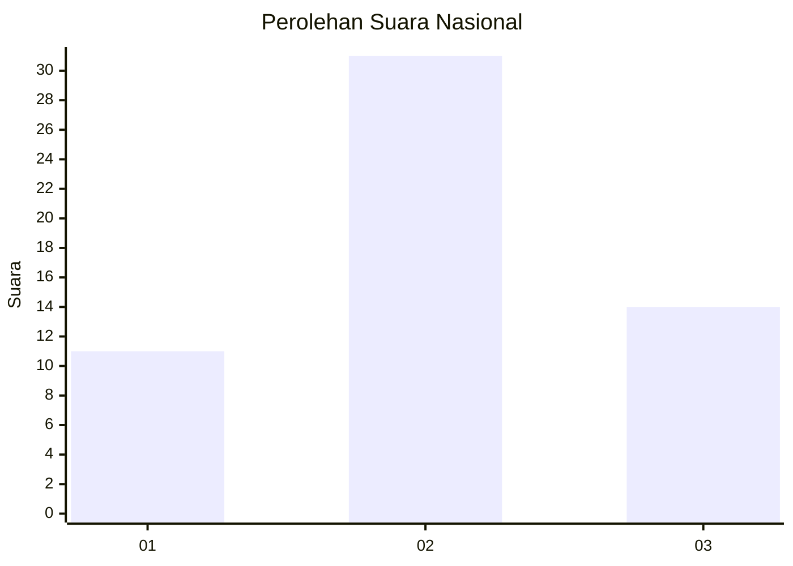
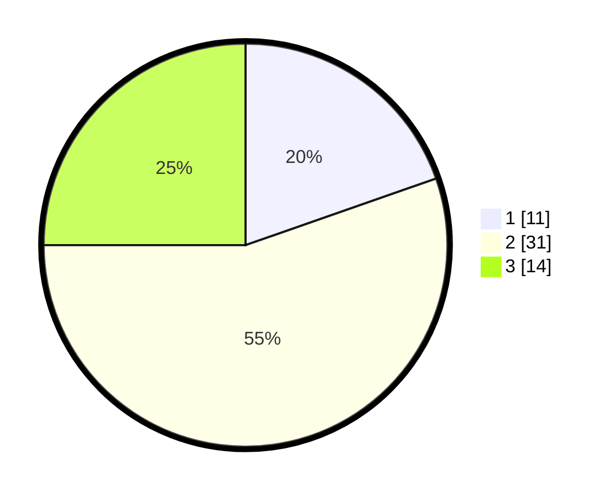

# Hasil

## Grafik

## Tabel

| No. | Nama Paslon    | Suara | Suara (raw) | Persentase |
|:--- |:-------------- | -----:| -----------:| ----------:|
| 1   | ANIES MUHAIMIN | 11    | [11][p-1]   | 19,64      |
| 2   | PRABOWO GIBRAN | 31    | [31][p-2]   | 55,36      |
| 3   | GANJAR MAHFUD  | 14    | [14][p-3]   | 25,00      |

[p-1]: https://github.com/gigit-pemilu/pemilu-2024/blob/main/pilpres/hitung-suara/sub/99-luar-negeri/sub/72-maputo-mozambik/sub/01-maputo-mozambik/sub/0001-maputo-mozambik/sub/004-ksk-002/sub/paslon-1.txt
[p-2]: https://github.com/gigit-pemilu/pemilu-2024/blob/main/pilpres/hitung-suara/sub/99-luar-negeri/sub/72-maputo-mozambik/sub/01-maputo-mozambik/sub/0001-maputo-mozambik/sub/004-ksk-002/sub/paslon-2.txt
[p-3]: https://github.com/gigit-pemilu/pemilu-2024/blob/main/pilpres/hitung-suara/sub/99-luar-negeri/sub/72-maputo-mozambik/sub/01-maputo-mozambik/sub/0001-maputo-mozambik/sub/004-ksk-002/sub/paslon-3.txt

## Foto C Plano

https://sirekap-obj-formc.kpu.go.id/ce8d/pemilu/ppwp/99/72/01/00/01/9972010001004-20240214-190444--cc7b4f9c-28a3-4351-a709-aea26a670629.jpg

https://sirekap-obj-formc.kpu.go.id/ce8d/pemilu/ppwp/99/72/01/00/01/9972010001004-20240214-191524--0bb1e3de-3c45-45df-bb16-4b94e33f091d.jpg

https://sirekap-obj-formc.kpu.go.id/ce8d/pemilu/ppwp/99/72/01/00/01/9972010001004-20240214-191641--241bcaa9-8973-488d-897e-2942bfb61801.jpg

## Metadata

| Key        | Value               |
| ---------- | ------------------- |
| Time Stamp | 2024-02-14 21:46:01 |

## DATA PEMILIH TETAP

Jumlah pemilih dalam DPT: **68**.
 * L: **68**.
 * P: **0**.

## DATA PENGGUNA HAK PILIH

Jumlah pengguna hak pilih dalam DPT: **50**.
 * L: **50**.
 * P: **0**.

Jumlah pengguna hak pilih dalam DPTb: **2**.
 * L: **1**.
 * P: **1**.

Jumlah pengguna hak pilih dalam DPK: **4**.
 * L: **4**.
 * P: **0**.

Jumlah pengguna hak pilih: **56**.
 * L: **55**.
 * P: **1**.

## JUMLAH SUARA SAH DAN TIDAK SAH

JUMLAH SELURUH SUARA SAH: **56**.

JUMLAH SUARA TIDAK SAH: **0**.

JUMLAH SELURUH SUARA SAH DAN SUARA TIDAK SAH: **56**.

