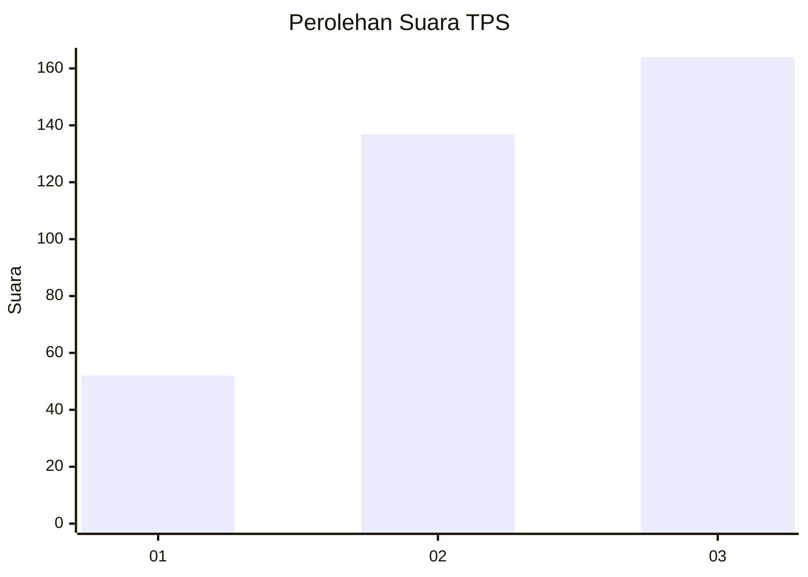
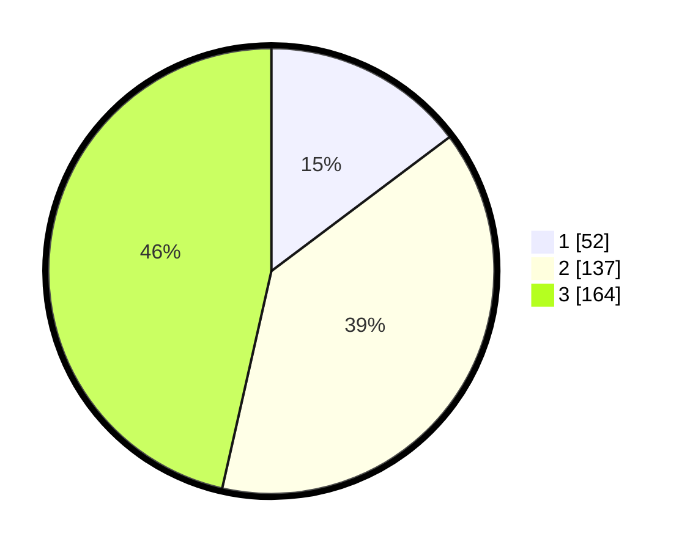

# Hasil

## Grafik

## Tabel

| No. | Nama Paslon    | Suara | Suara (raw) | Persentase |
|:--- |:-------------- | -----:| -----------:| ----------:|
| 1   | ANIES MUHAIMIN | 52    | [52][p-1]   | 14,73      |
| 2   | PRABOWO GIBRAN | 137   | [137][p-2]  | 38,81      |
| 3   | GANJAR MAHFUD  | 164   | [164][p-3]  | 46,46      |

[p-1]: https://github.com/gigit-pemilu/pemilu-2024-99-luar-negeri/blob/main/pilpres/hitung-suara/sub/99-luar-negeri/sub/73-marseille-perancis/sub/01-marseille-perancis/sub/0001-marseille-perancis/sub/001-pos-001/sub/paslon-1.txt
[p-2]: https://github.com/gigit-pemilu/pemilu-2024-99-luar-negeri/blob/main/pilpres/hitung-suara/sub/99-luar-negeri/sub/73-marseille-perancis/sub/01-marseille-perancis/sub/0001-marseille-perancis/sub/001-pos-001/sub/paslon-2.txt
[p-3]: https://github.com/gigit-pemilu/pemilu-2024-99-luar-negeri/blob/main/pilpres/hitung-suara/sub/99-luar-negeri/sub/73-marseille-perancis/sub/01-marseille-perancis/sub/0001-marseille-perancis/sub/001-pos-001/sub/paslon-3.txt

## Foto C Plano

https://sirekap-obj-formc.kpu.go.id/38da/pemilu/ppwp/99/73/01/00/01/9973010001001-20240215-010300--5eae64dc-f5dc-407b-bc2a-f51225129069.jpg

https://sirekap-obj-formc.kpu.go.id/38da/pemilu/ppwp/99/73/01/00/01/9973010001001-20240216-160524--295dc937-3ed9-4a61-b3cb-29c46558957f.jpg

https://sirekap-obj-formc.kpu.go.id/38da/pemilu/ppwp/99/73/01/00/01/9973010001001-20240215-010438--a88495fb-1ecb-4c17-be33-91992fb8e3a3.jpg

## Metadata

| Key        | Value               |
| ---------- | ------------------- |
| Time Stamp | 2024-02-16 16:25:10 |

## DATA PEMILIH TETAP

Jumlah pemilih dalam DPT: **584**.
 * L: **114**.
 * P: **470**.

## DATA PENGGUNA HAK PILIH

Jumlah pengguna hak pilih dalam DPT: **369**.
 * L: **75**.
 * P: **294**.

Jumlah pengguna hak pilih dalam DPTb: **0**.
 * L: **0**.
 * P: **0**.

Jumlah pengguna hak pilih dalam DPK: **0**.
 * L: **0**.
 * P: **0**.

Jumlah pengguna hak pilih: **369**.
 * L: **75**.
 * P: **294**.

## JUMLAH SUARA SAH DAN TIDAK SAH

JUMLAH SELURUH SUARA SAH: **353**.

JUMLAH SUARA TIDAK SAH: **16**.

JUMLAH SELURUH SUARA SAH DAN SUARA TIDAK SAH: **369**.

