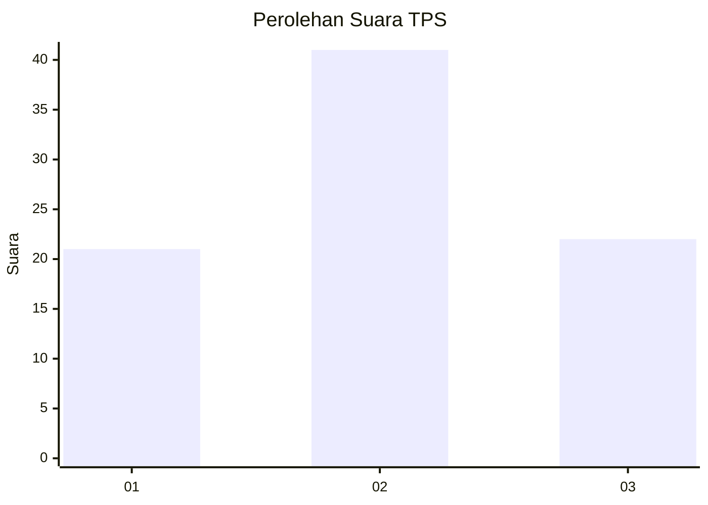
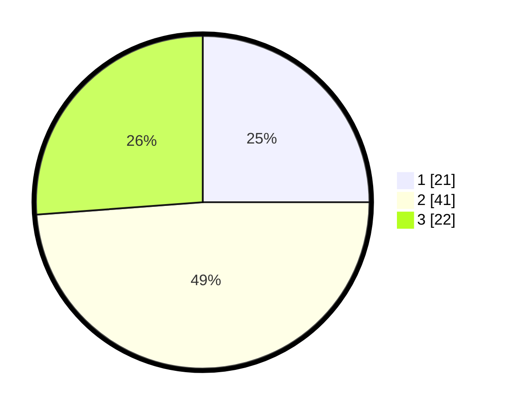

# Hasil

## Grafik

## Tabel

| No. | Nama Paslon    | Suara | Suara (raw) | Persentase |
|:--- |:-------------- | -----:| -----------:| ----------:|
| 1   | ANIES MUHAIMIN | 21    | [21][p-1]   | 25,00      |
| 2   | PRABOWO GIBRAN | 41    | [41][p-2]   | 48,81      |
| 3   | GANJAR MAHFUD  | 22    | [22][p-3]   | 26,19      |

[p-1]: https://github.com/gigit-pemilu/pemilu-2024-99-luar-negeri/blob/main/pilpres/hitung-suara/sub/99-luar-negeri/sub/73-marseille-perancis/sub/01-marseille-perancis/sub/0001-marseille-perancis/sub/002-tps-001/sub/paslon-1.txt
[p-2]: https://github.com/gigit-pemilu/pemilu-2024-99-luar-negeri/blob/main/pilpres/hitung-suara/sub/99-luar-negeri/sub/73-marseille-perancis/sub/01-marseille-perancis/sub/0001-marseille-perancis/sub/002-tps-001/sub/paslon-2.txt
[p-3]: https://github.com/gigit-pemilu/pemilu-2024-99-luar-negeri/blob/main/pilpres/hitung-suara/sub/99-luar-negeri/sub/73-marseille-perancis/sub/01-marseille-perancis/sub/0001-marseille-perancis/sub/002-tps-001/sub/paslon-3.txt

## Foto C Plano

https://sirekap-obj-formc.kpu.go.id/7239/pemilu/ppwp/99/73/01/00/01/9973010001002-20240214-230745--8a280708-625b-4b78-b001-aaad78188b62.jpg

https://sirekap-obj-formc.kpu.go.id/7239/pemilu/ppwp/99/73/01/00/01/9973010001002-20240214-230816--c2514470-9000-4c80-85e2-f368350cc2c9.jpg

https://sirekap-obj-formc.kpu.go.id/7239/pemilu/ppwp/99/73/01/00/01/9973010001002-20240214-230839--54262d8c-3a4b-4207-8582-9c86689db8b9.jpg

## Metadata

| Key        | Value               |
| ---------- | ------------------- |
| Time Stamp | 2024-02-16 02:00:27 |

## DATA PEMILIH TETAP

Jumlah pemilih dalam DPT: **75**.
 * L: **33**.
 * P: **42**.

## DATA PENGGUNA HAK PILIH

Jumlah pengguna hak pilih dalam DPT: **44**.
 * L: **19**.
 * P: **25**.

Jumlah pengguna hak pilih dalam DPTb: **37**.
 * L: **10**.
 * P: **27**.

Jumlah pengguna hak pilih dalam DPK: **6**.
 * L: **2**.
 * P: **4**.

Jumlah pengguna hak pilih: **87**.
 * L: **31**.
 * P: **56**.

## JUMLAH SUARA SAH DAN TIDAK SAH

JUMLAH SELURUH SUARA SAH: **84**.

JUMLAH SUARA TIDAK SAH: **3**.

JUMLAH SELURUH SUARA SAH DAN SUARA TIDAK SAH: **87**.

