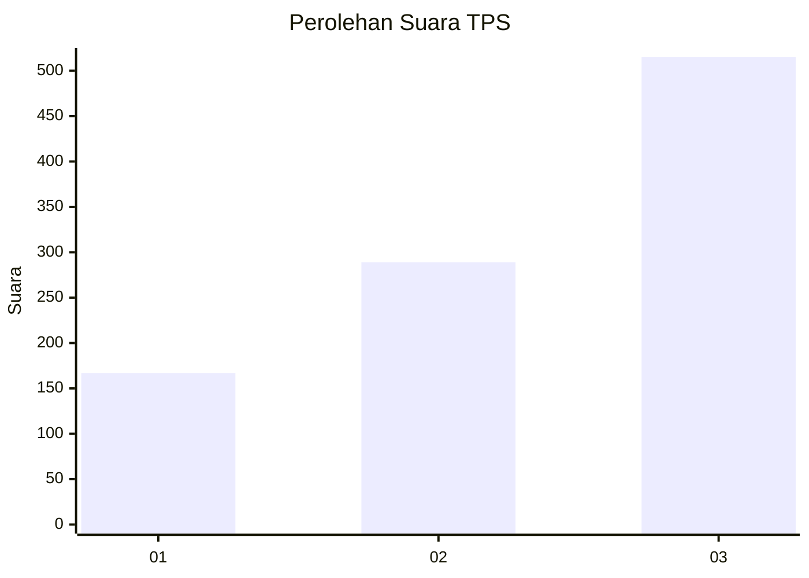
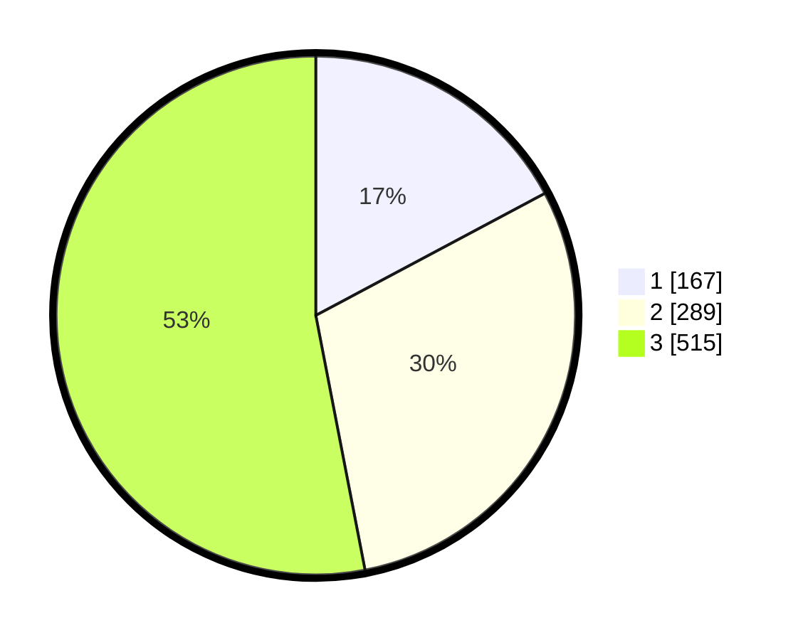

# Hasil

## Grafik

## Tabel

| No. | Nama Paslon    | Suara | Suara (raw) | Persentase |
|:--- |:-------------- | -----:| -----------:| ----------:|
| 1   | ANIES MUHAIMIN | 167   | [167][p-1]  | 17,20      |
| 2   | PRABOWO GIBRAN | 289   | [289][p-2]  | 29,76      |
| 3   | GANJAR MAHFUD  | 515   | [515][p-3]  | 53,04      |

[p-1]: https://github.com/gigit-pemilu/pemilu-2024-99-luar-negeri/blob/main/pilpres/hitung-suara/sub/99-luar-negeri/sub/74-melbourne-australia/sub/01-melbourne-australia/sub/0001-melbourne-australia/sub/001-pos-001/sub/paslon-1.txt
[p-2]: https://github.com/gigit-pemilu/pemilu-2024-99-luar-negeri/blob/main/pilpres/hitung-suara/sub/99-luar-negeri/sub/74-melbourne-australia/sub/01-melbourne-australia/sub/0001-melbourne-australia/sub/001-pos-001/sub/paslon-2.txt
[p-3]: https://github.com/gigit-pemilu/pemilu-2024-99-luar-negeri/blob/main/pilpres/hitung-suara/sub/99-luar-negeri/sub/74-melbourne-australia/sub/01-melbourne-australia/sub/0001-melbourne-australia/sub/001-pos-001/sub/paslon-3.txt

## Foto C Plano

https://sirekap-obj-formc.kpu.go.id/305d/pemilu/ppwp/99/74/01/00/01/9974010001001-20240217-130952--0f704cc0-4b98-4fda-b00b-94d921413a5c.jpg

https://sirekap-obj-formc.kpu.go.id/305d/pemilu/ppwp/99/74/01/00/01/9974010001001-20240217-131218--3c697938-435a-4b1a-997a-333206b10e4b.jpg

https://sirekap-obj-formc.kpu.go.id/305d/pemilu/ppwp/99/74/01/00/01/9974010001001-20240217-131344--50913655-b33d-4373-a2d1-8f0d4e58b742.jpg

## Metadata

| Key        | Value               |
| ---------- | ------------------- |
| Time Stamp | 2024-02-17 13:37:34 |

## DATA PEMILIH TETAP

Jumlah pemilih dalam DPT: **1576**.
 * L: **567**.
 * P: **1009**.

## DATA PENGGUNA HAK PILIH

Jumlah pengguna hak pilih dalam DPT: **989**.
 * L: **344**.
 * P: **645**.

Jumlah pengguna hak pilih dalam DPTb: **0**.
 * L: **0**.
 * P: **0**.

Jumlah pengguna hak pilih dalam DPK: **0**.
 * L: **0**.
 * P: **0**.

Jumlah pengguna hak pilih: **989**.
 * L: **344**.
 * P: **645**.

## JUMLAH SUARA SAH DAN TIDAK SAH

JUMLAH SELURUH SUARA SAH: **971**.

JUMLAH SUARA TIDAK SAH: **18**.

JUMLAH SELURUH SUARA SAH DAN SUARA TIDAK SAH: **989**.

