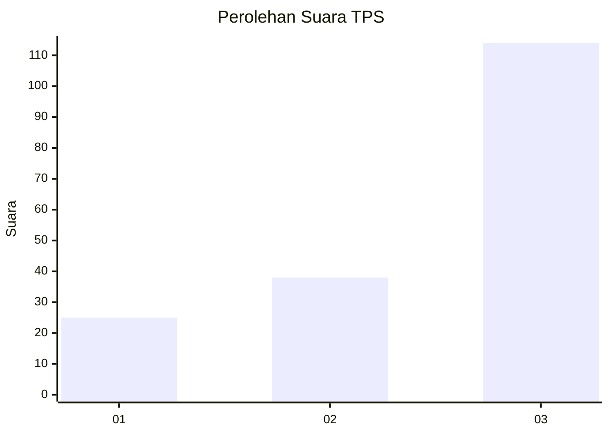
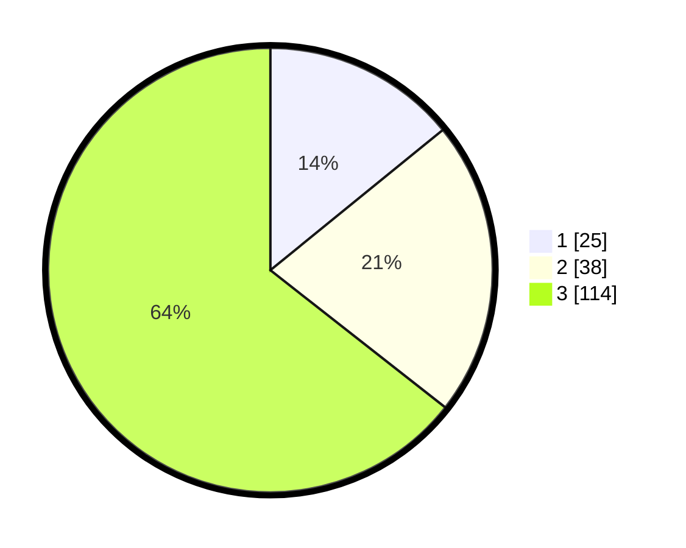

# Hasil

## Grafik

## Tabel

| No. | Nama Paslon    | Suara | Suara (raw) | Persentase |
|:--- |:-------------- | -----:| -----------:| ----------:|
| 1   | ANIES MUHAIMIN | 25    | [25][p-1]   | 14,12      |
| 2   | PRABOWO GIBRAN | 38    | [38][p-2]   | 21,47      |
| 3   | GANJAR MAHFUD  | 114   | [114][p-3]  | 64,41      |

[p-1]: https://github.com/gigit-pemilu/pemilu-2024-99-luar-negeri/blob/main/pilpres/hitung-suara/sub/99-luar-negeri/sub/74-melbourne-australia/sub/01-melbourne-australia/sub/0001-melbourne-australia/sub/002-tps-001/sub/paslon-1.txt
[p-2]: https://github.com/gigit-pemilu/pemilu-2024-99-luar-negeri/blob/main/pilpres/hitung-suara/sub/99-luar-negeri/sub/74-melbourne-australia/sub/01-melbourne-australia/sub/0001-melbourne-australia/sub/002-tps-001/sub/paslon-2.txt
[p-3]: https://github.com/gigit-pemilu/pemilu-2024-99-luar-negeri/blob/main/pilpres/hitung-suara/sub/99-luar-negeri/sub/74-melbourne-australia/sub/01-melbourne-australia/sub/0001-melbourne-australia/sub/002-tps-001/sub/paslon-3.txt

## Foto C Plano

https://sirekap-obj-formc.kpu.go.id/7a80/pemilu/ppwp/99/74/01/00/01/9974010001002-20240214-202319--29a97949-6a9e-4fbf-8582-bb2ed7983374.jpg

https://sirekap-obj-formc.kpu.go.id/7a80/pemilu/ppwp/99/74/01/00/01/9974010001002-20240214-202407--d80908b7-257b-4899-9a08-a4bd43afd1df.jpg

https://sirekap-obj-formc.kpu.go.id/7a80/pemilu/ppwp/99/74/01/00/01/9974010001002-20240214-202628--f91451c6-a202-4958-bccf-279a53b3620c.jpg

## Metadata

| Key        | Value               |
| ---------- | ------------------- |
| Time Stamp | 2024-02-15 18:30:25 |

## DATA PEMILIH TETAP

Jumlah pemilih dalam DPT: **490**.
 * L: **197**.
 * P: **293**.

## DATA PENGGUNA HAK PILIH

Jumlah pengguna hak pilih dalam DPT: **112**.
 * L: **48**.
 * P: **64**.

Jumlah pengguna hak pilih dalam DPTb: **50**.
 * L: **18**.
 * P: **32**.

Jumlah pengguna hak pilih dalam DPK: **19**.
 * L: **9**.
 * P: **10**.

Jumlah pengguna hak pilih: **181**.
 * L: **75**.
 * P: **106**.

## JUMLAH SUARA SAH DAN TIDAK SAH

JUMLAH SELURUH SUARA SAH: **177**.

JUMLAH SUARA TIDAK SAH: **4**.

JUMLAH SELURUH SUARA SAH DAN SUARA TIDAK SAH: **181**.

