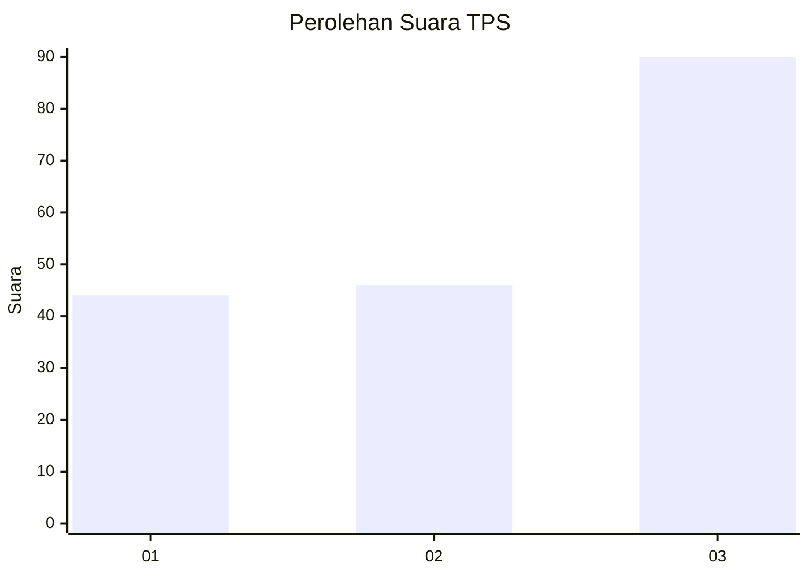
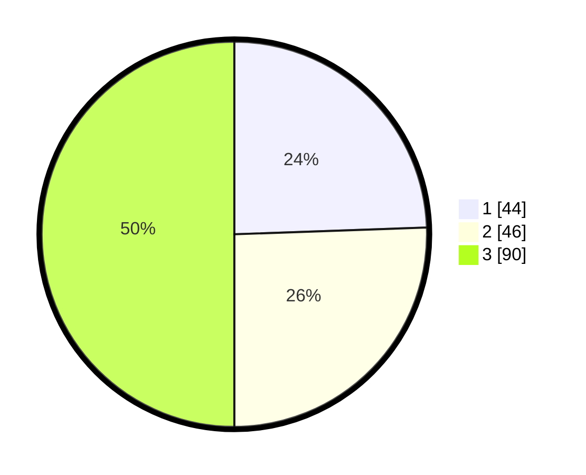

# Hasil

## Grafik

## Tabel

| No. | Nama Paslon    | Suara | Suara (raw) | Persentase |
|:--- |:-------------- | -----:| -----------:| ----------:|
| 1   | ANIES MUHAIMIN | 44    | [44][p-1]   | 24,44      |
| 2   | PRABOWO GIBRAN | 46    | [46][p-2]   | 25,56      |
| 3   | GANJAR MAHFUD  | 90    | [90][p-3]   | 50,00      |

[p-1]: https://github.com/gigit-pemilu/pemilu-2024-99-luar-negeri/blob/main/pilpres/hitung-suara/sub/99-luar-negeri/sub/74-melbourne-australia/sub/01-melbourne-australia/sub/0001-melbourne-australia/sub/004-tps-003/sub/paslon-1.txt
[p-2]: https://github.com/gigit-pemilu/pemilu-2024-99-luar-negeri/blob/main/pilpres/hitung-suara/sub/99-luar-negeri/sub/74-melbourne-australia/sub/01-melbourne-australia/sub/0001-melbourne-australia/sub/004-tps-003/sub/paslon-2.txt
[p-3]: https://github.com/gigit-pemilu/pemilu-2024-99-luar-negeri/blob/main/pilpres/hitung-suara/sub/99-luar-negeri/sub/74-melbourne-australia/sub/01-melbourne-australia/sub/0001-melbourne-australia/sub/004-tps-003/sub/paslon-3.txt

## Foto C Plano

https://sirekap-obj-formc.kpu.go.id/4b34/pemilu/ppwp/99/74/01/00/01/9974010001004-20240214-204921--ba8e454f-bb33-45ea-8acf-87fe42cade5f.jpg

https://sirekap-obj-formc.kpu.go.id/4b34/pemilu/ppwp/99/74/01/00/01/9974010001004-20240214-204948--a13de820-a387-4493-adf5-a59e024af41d.jpg

https://sirekap-obj-formc.kpu.go.id/4b34/pemilu/ppwp/99/74/01/00/01/9974010001004-20240214-205015--13118d09-8c65-4d63-917d-e4209f6e90d6.jpg

## Metadata

| Key        | Value               |
| ---------- | ------------------- |
| Time Stamp | 2024-02-14 21:46:01 |

## DATA PEMILIH TETAP

Jumlah pemilih dalam DPT: **490**.
 * L: **229**.
 * P: **261**.

## DATA PENGGUNA HAK PILIH

Jumlah pengguna hak pilih dalam DPT: **133**.
 * L: **52**.
 * P: **81**.

Jumlah pengguna hak pilih dalam DPTb: **49**.
 * L: **21**.
 * P: **28**.

Jumlah pengguna hak pilih dalam DPK: **1**.
 * L: **0**.
 * P: **1**.

Jumlah pengguna hak pilih: **183**.
 * L: **73**.
 * P: **110**.

## JUMLAH SUARA SAH DAN TIDAK SAH

JUMLAH SELURUH SUARA SAH: **180**.

JUMLAH SUARA TIDAK SAH: **3**.

JUMLAH SELURUH SUARA SAH DAN SUARA TIDAK SAH: **183**.

