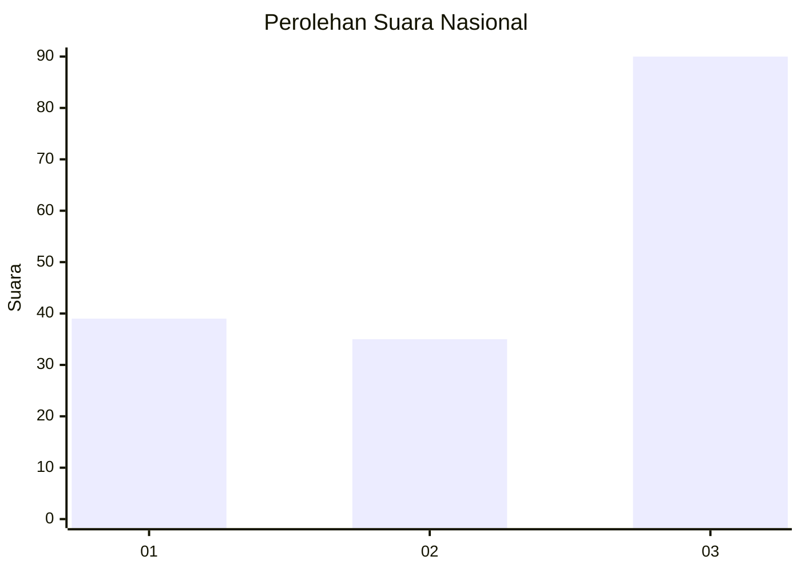
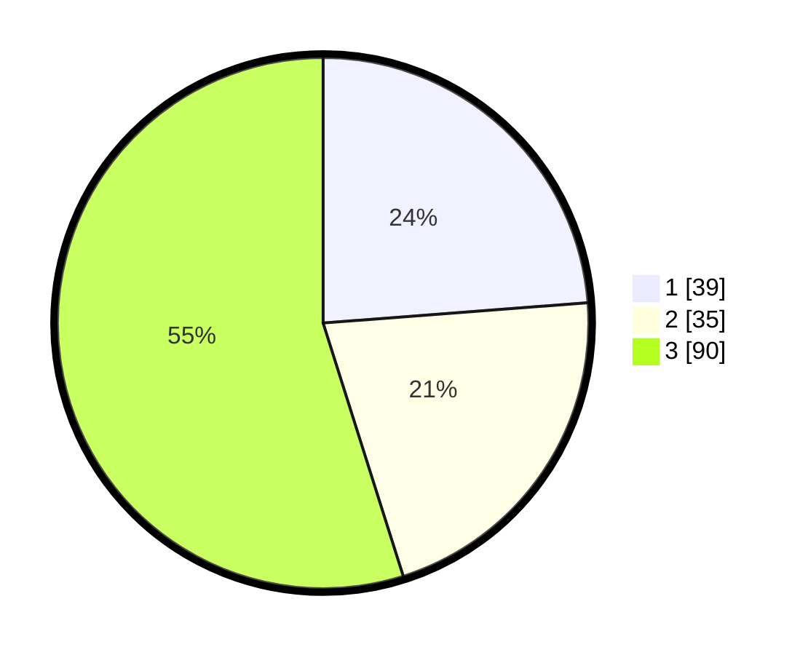

# Hasil

## Grafik

## Tabel

| No. | Nama Paslon    | Suara | Suara (raw) | Persentase |
|:--- |:-------------- | -----:| -----------:| ----------:|
| 1   | ANIES MUHAIMIN | 39    | [39][p-1]   | 23,78      |
| 2   | PRABOWO GIBRAN | 35    | [35][p-2]   | 21,34      |
| 3   | GANJAR MAHFUD  | 90    | [90][p-3]   | 54,88      |

[p-1]: https://github.com/gigit-pemilu/pemilu-2024/blob/main/pilpres/hitung-suara/sub/99-luar-negeri/sub/74-melbourne-australia/sub/01-melbourne-australia/sub/0001-melbourne-australia/sub/005-tps-004/sub/paslon-1.txt
[p-2]: https://github.com/gigit-pemilu/pemilu-2024/blob/main/pilpres/hitung-suara/sub/99-luar-negeri/sub/74-melbourne-australia/sub/01-melbourne-australia/sub/0001-melbourne-australia/sub/005-tps-004/sub/paslon-2.txt
[p-3]: https://github.com/gigit-pemilu/pemilu-2024/blob/main/pilpres/hitung-suara/sub/99-luar-negeri/sub/74-melbourne-australia/sub/01-melbourne-australia/sub/0001-melbourne-australia/sub/005-tps-004/sub/paslon-3.txt

## Foto C Plano

https://sirekap-obj-formc.kpu.go.id/8f80/pemilu/ppwp/99/74/01/00/01/9974010001005-20240214-191824--256a7f62-f32e-4278-8da5-1c31324902f5.jpg

https://sirekap-obj-formc.kpu.go.id/8f80/pemilu/ppwp/99/74/01/00/01/9974010001005-20240214-191954--a8554c22-0de2-48c7-89e0-18313671e069.jpg

https://sirekap-obj-formc.kpu.go.id/8f80/pemilu/ppwp/99/74/01/00/01/9974010001005-20240214-191458--73f2b945-2ef9-4daf-a8c6-7df0d0a951b2.jpg

## Metadata

| Key        | Value               |
| ---------- | ------------------- |
| Time Stamp | 2024-02-14 21:46:01 |

## DATA PEMILIH TETAP

Jumlah pemilih dalam DPT: **490**.
 * L: **205**.
 * P: **285**.

## DATA PENGGUNA HAK PILIH

Jumlah pengguna hak pilih dalam DPT: **92**.
 * L: **39**.
 * P: **53**.

Jumlah pengguna hak pilih dalam DPTb: **54**.
 * L: **19**.
 * P: **35**.

Jumlah pengguna hak pilih dalam DPK: **23**.
 * L: **9**.
 * P: **14**.

Jumlah pengguna hak pilih: **169**.
 * L: **67**.
 * P: **102**.

## JUMLAH SUARA SAH DAN TIDAK SAH

JUMLAH SELURUH SUARA SAH: **164**.

JUMLAH SUARA TIDAK SAH: **5**.

JUMLAH SELURUH SUARA SAH DAN SUARA TIDAK SAH: **169**.

