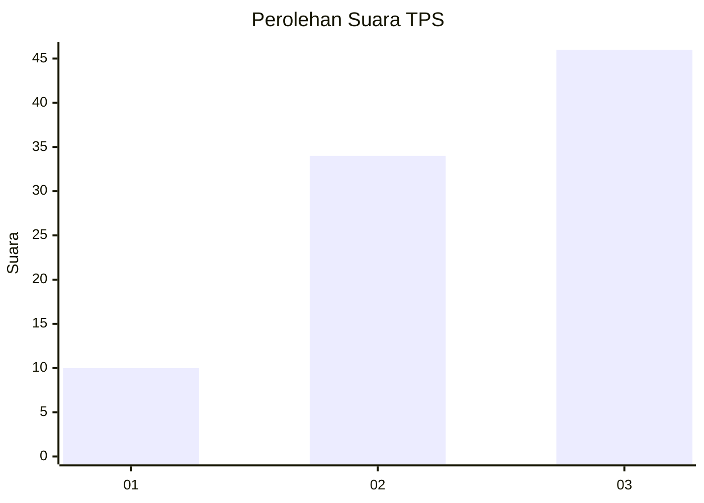
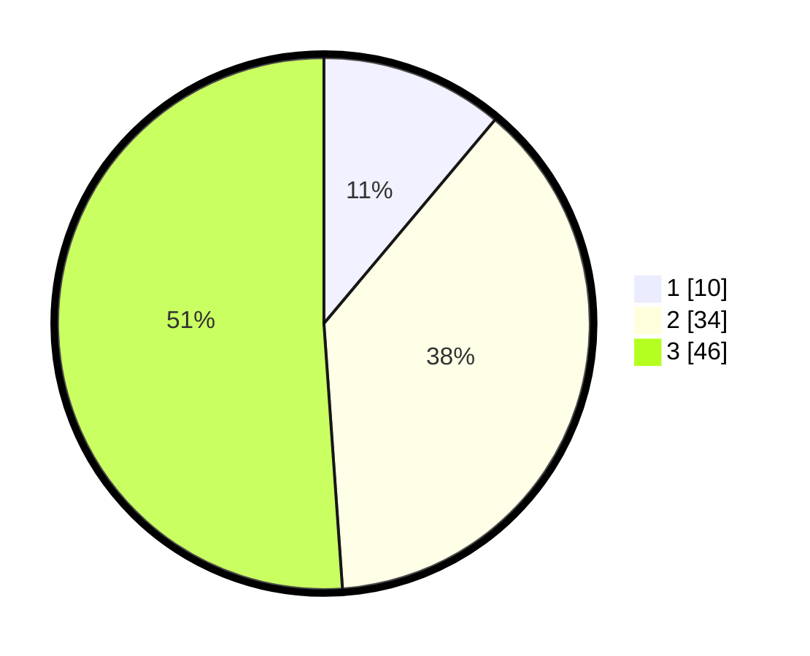

# Hasil

## Grafik

## Tabel

| No. | Nama Paslon    | Suara | Suara (raw) | Persentase |
|:--- |:-------------- | -----:| -----------:| ----------:|
| 1   | ANIES MUHAIMIN | 10    | [10][p-1]   | 11,11      |
| 2   | PRABOWO GIBRAN | 34    | [34][p-2]   | 37,78      |
| 3   | GANJAR MAHFUD  | 46    | [46][p-3]   | 51,11      |

[p-1]: https://github.com/gigit-pemilu/pemilu-2024-99-luar-negeri/blob/main/pilpres/hitung-suara/sub/99-luar-negeri/sub/75-mexico-city-mexico/sub/01-mexico-city-mexico/sub/0001-mexico-city-mexico/sub/002-tps-001/sub/paslon-1.txt
[p-2]: https://github.com/gigit-pemilu/pemilu-2024-99-luar-negeri/blob/main/pilpres/hitung-suara/sub/99-luar-negeri/sub/75-mexico-city-mexico/sub/01-mexico-city-mexico/sub/0001-mexico-city-mexico/sub/002-tps-001/sub/paslon-2.txt
[p-3]: https://github.com/gigit-pemilu/pemilu-2024-99-luar-negeri/blob/main/pilpres/hitung-suara/sub/99-luar-negeri/sub/75-mexico-city-mexico/sub/01-mexico-city-mexico/sub/0001-mexico-city-mexico/sub/002-tps-001/sub/paslon-3.txt

## Foto C Plano

https://sirekap-obj-formc.kpu.go.id/dbbc/pemilu/ppwp/99/75/01/00/01/9975010001002-20240215-050818--beaaf963-2b5a-4ec0-b0c8-547354b3ca30.jpg

https://sirekap-obj-formc.kpu.go.id/dbbc/pemilu/ppwp/99/75/01/00/01/9975010001002-20240215-050922--10138a0d-1fa6-493b-b514-35f2eadd14a6.jpg

https://sirekap-obj-formc.kpu.go.id/dbbc/pemilu/ppwp/99/75/01/00/01/9975010001002-20240215-051005--35e2c3b5-8f12-44bc-8ce8-d6c7e8e0fcce.jpg

## Metadata

| Key        | Value               |
| ---------- | ------------------- |
| Time Stamp | 2024-02-17 02:30:03 |

## DATA PEMILIH TETAP

Jumlah pemilih dalam DPT: **116**.
 * L: **49**.
 * P: **67**.

## DATA PENGGUNA HAK PILIH

Jumlah pengguna hak pilih dalam DPT: **83**.
 * L: **34**.
 * P: **49**.

Jumlah pengguna hak pilih dalam DPTb: **6**.
 * L: **5**.
 * P: **1**.

Jumlah pengguna hak pilih dalam DPK: **4**.
 * L: **3**.
 * P: **1**.

Jumlah pengguna hak pilih: **93**.
 * L: **42**.
 * P: **51**.

## JUMLAH SUARA SAH DAN TIDAK SAH

JUMLAH SELURUH SUARA SAH: **90**.

JUMLAH SUARA TIDAK SAH: **3**.

JUMLAH SELURUH SUARA SAH DAN SUARA TIDAK SAH: **93**.

