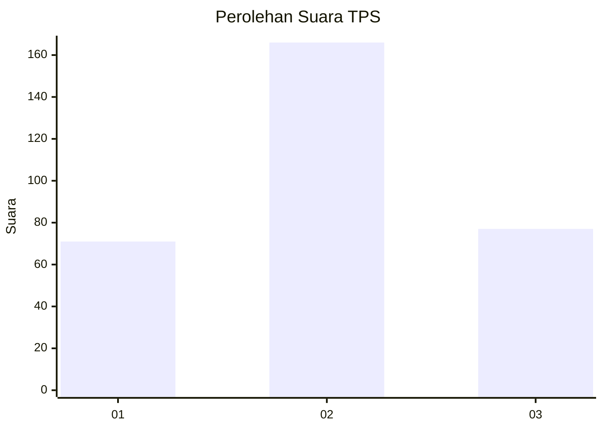
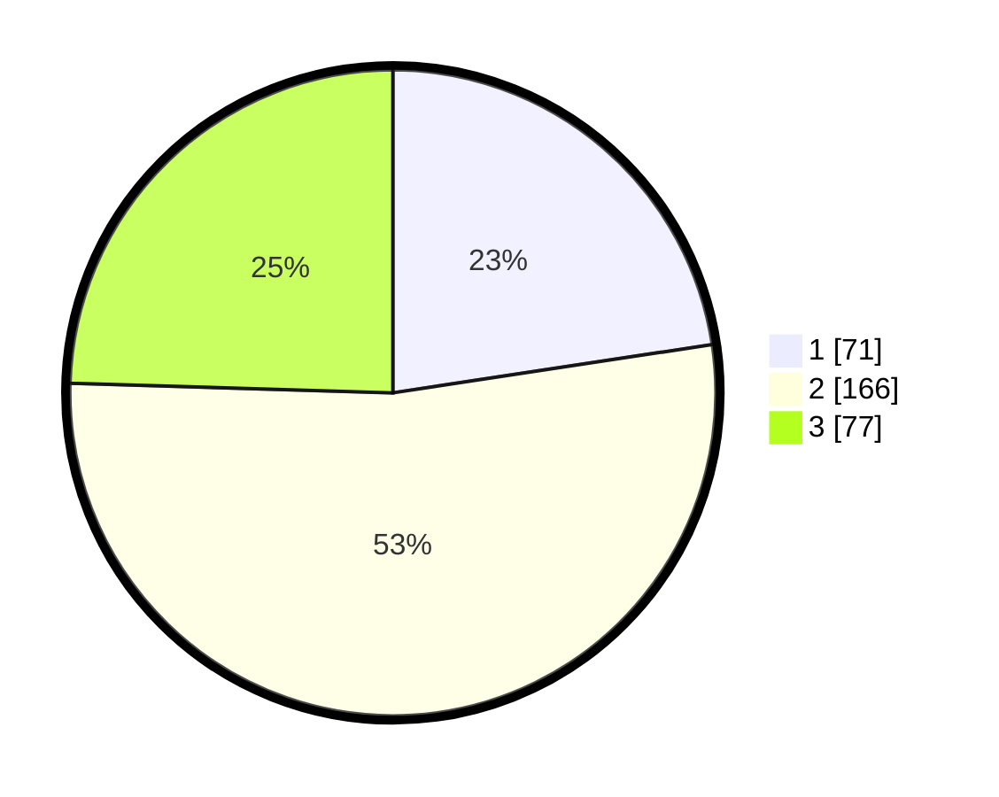

# Hasil

## Grafik

## Tabel

| No. | Nama Paslon    | Suara | Suara (raw) | Persentase |
|:--- |:-------------- | -----:| -----------:| ----------:|
| 1   | ANIES MUHAIMIN | 71    | [71][p-1]   | 22,61      |
| 2   | PRABOWO GIBRAN | 166   | [166][p-2]  | 52,87      |
| 3   | GANJAR MAHFUD  | 77    | [77][p-3]   | 24,52      |

[p-1]: https://github.com/gigit-pemilu/pemilu-2024-99-luar-negeri/blob/main/pilpres/hitung-suara/sub/99-luar-negeri/sub/76-moskow-rusia/sub/01-moskow-rusia/sub/0001-moskow-rusia/sub/002-tps-001/sub/paslon-1.txt
[p-2]: https://github.com/gigit-pemilu/pemilu-2024-99-luar-negeri/blob/main/pilpres/hitung-suara/sub/99-luar-negeri/sub/76-moskow-rusia/sub/01-moskow-rusia/sub/0001-moskow-rusia/sub/002-tps-001/sub/paslon-2.txt
[p-3]: https://github.com/gigit-pemilu/pemilu-2024-99-luar-negeri/blob/main/pilpres/hitung-suara/sub/99-luar-negeri/sub/76-moskow-rusia/sub/01-moskow-rusia/sub/0001-moskow-rusia/sub/002-tps-001/sub/paslon-3.txt

## Foto C Plano

https://sirekap-obj-formc.kpu.go.id/0033/pemilu/ppwp/99/76/01/00/01/9976010001002-20240216-140018--7933c10b-9ae3-4843-a6ae-c4a80a8aa65c.jpg

https://sirekap-obj-formc.kpu.go.id/0033/pemilu/ppwp/99/76/01/00/01/9976010001002-20240216-140019--36d09161-e81f-4311-bdcc-6dedd6b73d36.jpg

https://sirekap-obj-formc.kpu.go.id/0033/pemilu/ppwp/99/76/01/00/01/9976010001002-20240216-140018--a929474d-3790-4d83-be2c-d650e369144d.jpg

## Metadata

| Key        | Value               |
| ---------- | ------------------- |
| Time Stamp | 2024-02-17 19:30:00 |

## DATA PEMILIH TETAP

Jumlah pemilih dalam DPT: **835**.
 * L: **217**.
 * P: **618**.

## DATA PENGGUNA HAK PILIH

Jumlah pengguna hak pilih dalam DPT: **203**.
 * L: **100**.
 * P: **103**.

Jumlah pengguna hak pilih dalam DPTb: **107**.
 * L: **44**.
 * P: **63**.

Jumlah pengguna hak pilih dalam DPK: **14**.
 * L: **7**.
 * P: **7**.

Jumlah pengguna hak pilih: **324**.
 * L: **151**.
 * P: **173**.

## JUMLAH SUARA SAH DAN TIDAK SAH

JUMLAH SELURUH SUARA SAH: **314**.

JUMLAH SUARA TIDAK SAH: **10**.

JUMLAH SELURUH SUARA SAH DAN SUARA TIDAK SAH: **324**.

