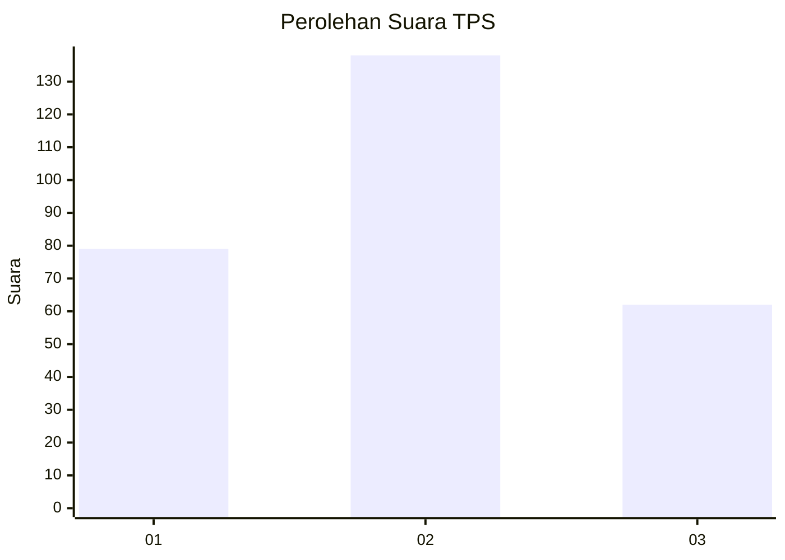
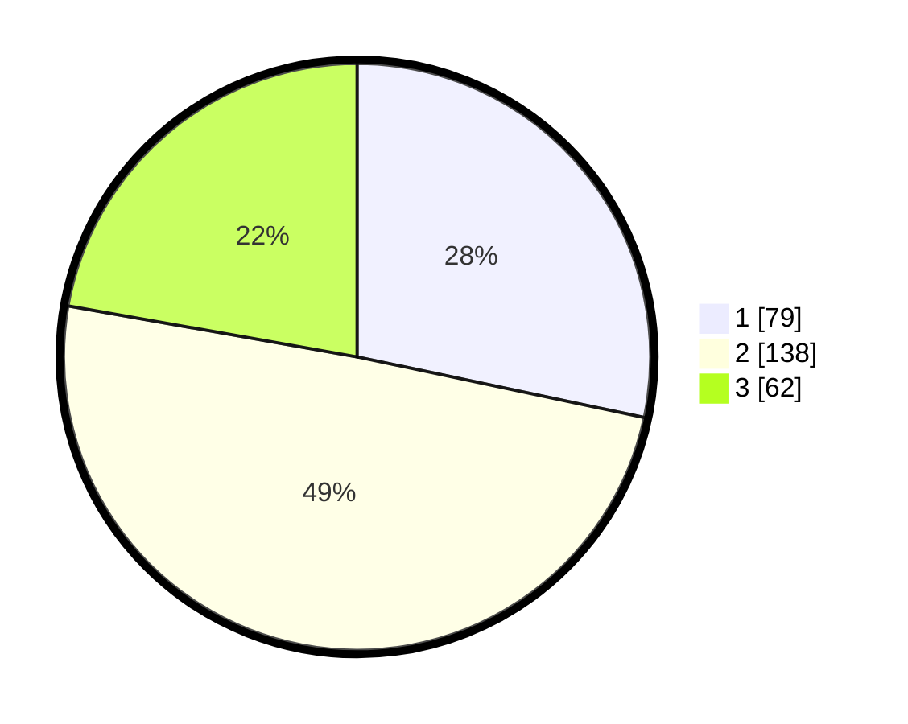

# Hasil

## Grafik

## Tabel

| No. | Nama Paslon    | Suara | Suara (raw) | Persentase |
|:--- |:-------------- | -----:| -----------:| ----------:|
| 1   | ANIES MUHAIMIN | 79    | [79][p-1]   | 28,32      |
| 2   | PRABOWO GIBRAN | 138   | [138][p-2]  | 49,46      |
| 3   | GANJAR MAHFUD  | 62    | [62][p-3]   | 22,22      |

[p-1]: https://github.com/gigit-pemilu/pemilu-2024-99-luar-negeri/blob/main/pilpres/hitung-suara/sub/99-luar-negeri/sub/77-mumbai-india/sub/01-mumbai-india/sub/0001-mumbai-india/sub/001-pos-001/sub/paslon-1.txt
[p-2]: https://github.com/gigit-pemilu/pemilu-2024-99-luar-negeri/blob/main/pilpres/hitung-suara/sub/99-luar-negeri/sub/77-mumbai-india/sub/01-mumbai-india/sub/0001-mumbai-india/sub/001-pos-001/sub/paslon-2.txt
[p-3]: https://github.com/gigit-pemilu/pemilu-2024-99-luar-negeri/blob/main/pilpres/hitung-suara/sub/99-luar-negeri/sub/77-mumbai-india/sub/01-mumbai-india/sub/0001-mumbai-india/sub/001-pos-001/sub/paslon-3.txt

## Foto C Plano

https://sirekap-obj-formc.kpu.go.id/371f/pemilu/ppwp/99/77/01/00/01/9977010001001-20240216-164939--8e8665fb-476c-4ffd-bbfa-cf8a0906cc45.jpg

https://sirekap-obj-formc.kpu.go.id/371f/pemilu/ppwp/99/77/01/00/01/9977010001001-20240216-163733--8bcc5112-aca5-4516-b907-08a26a86ed1d.jpg

https://sirekap-obj-formc.kpu.go.id/371f/pemilu/ppwp/99/77/01/00/01/9977010001001-20240216-163653--e1045a21-1b84-422c-8c70-ee21bf67b1f3.jpg

## Metadata

| Key        | Value               |
| ---------- | ------------------- |
| Time Stamp | 2024-02-16 17:00:00 |

## DATA PEMILIH TETAP

Jumlah pemilih dalam DPT: **389**.
 * L: **69**.
 * P: **320**.

## DATA PENGGUNA HAK PILIH

Jumlah pengguna hak pilih dalam DPT: **378**.
 * L: **67**.
 * P: **311**.

Jumlah pengguna hak pilih dalam DPTb: **6**.
 * L: **1**.
 * P: **5**.

Jumlah pengguna hak pilih dalam DPK: **0**.
 * L: **0**.
 * P: **0**.

Jumlah pengguna hak pilih: **384**.
 * L: **68**.
 * P: **316**.

## JUMLAH SUARA SAH DAN TIDAK SAH

JUMLAH SELURUH SUARA SAH: **279**.

JUMLAH SUARA TIDAK SAH: **32**.

JUMLAH SELURUH SUARA SAH DAN SUARA TIDAK SAH: **311**.

