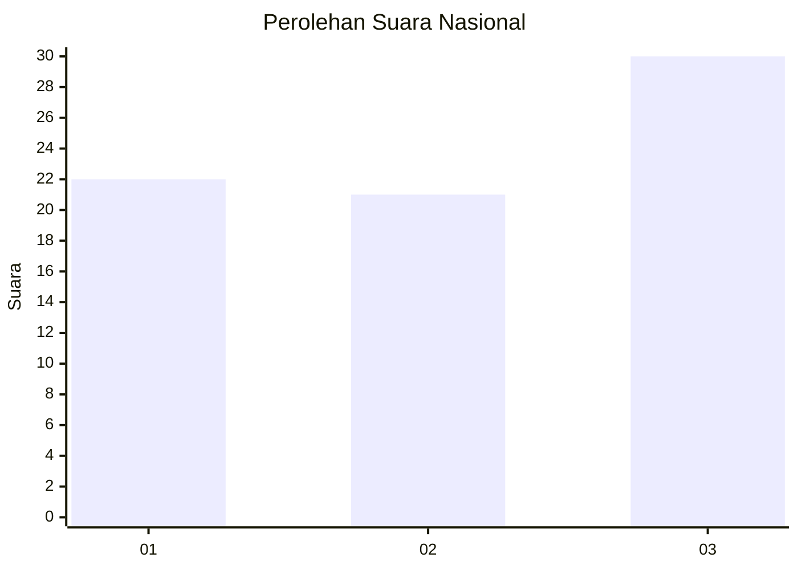
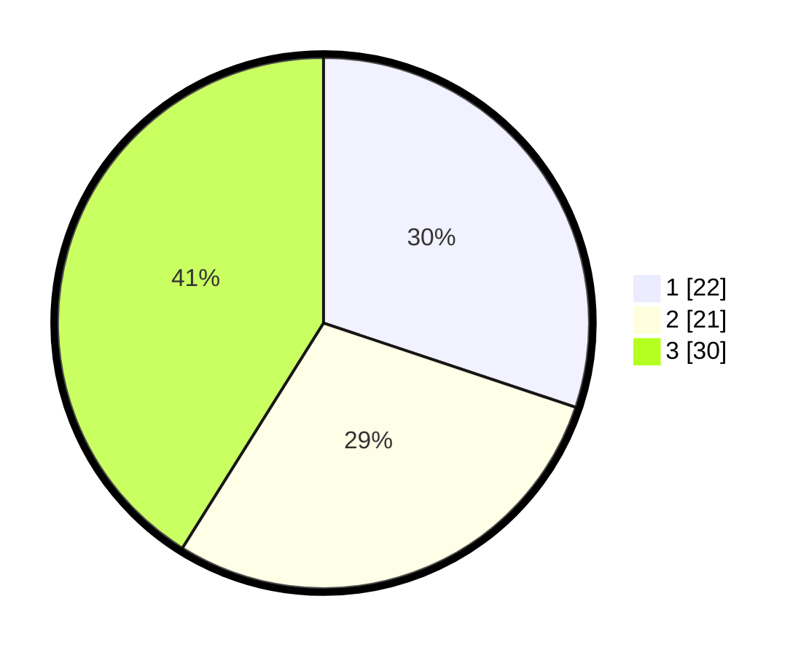

# Hasil

## Grafik

## Tabel

| No. | Nama Paslon    | Suara | Suara (raw) | Persentase |
|:--- |:-------------- | -----:| -----------:| ----------:|
| 1   | ANIES MUHAIMIN | 22    | [22][p-1]   | 30,14      |
| 2   | PRABOWO GIBRAN | 21    | [21][p-2]   | 28,77      |
| 3   | GANJAR MAHFUD  | 30    | [30][p-3]   | 41,10      |

[p-1]: https://github.com/gigit-pemilu/pemilu-2024/blob/main/pilpres/hitung-suara/sub/99-luar-negeri/sub/77-mumbai-india/sub/01-mumbai-india/sub/0001-mumbai-india/sub/002-tps-001/sub/paslon-1.txt
[p-2]: https://github.com/gigit-pemilu/pemilu-2024/blob/main/pilpres/hitung-suara/sub/99-luar-negeri/sub/77-mumbai-india/sub/01-mumbai-india/sub/0001-mumbai-india/sub/002-tps-001/sub/paslon-2.txt
[p-3]: https://github.com/gigit-pemilu/pemilu-2024/blob/main/pilpres/hitung-suara/sub/99-luar-negeri/sub/77-mumbai-india/sub/01-mumbai-india/sub/0001-mumbai-india/sub/002-tps-001/sub/paslon-3.txt

## Foto C Plano

https://sirekap-obj-formc.kpu.go.id/153d/pemilu/ppwp/99/77/01/00/01/9977010001002-20240214-203420--58270a21-95f7-4bab-8896-8b204f3ab9c7.jpg

https://sirekap-obj-formc.kpu.go.id/153d/pemilu/ppwp/99/77/01/00/01/9977010001002-20240216-141729--a5df92e0-ce87-41f8-a3cd-803369c73d10.jpg

https://sirekap-obj-formc.kpu.go.id/153d/pemilu/ppwp/99/77/01/00/01/9977010001002-20240214-203603--1dd1ee98-607c-45f9-886c-971dbf11bc00.jpg

## Metadata

| Key        | Value               |
| ---------- | ------------------- |
| Time Stamp | 2024-02-19 06:16:00 |

## DATA PEMILIH TETAP

Jumlah pemilih dalam DPT: **90**.
 * L: **30**.
 * P: **60**.

## DATA PENGGUNA HAK PILIH

Jumlah pengguna hak pilih dalam DPT: **64**.
 * L: **22**.
 * P: **42**.

Jumlah pengguna hak pilih dalam DPTb: **7**.
 * L: **3**.
 * P: **4**.

Jumlah pengguna hak pilih dalam DPK: **3**.
 * L: **1**.
 * P: **2**.

Jumlah pengguna hak pilih: **74**.
 * L: **26**.
 * P: **48**.

## JUMLAH SUARA SAH DAN TIDAK SAH

JUMLAH SELURUH SUARA SAH: **73**.

JUMLAH SUARA TIDAK SAH: **1**.

JUMLAH SELURUH SUARA SAH DAN SUARA TIDAK SAH: **74**.

