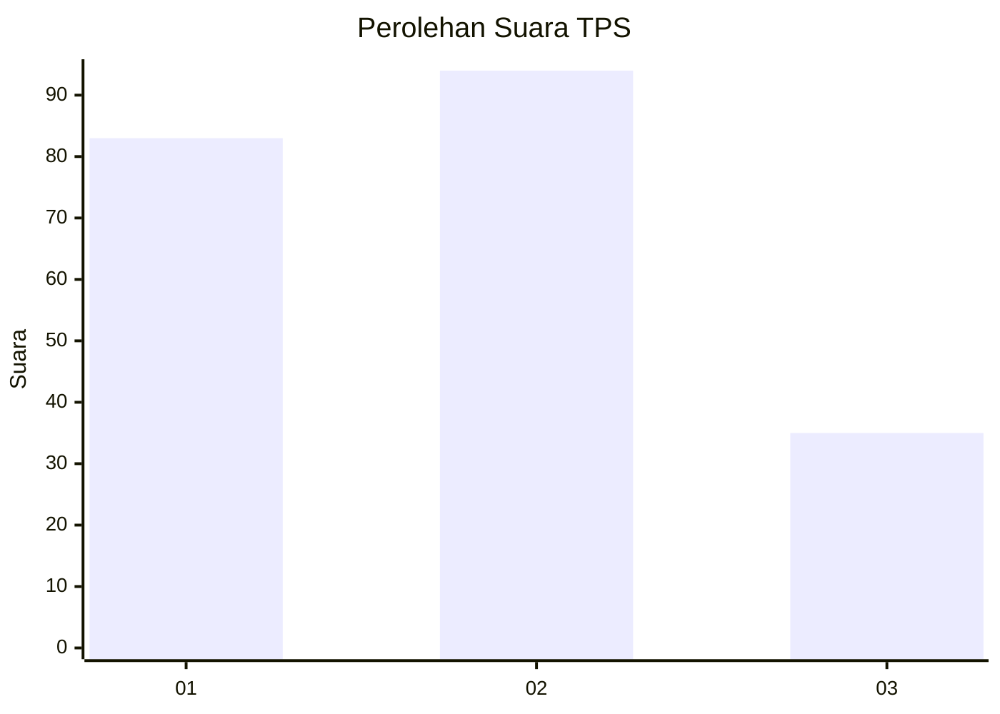
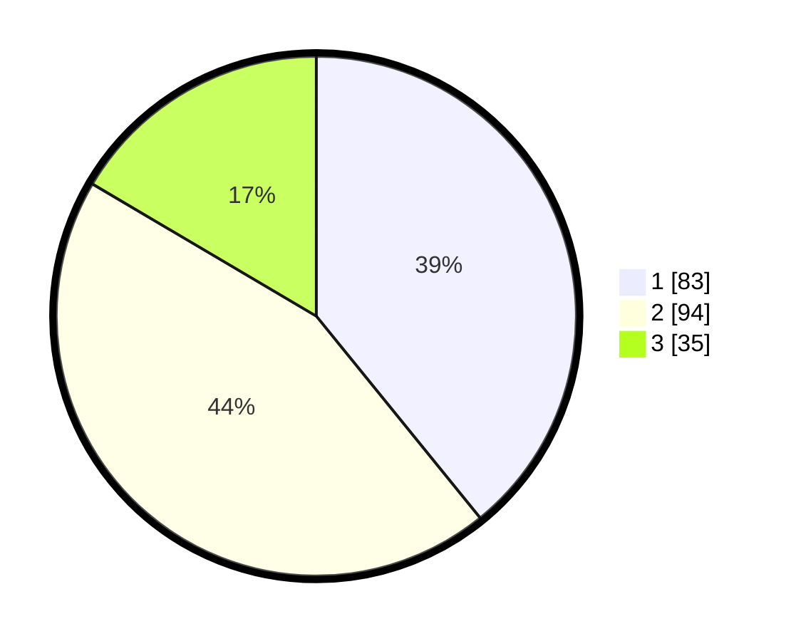

# Hasil

## Grafik

## Tabel

| No. | Nama Paslon    | Suara | Suara (raw) | Persentase |
|:--- |:-------------- | -----:| -----------:| ----------:|
| 1   | ANIES MUHAIMIN | 83    | [83][p-1]   | 39,15      |
| 2   | PRABOWO GIBRAN | 94    | [94][p-2]   | 44,34      |
| 3   | GANJAR MAHFUD  | 35    | [35][p-3]   | 16,51      |

[p-1]: https://github.com/gigit-pemilu/pemilu-2024-99-luar-negeri/blob/main/pilpres/hitung-suara/sub/99-luar-negeri/sub/78-muscat-oman/sub/01-muscat-oman/sub/0001-muscat-oman/sub/001-tps/sub/paslon-1.txt
[p-2]: https://github.com/gigit-pemilu/pemilu-2024-99-luar-negeri/blob/main/pilpres/hitung-suara/sub/99-luar-negeri/sub/78-muscat-oman/sub/01-muscat-oman/sub/0001-muscat-oman/sub/001-tps/sub/paslon-2.txt
[p-3]: https://github.com/gigit-pemilu/pemilu-2024-99-luar-negeri/blob/main/pilpres/hitung-suara/sub/99-luar-negeri/sub/78-muscat-oman/sub/01-muscat-oman/sub/0001-muscat-oman/sub/001-tps/sub/paslon-3.txt

## Foto C Plano

https://sirekap-obj-formc.kpu.go.id/0365/pemilu/ppwp/99/78/01/00/01/9978010001001-20240214-220503--72377c9c-3b3e-4e69-8d8d-6ad0e895f69c.jpg

https://sirekap-obj-formc.kpu.go.id/0365/pemilu/ppwp/99/78/01/00/01/9978010001001-20240214-220637--07f79aa3-61c9-4213-aa0a-d3ba5ad528ac.jpg

https://sirekap-obj-formc.kpu.go.id/0365/pemilu/ppwp/99/78/01/00/01/9978010001001-20240217-151244--ac50e000-fcf5-4673-b246-501dfced9d9c.jpg

## Metadata

| Key        | Value               |
| ---------- | ------------------- |
| Time Stamp | 2024-02-17 16:00:02 |

## DATA PEMILIH TETAP

Jumlah pemilih dalam DPT: **435**.
 * L: **108**.
 * P: **327**.

## DATA PENGGUNA HAK PILIH

Jumlah pengguna hak pilih dalam DPT: **161**.
 * L: **50**.
 * P: **111**.

Jumlah pengguna hak pilih dalam DPTb: **28**.
 * L: **8**.
 * P: **20**.

Jumlah pengguna hak pilih dalam DPK: **25**.
 * L: **12**.
 * P: **13**.

Jumlah pengguna hak pilih: **214**.
 * L: **70**.
 * P: **144**.

## JUMLAH SUARA SAH DAN TIDAK SAH

JUMLAH SELURUH SUARA SAH: **212**.

JUMLAH SUARA TIDAK SAH: **2**.

JUMLAH SELURUH SUARA SAH DAN SUARA TIDAK SAH: **214**.

