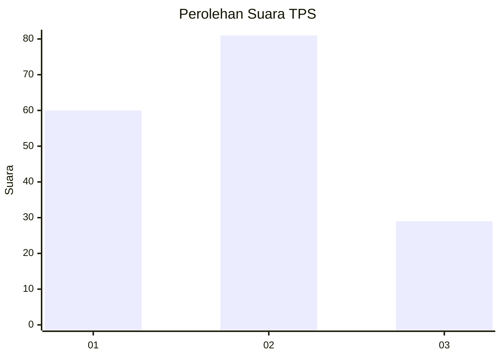
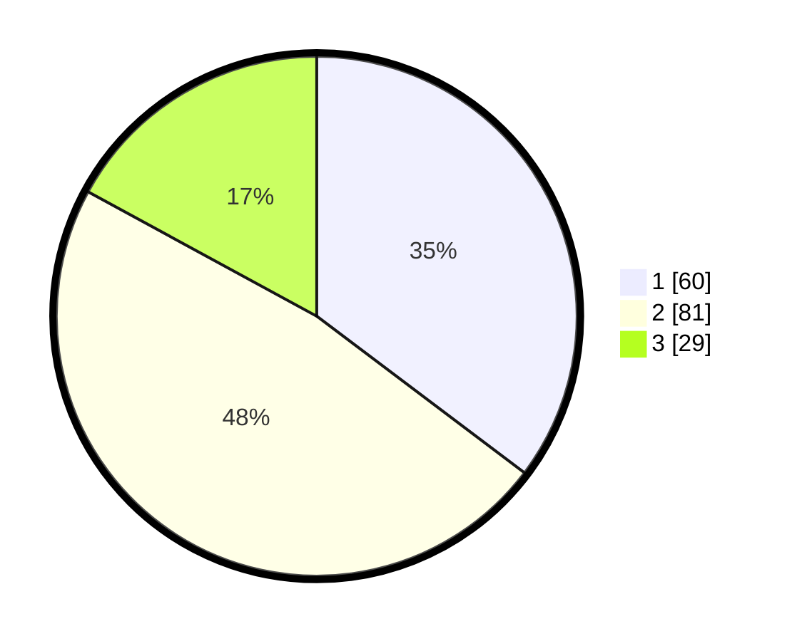

# Hasil

## Grafik

## Tabel

| No. | Nama Paslon    | Suara | Suara (raw) | Persentase |
|:--- |:-------------- | -----:| -----------:| ----------:|
| 1   | ANIES MUHAIMIN | 60    | [60][p-1]   | 35,29      |
| 2   | PRABOWO GIBRAN | 81    | [81][p-2]   | 47,65      |
| 3   | GANJAR MAHFUD  | 29    | [29][p-3]   | 17,06      |

[p-1]: https://github.com/gigit-pemilu/pemilu-2024-99-luar-negeri/blob/main/pilpres/hitung-suara/sub/99-luar-negeri/sub/78-muscat-oman/sub/01-muscat-oman/sub/0001-muscat-oman/sub/002-tps/sub/paslon-1.txt
[p-2]: https://github.com/gigit-pemilu/pemilu-2024-99-luar-negeri/blob/main/pilpres/hitung-suara/sub/99-luar-negeri/sub/78-muscat-oman/sub/01-muscat-oman/sub/0001-muscat-oman/sub/002-tps/sub/paslon-2.txt
[p-3]: https://github.com/gigit-pemilu/pemilu-2024-99-luar-negeri/blob/main/pilpres/hitung-suara/sub/99-luar-negeri/sub/78-muscat-oman/sub/01-muscat-oman/sub/0001-muscat-oman/sub/002-tps/sub/paslon-3.txt

## Foto C Plano

https://sirekap-obj-formc.kpu.go.id/39e5/pemilu/ppwp/99/78/01/00/01/9978010001002-20240215-023323--e3fe6107-69d2-4758-af81-09dbec5e911e.jpg

https://sirekap-obj-formc.kpu.go.id/39e5/pemilu/ppwp/99/78/01/00/01/9978010001002-20240214-202419--a05c6eed-b5f3-4558-b6b3-3312ade1830c.jpg

https://sirekap-obj-formc.kpu.go.id/39e5/pemilu/ppwp/99/78/01/00/01/9978010001002-20240214-202522--6221b17e-959c-4300-84d1-dd252adf23a0.jpg

## Metadata

| Key        | Value               |
| ---------- | ------------------- |
| Time Stamp | 2024-02-15 18:30:25 |

## DATA PEMILIH TETAP

Jumlah pemilih dalam DPT: **300**.
 * L: **50**.
 * P: **250**.

## DATA PENGGUNA HAK PILIH

Jumlah pengguna hak pilih dalam DPT: **109**.
 * L: **24**.
 * P: **85**.

Jumlah pengguna hak pilih dalam DPTb: **46**.
 * L: **17**.
 * P: **29**.

Jumlah pengguna hak pilih dalam DPK: **19**.
 * L: **5**.
 * P: **14**.

Jumlah pengguna hak pilih: **174**.
 * L: **46**.
 * P: **128**.

## JUMLAH SUARA SAH DAN TIDAK SAH

JUMLAH SELURUH SUARA SAH: **170**.

JUMLAH SUARA TIDAK SAH: **4**.

JUMLAH SELURUH SUARA SAH DAN SUARA TIDAK SAH: **174**.

