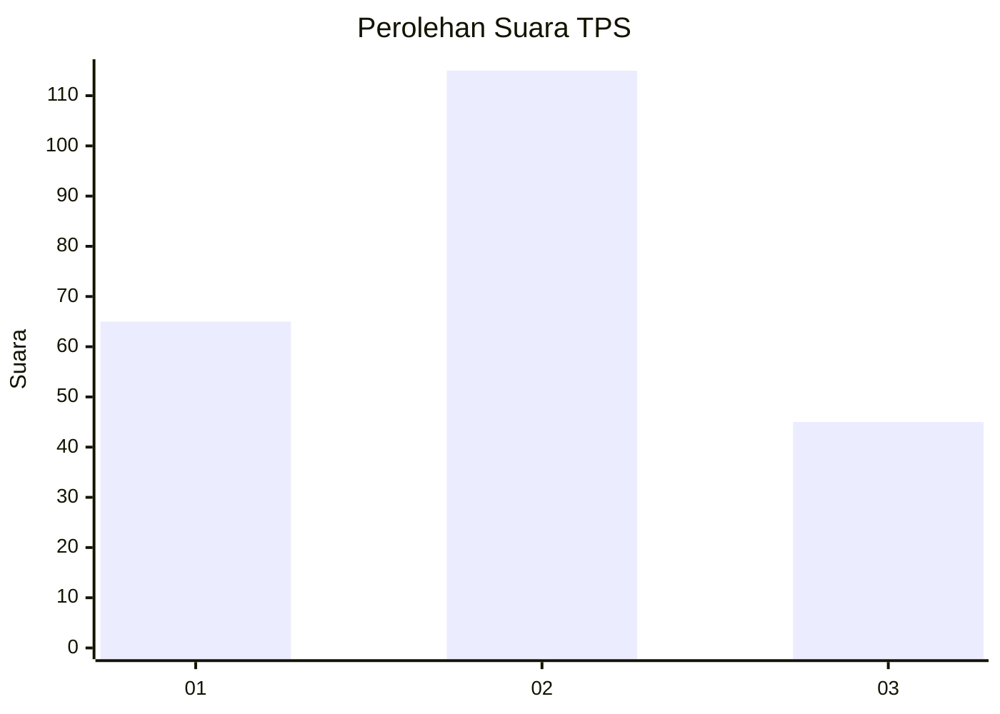
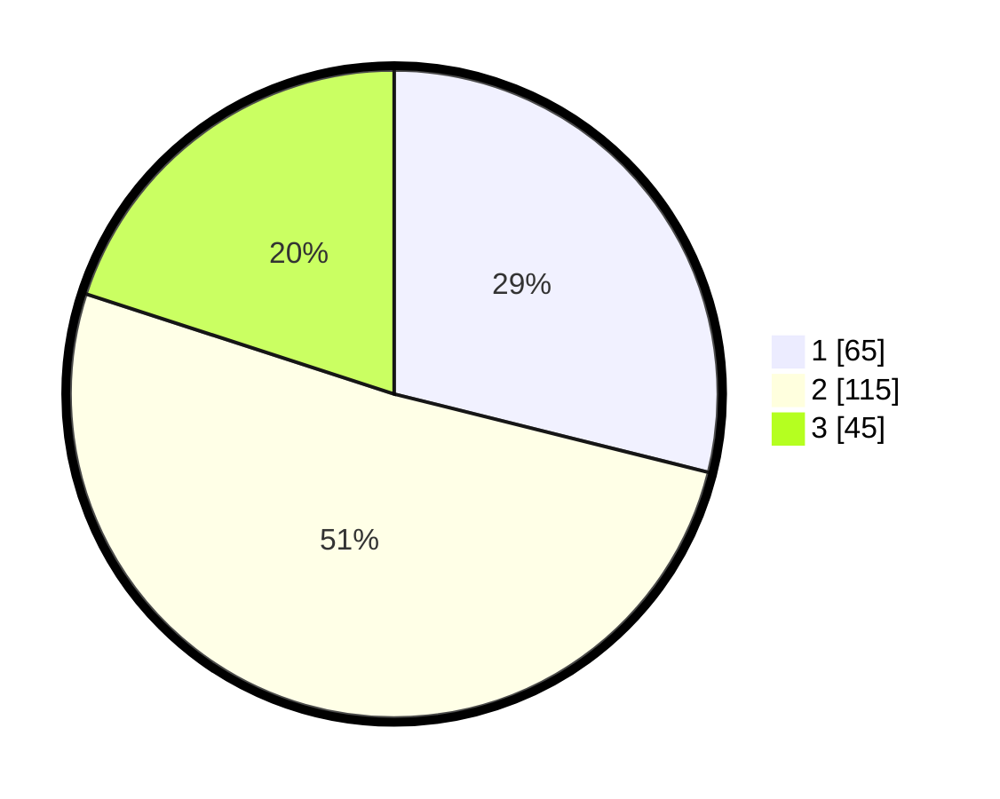

# Hasil

## Grafik

## Tabel

| No. | Nama Paslon    | Suara | Suara (raw) | Persentase |
|:--- |:-------------- | -----:| -----------:| ----------:|
| 1   | ANIES MUHAIMIN | 65    | [65][p-1]   | 28,89      |
| 2   | PRABOWO GIBRAN | 115   | [115][p-2]  | 51,11      |
| 3   | GANJAR MAHFUD  | 45    | [45][p-3]   | 20,00      |

[p-1]: https://github.com/gigit-pemilu/pemilu-2024-99-luar-negeri/blob/main/pilpres/hitung-suara/sub/99-luar-negeri/sub/78-muscat-oman/sub/01-muscat-oman/sub/0001-muscat-oman/sub/003-tps/sub/paslon-1.txt
[p-2]: https://github.com/gigit-pemilu/pemilu-2024-99-luar-negeri/blob/main/pilpres/hitung-suara/sub/99-luar-negeri/sub/78-muscat-oman/sub/01-muscat-oman/sub/0001-muscat-oman/sub/003-tps/sub/paslon-2.txt
[p-3]: https://github.com/gigit-pemilu/pemilu-2024-99-luar-negeri/blob/main/pilpres/hitung-suara/sub/99-luar-negeri/sub/78-muscat-oman/sub/01-muscat-oman/sub/0001-muscat-oman/sub/003-tps/sub/paslon-3.txt

## Foto C Plano

https://sirekap-obj-formc.kpu.go.id/0d3a/pemilu/ppwp/99/78/01/00/01/9978010001003-20240214-235453--77350146-abd3-448f-9869-7ff904f8a813.jpg

https://sirekap-obj-formc.kpu.go.id/0d3a/pemilu/ppwp/99/78/01/00/01/9978010001003-20240214-235602--8d61d7cd-2171-4cf2-94ef-efe73f2d80c3.jpg

https://sirekap-obj-formc.kpu.go.id/0d3a/pemilu/ppwp/99/78/01/00/01/9978010001003-20240214-235550--cf193a46-ff22-497b-99d5-8a0a047a97cf.jpg

## Metadata

| Key        | Value               |
| ---------- | ------------------- |
| Time Stamp | 2024-02-15 15:00:29 |

## DATA PEMILIH TETAP

Jumlah pemilih dalam DPT: **392**.
 * L: **44**.
 * P: **348**.

## DATA PENGGUNA HAK PILIH

Jumlah pengguna hak pilih dalam DPT: **158**.
 * L: **27**.
 * P: **131**.

Jumlah pengguna hak pilih dalam DPTb: **39**.
 * L: **9**.
 * P: **30**.

Jumlah pengguna hak pilih dalam DPK: **34**.
 * L: **3**.
 * P: **31**.

Jumlah pengguna hak pilih: **231**.
 * L: **39**.
 * P: **192**.

## JUMLAH SUARA SAH DAN TIDAK SAH

JUMLAH SELURUH SUARA SAH: **225**.

JUMLAH SUARA TIDAK SAH: **6**.

JUMLAH SELURUH SUARA SAH DAN SUARA TIDAK SAH: **231**.

