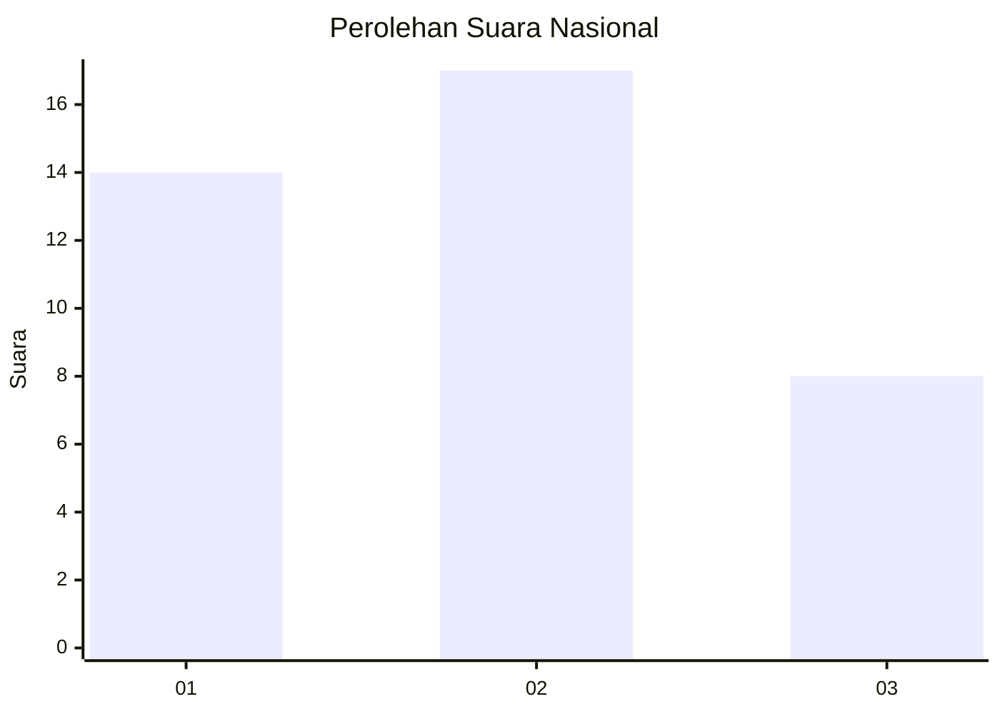
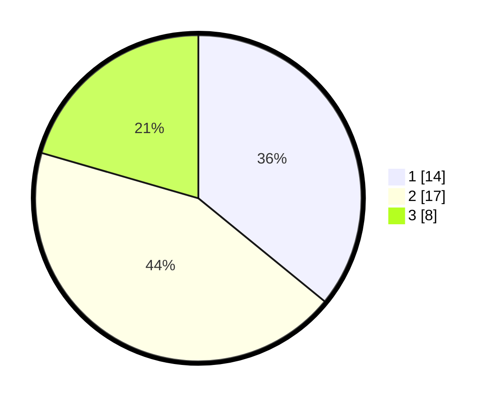

# Hasil

## Grafik

## Tabel

| No. | Nama Paslon    | Suara | Suara (raw) | Persentase |
|:--- |:-------------- | -----:| -----------:| ----------:|
| 1   | ANIES MUHAIMIN | 14    | [14][p-1]   | 35,90      |
| 2   | PRABOWO GIBRAN | 17    | [17][p-2]   | 43,59      |
| 3   | GANJAR MAHFUD  | 8     | [8][p-3]    | 20,51      |

[p-1]: https://github.com/gigit-pemilu/pemilu-2024/blob/main/pilpres/hitung-suara/sub/99-luar-negeri/sub/79-nairobi-kenya/sub/01-nairobi-kenya/sub/0001-nairobi-kenya/sub/001-pos-001/sub/paslon-1.txt
[p-2]: https://github.com/gigit-pemilu/pemilu-2024/blob/main/pilpres/hitung-suara/sub/99-luar-negeri/sub/79-nairobi-kenya/sub/01-nairobi-kenya/sub/0001-nairobi-kenya/sub/001-pos-001/sub/paslon-2.txt
[p-3]: https://github.com/gigit-pemilu/pemilu-2024/blob/main/pilpres/hitung-suara/sub/99-luar-negeri/sub/79-nairobi-kenya/sub/01-nairobi-kenya/sub/0001-nairobi-kenya/sub/001-pos-001/sub/paslon-3.txt

## Foto C Plano

https://sirekap-obj-formc.kpu.go.id/5474/pemilu/ppwp/99/79/01/00/01/9979010001001-20240219-174129--01572610-524a-4c01-bf58-fa0abafc08b8.jpg

https://sirekap-obj-formc.kpu.go.id/5474/pemilu/ppwp/99/79/01/00/01/9979010001001-20240219-174131--7356ec0a-1100-448f-82c4-c09774f9ddaa.jpg

https://sirekap-obj-formc.kpu.go.id/5474/pemilu/ppwp/99/79/01/00/01/9979010001001-20240219-174130--c7a6ef93-d9d5-4696-b56d-7323765d9e07.jpg

## Metadata

| Key        | Value               |
| ---------- | ------------------- |
| Time Stamp | 2024-02-19 23:00:00 |

## DATA PEMILIH TETAP

Jumlah pemilih dalam DPT: **57**.
 * L: **54**.
 * P: **3**.

## DATA PENGGUNA HAK PILIH

Jumlah pengguna hak pilih dalam DPT: **48**.
 * L: **46**.
 * P: **2**.

Jumlah pengguna hak pilih dalam DPTb: **1**.
 * L: **1**.
 * P: **0**.

Jumlah pengguna hak pilih dalam DPK: **0**.
 * L: **0**.
 * P: **0**.

Jumlah pengguna hak pilih: **49**.
 * L: **47**.
 * P: **2**.

## JUMLAH SUARA SAH DAN TIDAK SAH

JUMLAH SELURUH SUARA SAH: **39**.

JUMLAH SUARA TIDAK SAH: **1**.

JUMLAH SELURUH SUARA SAH DAN SUARA TIDAK SAH: **40**.

