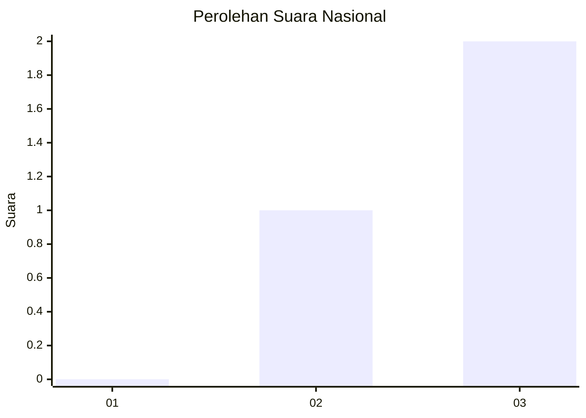
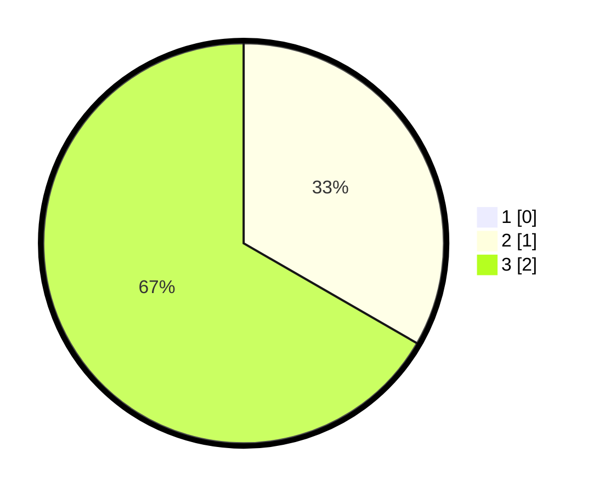

# Hasil

## Grafik

## Tabel

| No. | Nama Paslon    | Suara | Suara (raw) | Persentase |
|:--- |:-------------- | -----:| -----------:| ----------:|
| 1   | ANIES MUHAIMIN | 0     | [0][p-1]    | 0,00       |
| 2   | PRABOWO GIBRAN | 1     | [1][p-2]    | 33,33      |
| 3   | GANJAR MAHFUD  | 2     | [2][p-3]    | 66,67      |

[p-1]: https://github.com/gigit-pemilu/pemilu-2024/blob/main/pilpres/hitung-suara/sub/99-luar-negeri/sub/79-nairobi-kenya/sub/01-nairobi-kenya/sub/0001-nairobi-kenya/sub/002-pos-002/sub/paslon-1.txt
[p-2]: https://github.com/gigit-pemilu/pemilu-2024/blob/main/pilpres/hitung-suara/sub/99-luar-negeri/sub/79-nairobi-kenya/sub/01-nairobi-kenya/sub/0001-nairobi-kenya/sub/002-pos-002/sub/paslon-2.txt
[p-3]: https://github.com/gigit-pemilu/pemilu-2024/blob/main/pilpres/hitung-suara/sub/99-luar-negeri/sub/79-nairobi-kenya/sub/01-nairobi-kenya/sub/0001-nairobi-kenya/sub/002-pos-002/sub/paslon-3.txt

## Foto C Plano

https://sirekap-obj-formc.kpu.go.id/df80/pemilu/ppwp/99/79/01/00/01/9979010001002-20240219-183425--57bf9b71-f765-4ce6-a9b2-d592ff8feaf5.jpg

https://sirekap-obj-formc.kpu.go.id/df80/pemilu/ppwp/99/79/01/00/01/9979010001002-20240219-183427--e4d3c962-fc60-44d2-92d2-5147863d801c.jpg

https://sirekap-obj-formc.kpu.go.id/df80/pemilu/ppwp/99/79/01/00/01/9979010001002-20240219-183426--610e5db4-01b3-4f7b-9eb5-83e229d317d8.jpg

## Metadata

| Key        | Value               |
| ---------- | ------------------- |
| Time Stamp | 2024-02-19 23:00:00 |

## DATA PEMILIH TETAP

Jumlah pemilih dalam DPT: **6**.
 * L: **5**.
 * P: **1**.

## DATA PENGGUNA HAK PILIH

Jumlah pengguna hak pilih dalam DPT: **4**.
 * L: **3**.
 * P: **1**.

Jumlah pengguna hak pilih dalam DPTb: **0**.
 * L: **0**.
 * P: **0**.

Jumlah pengguna hak pilih dalam DPK: **0**.
 * L: **0**.
 * P: **0**.

Jumlah pengguna hak pilih: **4**.
 * L: **3**.
 * P: **1**.

## JUMLAH SUARA SAH DAN TIDAK SAH

JUMLAH SELURUH SUARA SAH: **3**.

JUMLAH SUARA TIDAK SAH: **0**.

JUMLAH SELURUH SUARA SAH DAN SUARA TIDAK SAH: **3**.

