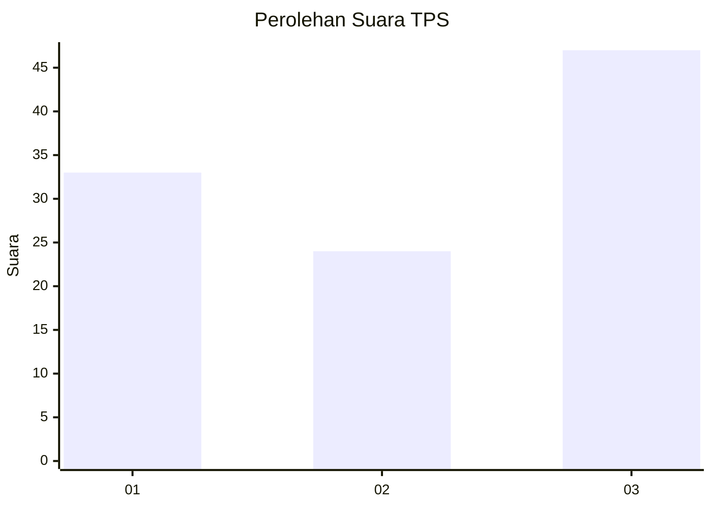
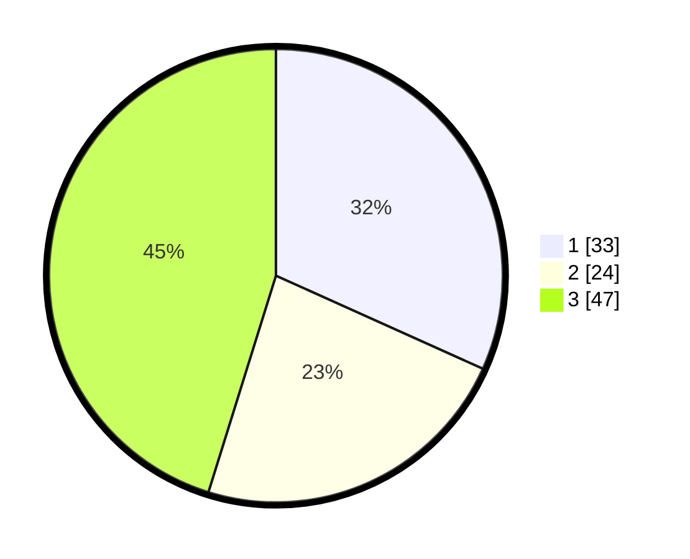

# Hasil

## Grafik

## Tabel

| No. | Nama Paslon    | Suara | Suara (raw) | Persentase |
|:--- |:-------------- | -----:| -----------:| ----------:|
| 1   | ANIES MUHAIMIN | 33    | [33][p-1]   | 31,73      |
| 2   | PRABOWO GIBRAN | 24    | [24][p-2]   | 23,08      |
| 3   | GANJAR MAHFUD  | 47    | [47][p-3]   | 45,19      |

[p-1]: https://github.com/gigit-pemilu/pemilu-2024-99-luar-negeri/blob/main/pilpres/hitung-suara/sub/99-luar-negeri/sub/79-nairobi-kenya/sub/01-nairobi-kenya/sub/0001-nairobi-kenya/sub/003-tps-001/sub/paslon-1.txt
[p-2]: https://github.com/gigit-pemilu/pemilu-2024-99-luar-negeri/blob/main/pilpres/hitung-suara/sub/99-luar-negeri/sub/79-nairobi-kenya/sub/01-nairobi-kenya/sub/0001-nairobi-kenya/sub/003-tps-001/sub/paslon-2.txt
[p-3]: https://github.com/gigit-pemilu/pemilu-2024-99-luar-negeri/blob/main/pilpres/hitung-suara/sub/99-luar-negeri/sub/79-nairobi-kenya/sub/01-nairobi-kenya/sub/0001-nairobi-kenya/sub/003-tps-001/sub/paslon-3.txt

## Foto C Plano

https://sirekap-obj-formc.kpu.go.id/0d3a/pemilu/ppwp/99/79/01/00/01/9979010001003-20240217-100609--bc4630f3-c01c-4ba2-a8b0-193e3940be0a.jpg

https://sirekap-obj-formc.kpu.go.id/0d3a/pemilu/ppwp/99/79/01/00/01/9979010001003-20240217-100611--cddeb9da-cc88-4eda-b297-514bd608e586.jpg

https://sirekap-obj-formc.kpu.go.id/0d3a/pemilu/ppwp/99/79/01/00/01/9979010001003-20240217-100610--7705c6d7-c151-4109-aa2f-66385456edac.jpg

## Metadata

| Key        | Value               |
| ---------- | ------------------- |
| Time Stamp | 2024-02-17 10:30:03 |

## DATA PEMILIH TETAP

Jumlah pemilih dalam DPT: **83**.
 * L: **33**.
 * P: **50**.

## DATA PENGGUNA HAK PILIH

Jumlah pengguna hak pilih dalam DPT: **76**.
 * L: **32**.
 * P: **44**.

Jumlah pengguna hak pilih dalam DPTb: **21**.
 * L: **9**.
 * P: **12**.

Jumlah pengguna hak pilih dalam DPK: **8**.
 * L: **3**.
 * P: **5**.

Jumlah pengguna hak pilih: **105**.
 * L: **44**.
 * P: **61**.

## JUMLAH SUARA SAH DAN TIDAK SAH

JUMLAH SELURUH SUARA SAH: **104**.

JUMLAH SUARA TIDAK SAH: **1**.

JUMLAH SELURUH SUARA SAH DAN SUARA TIDAK SAH: **105**.

