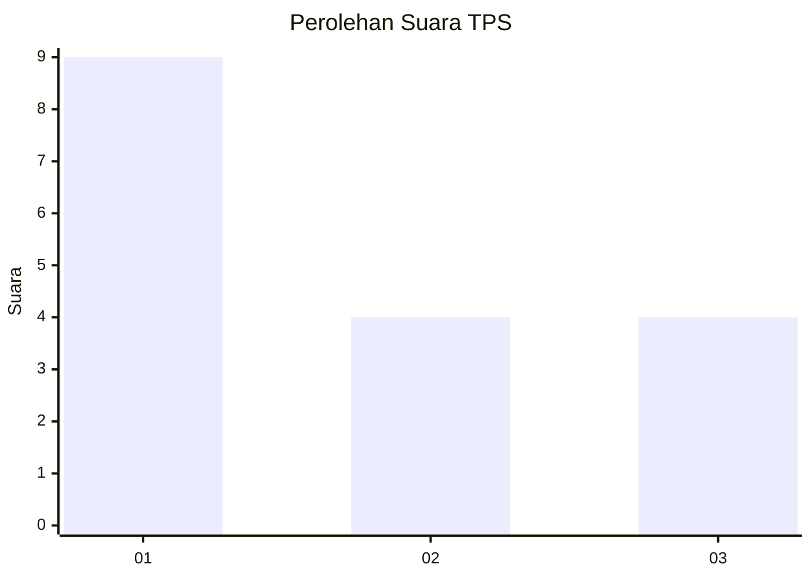
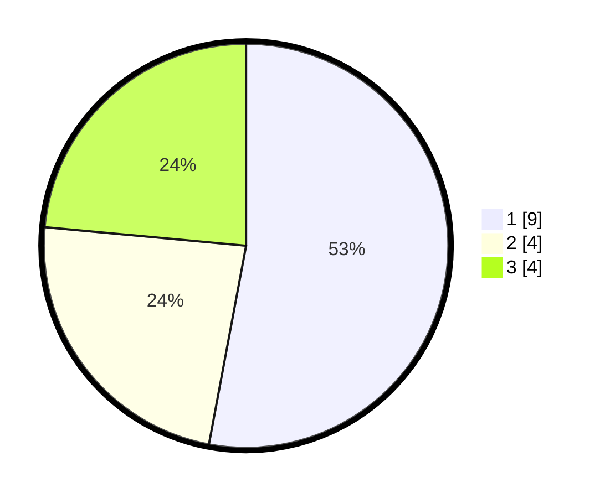

# Hasil

## Grafik

## Tabel

| No. | Nama Paslon    | Suara | Suara (raw) | Persentase |
|:--- |:-------------- | -----:| -----------:| ----------:|
| 1   | ANIES MUHAIMIN | 9     | [9][p-1]    | 52,94      |
| 2   | PRABOWO GIBRAN | 4     | [4][p-2]    | 23,53      |
| 3   | GANJAR MAHFUD  | 4     | [4][p-3]    | 23,53      |

[p-1]: https://github.com/gigit-pemilu/pemilu-2024-99-luar-negeri/blob/main/pilpres/hitung-suara/sub/99-luar-negeri/sub/79-nairobi-kenya/sub/01-nairobi-kenya/sub/0001-nairobi-kenya/sub/004-ksk-001/sub/paslon-1.txt
[p-2]: https://github.com/gigit-pemilu/pemilu-2024-99-luar-negeri/blob/main/pilpres/hitung-suara/sub/99-luar-negeri/sub/79-nairobi-kenya/sub/01-nairobi-kenya/sub/0001-nairobi-kenya/sub/004-ksk-001/sub/paslon-2.txt
[p-3]: https://github.com/gigit-pemilu/pemilu-2024-99-luar-negeri/blob/main/pilpres/hitung-suara/sub/99-luar-negeri/sub/79-nairobi-kenya/sub/01-nairobi-kenya/sub/0001-nairobi-kenya/sub/004-ksk-001/sub/paslon-3.txt

## Foto C Plano

https://sirekap-obj-formc.kpu.go.id/3bef/pemilu/ppwp/99/79/01/00/01/9979010001004-20240217-165200--f987668b-354a-41d2-99b3-4c65283de9e4.jpg

https://sirekap-obj-formc.kpu.go.id/3bef/pemilu/ppwp/99/79/01/00/01/9979010001004-20240217-165201--853f33a5-daf3-49f1-9621-ec8048aca746.jpg

https://sirekap-obj-formc.kpu.go.id/3bef/pemilu/ppwp/99/79/01/00/01/9979010001004-20240217-165201--a232f7e8-45c8-41f8-bf38-635f9c87f6c7.jpg

## Metadata

| Key        | Value               |
| ---------- | ------------------- |
| Time Stamp | 2024-02-19 06:16:00 |

## DATA PEMILIH TETAP

Jumlah pemilih dalam DPT: **21**.
 * L: **15**.
 * P: **6**.

## DATA PENGGUNA HAK PILIH

Jumlah pengguna hak pilih dalam DPT: **13**.
 * L: **7**.
 * P: **6**.

Jumlah pengguna hak pilih dalam DPTb: **4**.
 * L: **4**.
 * P: **0**.

Jumlah pengguna hak pilih dalam DPK: **0**.
 * L: **0**.
 * P: **0**.

Jumlah pengguna hak pilih: **17**.
 * L: **11**.
 * P: **6**.

## JUMLAH SUARA SAH DAN TIDAK SAH

JUMLAH SELURUH SUARA SAH: **17**.

JUMLAH SUARA TIDAK SAH: **0**.

JUMLAH SELURUH SUARA SAH DAN SUARA TIDAK SAH: **17**.

