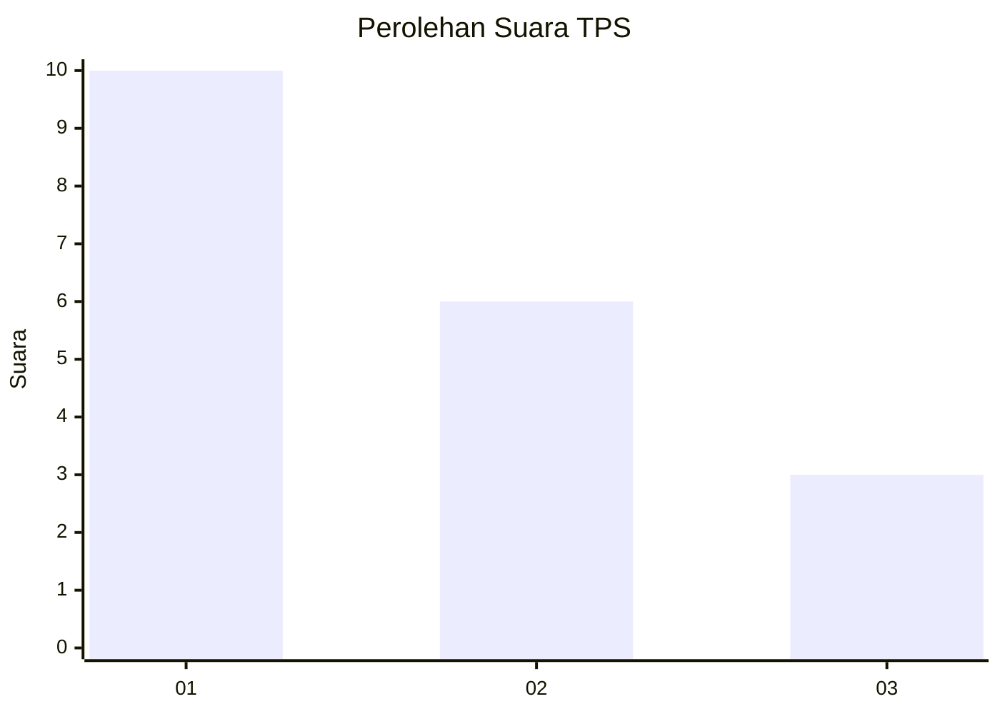
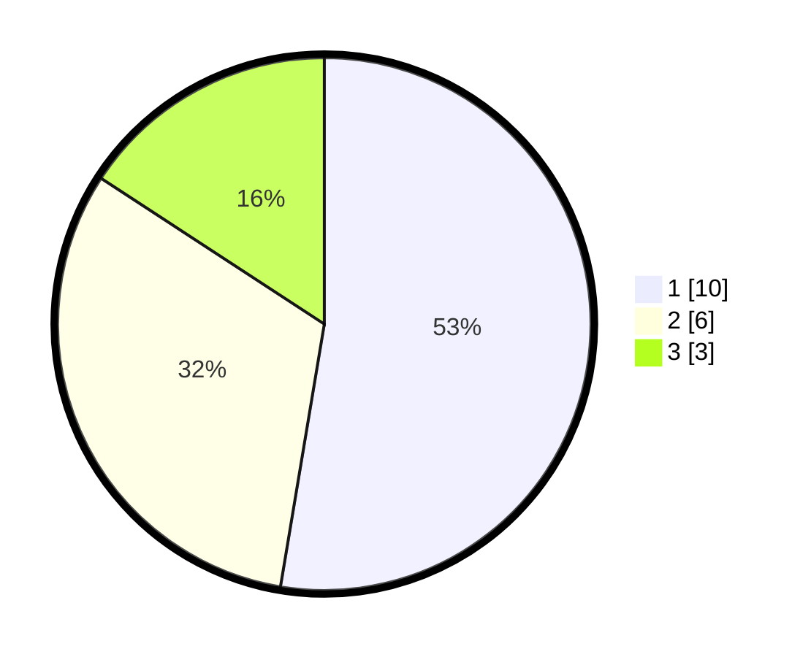

# Hasil

## Grafik

## Tabel

| No. | Nama Paslon    | Suara | Suara (raw) | Persentase |
|:--- |:-------------- | -----:| -----------:| ----------:|
| 1   | ANIES MUHAIMIN | 10    | [10][p-1]   | 52,63      |
| 2   | PRABOWO GIBRAN | 6     | [6][p-2]    | 31,58      |
| 3   | GANJAR MAHFUD  | 3     | [3][p-3]    | 15,79      |

[p-1]: https://github.com/gigit-pemilu/pemilu-2024-99-luar-negeri/blob/main/pilpres/hitung-suara/sub/99-luar-negeri/sub/79-nairobi-kenya/sub/01-nairobi-kenya/sub/0001-nairobi-kenya/sub/005-ksk-002/sub/paslon-1.txt
[p-2]: https://github.com/gigit-pemilu/pemilu-2024-99-luar-negeri/blob/main/pilpres/hitung-suara/sub/99-luar-negeri/sub/79-nairobi-kenya/sub/01-nairobi-kenya/sub/0001-nairobi-kenya/sub/005-ksk-002/sub/paslon-2.txt
[p-3]: https://github.com/gigit-pemilu/pemilu-2024-99-luar-negeri/blob/main/pilpres/hitung-suara/sub/99-luar-negeri/sub/79-nairobi-kenya/sub/01-nairobi-kenya/sub/0001-nairobi-kenya/sub/005-ksk-002/sub/paslon-3.txt

## Foto C Plano

https://sirekap-obj-formc.kpu.go.id/a358/pemilu/ppwp/99/79/01/00/01/9979010001005-20240217-100522--25f35777-e614-4670-bf65-1ef6af0c663b.jpg

https://sirekap-obj-formc.kpu.go.id/a358/pemilu/ppwp/99/79/01/00/01/9979010001005-20240217-100523--abcca3d5-88c8-46d5-9124-bc6fb93a4d39.jpg

https://sirekap-obj-formc.kpu.go.id/a358/pemilu/ppwp/99/79/01/00/01/9979010001005-20240217-100523--10c10978-0fc0-40e6-a819-d6e60d0026e4.jpg

## Metadata

| Key        | Value               |
| ---------- | ------------------- |
| Time Stamp | 2024-02-19 06:16:00 |

## DATA PEMILIH TETAP

Jumlah pemilih dalam DPT: **27**.
 * L: **15**.
 * P: **12**.

## DATA PENGGUNA HAK PILIH

Jumlah pengguna hak pilih dalam DPT: **17**.
 * L: **9**.
 * P: **8**.

Jumlah pengguna hak pilih dalam DPTb: **3**.
 * L: **2**.
 * P: **1**.

Jumlah pengguna hak pilih dalam DPK: **0**.
 * L: **0**.
 * P: **0**.

Jumlah pengguna hak pilih: **20**.
 * L: **11**.
 * P: **9**.

## JUMLAH SUARA SAH DAN TIDAK SAH

JUMLAH SELURUH SUARA SAH: **19**.

JUMLAH SUARA TIDAK SAH: **1**.

JUMLAH SELURUH SUARA SAH DAN SUARA TIDAK SAH: **20**.

