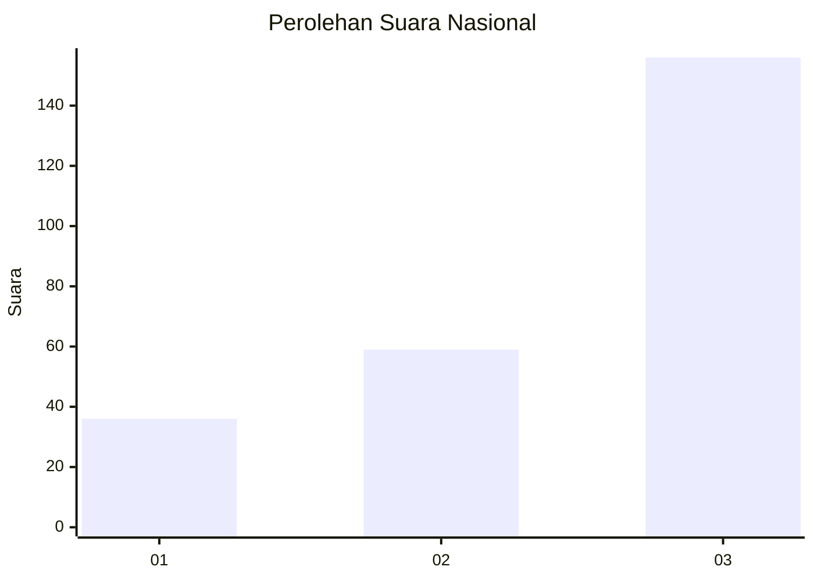
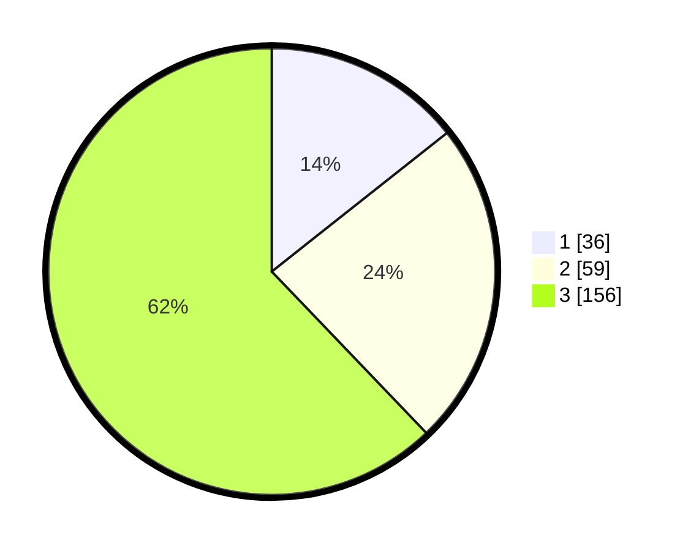

# Hasil

## Grafik

## Tabel

| No. | Nama Paslon    | Suara | Suara (raw) | Persentase |
|:--- |:-------------- | -----:| -----------:| ----------:|
| 1   | ANIES MUHAIMIN | 36    | [36][p-1]   | 14,34      |
| 2   | PRABOWO GIBRAN | 59    | [59][p-2]   | 23,51      |
| 3   | GANJAR MAHFUD  | 156   | [156][p-3]  | 62,15      |

[p-1]: https://github.com/gigit-pemilu/pemilu-2024/blob/main/pilpres/hitung-suara/sub/99-luar-negeri/sub/81-new-york-amerika-serikat/sub/01-new-york-amerika-serikat/sub/0001-new-york-amerika-serikat/sub/001-pos-001/sub/paslon-1.txt
[p-2]: https://github.com/gigit-pemilu/pemilu-2024/blob/main/pilpres/hitung-suara/sub/99-luar-negeri/sub/81-new-york-amerika-serikat/sub/01-new-york-amerika-serikat/sub/0001-new-york-amerika-serikat/sub/001-pos-001/sub/paslon-2.txt
[p-3]: https://github.com/gigit-pemilu/pemilu-2024/blob/main/pilpres/hitung-suara/sub/99-luar-negeri/sub/81-new-york-amerika-serikat/sub/01-new-york-amerika-serikat/sub/0001-new-york-amerika-serikat/sub/001-pos-001/sub/paslon-3.txt

## Foto C Plano

https://sirekap-obj-formc.kpu.go.id/e267/pemilu/ppwp/99/81/01/00/01/9981010001001-20240217-111134--2cc4b008-cee3-40f6-8168-a4442e443380.jpg

https://sirekap-obj-formc.kpu.go.id/e267/pemilu/ppwp/99/81/01/00/01/9981010001001-20240217-110102--2b628c3b-2bdb-4b69-a665-6f04df0d005e.jpg

https://sirekap-obj-formc.kpu.go.id/e267/pemilu/ppwp/99/81/01/00/01/9981010001001-20240217-110145--378751a8-2658-421d-b471-f4de76cd6cae.jpg

## Metadata

| Key        | Value               |
| ---------- | ------------------- |
| Time Stamp | 2024-02-19 06:16:00 |

## DATA PEMILIH TETAP

Jumlah pemilih dalam DPT: **1310**.
 * L: **560**.
 * P: **750**.

## DATA PENGGUNA HAK PILIH

Jumlah pengguna hak pilih dalam DPT: **259**.
 * L: **99**.
 * P: **160**.

Jumlah pengguna hak pilih dalam DPTb: **3**.
 * L: **0**.
 * P: **3**.

Jumlah pengguna hak pilih dalam DPK: **3**.
 * L: **1**.
 * P: **2**.

Jumlah pengguna hak pilih: **265**.
 * L: **100**.
 * P: **165**.

## JUMLAH SUARA SAH DAN TIDAK SAH

JUMLAH SELURUH SUARA SAH: **251**.

JUMLAH SUARA TIDAK SAH: **14**.

JUMLAH SELURUH SUARA SAH DAN SUARA TIDAK SAH: **265**.

