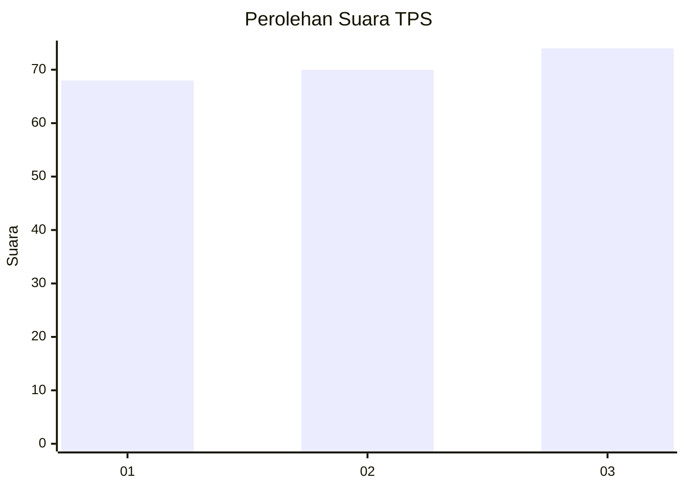
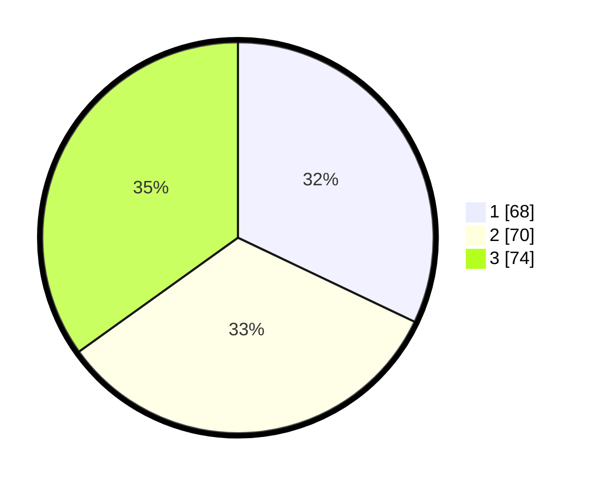

# Hasil

## Grafik

## Tabel

| No. | Nama Paslon    | Suara | Suara (raw) | Persentase |
|:--- |:-------------- | -----:| -----------:| ----------:|
| 1   | ANIES MUHAIMIN | 68    | [68][p-1]   | 32,08      |
| 2   | PRABOWO GIBRAN | 70    | [70][p-2]   | 33,02      |
| 3   | GANJAR MAHFUD  | 74    | [74][p-3]   | 34,91      |

[p-1]: https://github.com/gigit-pemilu/pemilu-2024-99-luar-negeri/blob/main/pilpres/hitung-suara/sub/99-luar-negeri/sub/81-new-york-amerika-serikat/sub/01-new-york-amerika-serikat/sub/0001-new-york-amerika-serikat/sub/002-tps-001/sub/paslon-1.txt
[p-2]: https://github.com/gigit-pemilu/pemilu-2024-99-luar-negeri/blob/main/pilpres/hitung-suara/sub/99-luar-negeri/sub/81-new-york-amerika-serikat/sub/01-new-york-amerika-serikat/sub/0001-new-york-amerika-serikat/sub/002-tps-001/sub/paslon-2.txt
[p-3]: https://github.com/gigit-pemilu/pemilu-2024-99-luar-negeri/blob/main/pilpres/hitung-suara/sub/99-luar-negeri/sub/81-new-york-amerika-serikat/sub/01-new-york-amerika-serikat/sub/0001-new-york-amerika-serikat/sub/002-tps-001/sub/paslon-3.txt

## Foto C Plano

https://sirekap-obj-formc.kpu.go.id/7e65/pemilu/ppwp/99/81/01/00/01/9981010001002-20240216-101920--3dfa59c5-284a-48e0-988b-9c9cb4e01015.jpg

https://sirekap-obj-formc.kpu.go.id/7e65/pemilu/ppwp/99/81/01/00/01/9981010001002-20240216-101931--28acb7ff-cb5a-4705-ba47-0a7d19be1889.jpg

https://sirekap-obj-formc.kpu.go.id/7e65/pemilu/ppwp/99/81/01/00/01/9981010001002-20240216-130603--3fb195d4-4ee3-41a0-b1b1-81b555f58b8a.jpg

## Metadata

| Key        | Value               |
| ---------- | ------------------- |
| Time Stamp | 2024-02-19 06:16:00 |

## DATA PEMILIH TETAP

Jumlah pemilih dalam DPT: **499**.
 * L: **230**.
 * P: **269**.

## DATA PENGGUNA HAK PILIH

Jumlah pengguna hak pilih dalam DPT: **32**.
 * L: **12**.
 * P: **20**.

Jumlah pengguna hak pilih dalam DPTb: **102**.
 * L: **36**.
 * P: **66**.

Jumlah pengguna hak pilih dalam DPK: **82**.
 * L: **35**.
 * P: **47**.

Jumlah pengguna hak pilih: **216**.
 * L: **83**.
 * P: **133**.

## JUMLAH SUARA SAH DAN TIDAK SAH

JUMLAH SELURUH SUARA SAH: **212**.

JUMLAH SUARA TIDAK SAH: **4**.

JUMLAH SELURUH SUARA SAH DAN SUARA TIDAK SAH: **216**.

